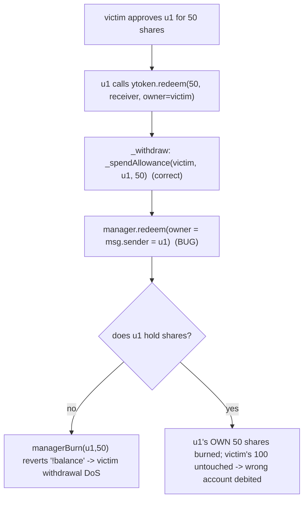

# YieldFi YToken: wrong `owner` (`msg.sender`) passed to `Manager.redeem` in delegated withdrawals

<!-- source-auditvault: https://github.com/Auditware/AuditVault/blob/main/findings/55538-incorrect-owner-passed-to-managerredeem-in-ytoken-withdrawal.md -->
<!-- date: 2025-04 -->

**Protocol:** YieldFi (v2.0) · **Auditor:** Cyfrin (Immeas) · **Severity:** High
**AuditVault:** [#55538](https://github.com/Auditware/AuditVault/blob/main/findings/55538-incorrect-owner-passed-to-managerredeem-in-ytoken-withdrawal.md) · **Report:** [Cyfrin YieldFi v2.0](https://github.com/Cyfrin/cyfrin-audit-reports/blob/main/reports_md/2025-04-24-cyfrin-yieldfi-v2.0.md)
**Vulnerable source:** `contracts/core/tokens/YToken.sol` — `_withdraw` (L161-L172) (same in `YTokenL2.sol`)
**Fix commit:** `adbb6fb` (`owner` now passed to `manager.redeem`)

## Provenance

The audited repo `YieldFiLabs/contracts@40caad6c` was **deleted** (no fork, no
mirror, Wayback 404). The exploit path uses real source where recoverable:

- `src/yieldfi/YToken.sol` — the `_withdraw` body is **verbatim from the Cyfrin
  report**; the base is the **real** OpenZeppelin `ERC4626` (v4.9.6) whose
  `_withdraw` is the exact allowance-spend point the audited override matches,
  plus YieldFi's real `Access` base (adapted to non-upgradeable `ReentrancyGuard`).
- `Administrator` (roles/blacklist/pause registry) and `Manager` are minimal,
  faithful stand-ins for the deleted YieldFi contracts — they implement exactly
  the `IRole`/`IBlackList`/`IPausable` surface `Access` queries and the
  `redeem(...)` entry point `_withdraw` calls. Neither is the finding's subject.

## Root cause

`YToken` defers withdrawals to a central `Manager`. Third parties may withdraw on
a user's behalf with an allowance. But `_withdraw` spends the **owner's**
allowance yet tells the Manager the redeemer is **`msg.sender`**:

```solidity
function _withdraw(address caller, address receiver, address owner, uint256 assets, uint256 shares)
    internal override nonReentrant notPaused {
    require(receiver != address(0) && owner != address(0) && assets > 0 && shares > 0, "!valid");
    require(!IBlackList(administrator).isBlackListed(caller) && !IBlackList(administrator).isBlackListed(receiver), "blacklisted");
    if (caller != owner) { _spendAllowance(owner, caller, shares); }
    // @audit msg.sender passed as owner (should be `owner`)
    IManager(manager).redeem(msg.sender, address(this), asset(), shares, receiver, address(0), "");
}
```

When the Manager executes the order it burns **`msg.sender`'s** shares, not the
owner's. So a delegated redemption either **reverts** (caller holds no shares) or
**burns the wrong account's tokens** (caller happens to hold shares), while the
owner's allowance is consumed for nothing.



## Reproduction

`test/…_exp.sol` (registry, `[PASS]`):

- **`test_wrongUsersTokensBurned`** — victim holds 100 shares, u1 holds 50 and is
  approved for 50. u1 redeems on victim's behalf → **u1's own 50 shares are
  burned** (50 → 0), victim's 100 are untouched, and victim's allowance is spent.
- **`test_thirdPartyWithdrawalReverts`** — u1 holds 0 shares; the delegated
  redeem **reverts `"!balance"`** — the exact failure the report's PoC observes.
- **`test_control_fixedBurnsCorrectOwner`** — passing `owner` (the fix) burns
  victim's 50 shares and leaves u1's intact.

```bash
_shared/run-poc/run_poc.sh 55538-incorrect-owner-passed-to-managerredeem-in-ytoken-withdrawal_exp -vvvvv
```

## Fix

Pass `owner` (not `msg.sender`) to `manager.redeem` in both `YToken._withdraw`
and `YTokenL2._withdraw` (fix commit `adbb6fb`).
