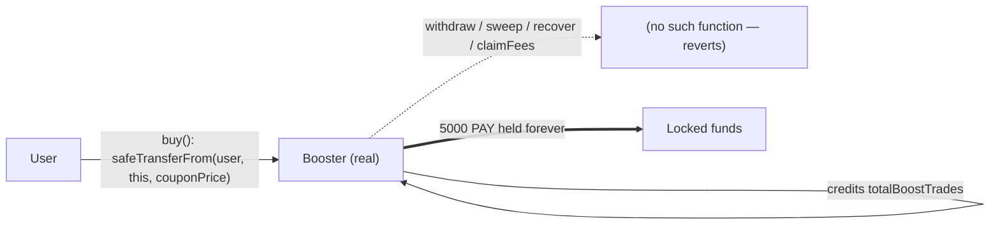

# [H-01] Buffer Finance v2.5 — payments for coupons to the Booster are irretrievable

> **Vulnerability classes:** vuln/logic/locked-funds · vuln/accounting/fee-sink · frozen-funds
>
> **Reproduction:** the test deploys the historical Buffer `Booster` contract and calls its real `buy` entry point. The coupon payment is `safeTransferFrom`'d into the Booster, and the contract exposes no function that can ever move that ERC20 back out — the money is locked forever.

<!-- source-auditvault: https://github.com/Auditware/AuditVault/blob/main/findings/55633-h-01-payments-for-coupons-to-booster-are-irretrievable-0x52.md -->
<!-- date: 2023-07 -->

## Root cause

The audited `Booster` at commit
[`84b6060`](https://github.com/Buffer-Finance/Buffer-Protocol-v2_5/blob/84b6060b4447b2550de595202e8820c7f515988b/contracts/core/Booster.sol#L80-L100)
collects coupon payments into **itself**:

```solidity
function buy(address tokenAddress, uint256 traderNFTId) external {
    ...
    uint256 price = couponPrice - discount;
    require(token.balanceOf(user) >= price, "Not enough balance");

    token.safeTransferFrom(user, address(this), couponPrice); // <-- payment lands in the Booster
    userBoostTrades[tokenAddress][user].totalBoostTrades += MAX_TRADES_PER_BOOST;

    emit BuyCoupon(tokenAddress, user, couponPrice);
}
```

The full `Booster` surface is: `setConfigure`, `getUserBoostData`, `updateUserBoost`,
`getBoostPercentage`, `setPrice`, `setBoostPercentage`, `buy`, plus the inherited
`Ownable` / `AccessControl` role helpers. **None of them transfer an ERC20 out of the
contract**, and there is no `fallback`/`receive`. Every unit paid for a coupon is
therefore permanently frozen — neither the payer, the owner, nor the admin can recover it.

The remediation ([PR #8](https://github.com/Buffer-Finance/Buffer-Protocol-v2_5/pull/8))
routes the fee to the admin instead of the Booster, confirming the destination address is
the bug.

The exact historical contract is vendored at
[`src/core/Booster.sol`](src/core/Booster.sol); its interfaces at
[`src/interfaces/Interfaces.sol`](src/interfaces/Interfaces.sol). OpenZeppelin 4.9.3
(`Ownable`/`AccessControl`/`SafeERC20`/`ERC20`) is vendored under `src/oz`.



## Reproduction

The fixture deploys the real `Booster`, a minimal real ERC20 as the opaque coupon-payment
token, and a minimal trader-NFT stub (an out-of-scope external boundary whose owner never
matches the buyer, so the full `couponPrice` flows in). A user funds, approves, and buys
one coupon.

```bash
cd 55633-h-01-payments-for-coupons-to-booster-are-irretrievable-0x52_exp
forge test -vvv
```

Expected result: `1 passed`. The assertions in
[`test/55633-h-01-payments-for-coupons-to-booster-are-irretrievable-0x52_exp.sol`](test/55633-h-01-payments-for-coupons-to-booster-are-irretrievable-0x52_exp.sol)
verify that:

1. the buyer pays the full `couponPrice` (5,000 PAY) and the Booster holds it;
2. the boost credit is granted (the payment was a legitimate, expected one); and
3. **every** plausible retrieval selector (`withdraw`, `sweep`, `recoverERC20`,
   `rescueTokens`, `emergencyWithdraw`, `transferToken`, `claimFees`, …) reverts with
   *"unrecognized function selector … no fallback"* — so no egress path exists and the
   5,000 PAY remains locked in the Booster after all attempts. Harm: `profit == 0`
   attacker-side; the concrete loss is the permanently frozen coupon revenue.

## Sources

- [AuditVault finding #55633](https://github.com/Auditware/AuditVault/blob/main/findings/55633-h-01-payments-for-coupons-to-booster-are-irretrievable-0x52.md)
- [Buffer v2.5 `Booster.sol` @ `84b6060`](https://github.com/Buffer-Finance/Buffer-Protocol-v2_5/blob/84b6060b4447b2550de595202e8820c7f515988b/contracts/core/Booster.sol#L80-L100)
- [0x52 report — 2023-07-26 Buffer v2.5](https://github.com/solodit/solodit_content/blob/main/reports/0x52/2023-07-26-Buffer-v2.5.md)
- [Fix PR #8 (fees to admin)](https://github.com/Buffer-Finance/Buffer-Protocol-v2_5/pull/8)
