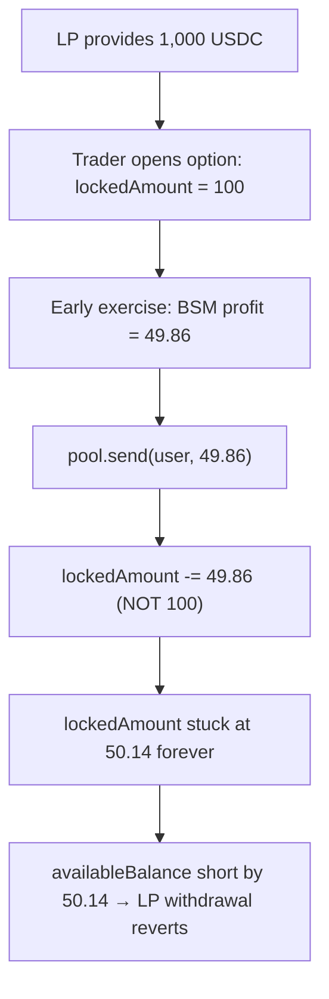

# Buffer `BufferBinaryPool.send()` permanently locks LP funds on an early exercise

> **Vulnerability classes:** vuln/dos/frozen-funds · impact/loss-of-funds/locked-funds · novelty/variant
>
> **Reproduction:** the test deploys the REAL audited Buffer v2.5 `BufferBinaryPool` +
> `BufferBinaryOptions` + `OptionsConfig`, opens a real option that locks 100 USDC of LP
> liquidity, then exercises it EARLY through the real `unlock → _exercise → pool.send` path.
> The early exercise pays a partial `profit < lockedAmount`, and the pool's `send()` unlocks
> only the amount paid — leaving the remainder counted as locked forever and blocking the
> LP's withdrawal.

<!-- source-auditvault: https://github.com/Auditware/AuditVault/blob/main/findings/55634-h-02-bufferbinarypool-can-permanently-lock-funds-on-early-ex.md -->
<!-- date: 2023-07 -->

## Root cause

When an option is exercised, [`BufferBinaryOptions._exercise`](src/core/BufferBinaryOptions.sol)
computes the payout. For an EARLY exercise (`option.expiration > closingTime`) the payout is a
partial Black–Scholes value, strictly less than the locked size:

```solidity
if (option.expiration > closingTime) {
    profit = (option.lockedAmount * OptionMath.blackScholesPriceBinary(...)) / 1e8; // < lockedAmount
} else {
    profit = option.lockedAmount;
}
pool.send(optionID, user, profit);
```

The pool's [`send`](src/core/BufferBinaryPool.sol) then decrements `lockedAmount` by the amount
**sent**, not by the full option size it is unlocking:

```solidity
uint256 transferTokenXAmount = tokenXAmount > ll.amount ? ll.amount : tokenXAmount;
ll.locked = false;                                    // the whole option is now closed
lockedPremium = lockedPremium - ll.premium;
lockedAmount  = lockedAmount - transferTokenXAmount;  // @> only the PARTIAL payout is unlocked
tokenX.safeTransfer(to, transferTokenXAmount);
```

The option is fully closed (`ll.locked = false`, NFT burned), yet `lockedAmount` is only reduced
by `profit`. The `lockedAmount - profit` remainder stays counted as locked **forever**. Because
`availableBalance() = totalTokenXBalance() - lockedAmount`, that remainder is permanently
subtracted from what LPs can withdraw — even though the tokens physically sit in the pool with no
option backing them.

## Exploit walkthrough (numbers from the test)

- An LP seeds the pool with **1,000 USDC**.
- A trader opens an option locking **100 USDC** (`lockedAmount = 100`, `premium = 50`).
- The trader exercises **early** (1,800s before expiry) at an at-the-money price, so the binary
  pays a partial **~49.86 USDC** (`profit < 100`).
- `send()` unlocks only ~49.86, so `lockedAmount` is stuck at **~50.14 USDC** even though the
  option is fully closed.
- `availableBalance()` is now permanently short by ~50.14. The sole LP owns 100% of the pool but
  their full-share `withdraw()` **reverts** with `"Pool: Not enough funds on the pool contract."`
  The ~50.14 USDC is locked forever.



**Negative control (in the same test):** a FULL exercise (`closingTime >= expiration`, so
`profit == lockedAmount`) unlocks the entire amount and leaves `lockedAmount == 0` — proving the
lock is caused specifically by the partial-payout branch of `send()`.

## Fix

`send()` must unlock the full option size, not the amount sent. Buffer's remediation
([PR #7](https://github.com/Buffer-Finance/Buffer-Protocol-v2_5/pull/7)) redeems `option.lockedAmount`
to the option contract, sends `profit` to the user, and returns any remainder to the pool.

## Reproduction

- Registry PoC: `_shared/run-poc/run_poc.sh 55634-h-02-bufferbinarypool-can-permanently-lock-funds-on-early-ex_exp -vvvvv`
- Real audited source under `src/` at commit `84b6060b4447b2550de595202e8820c7f515988b`.
