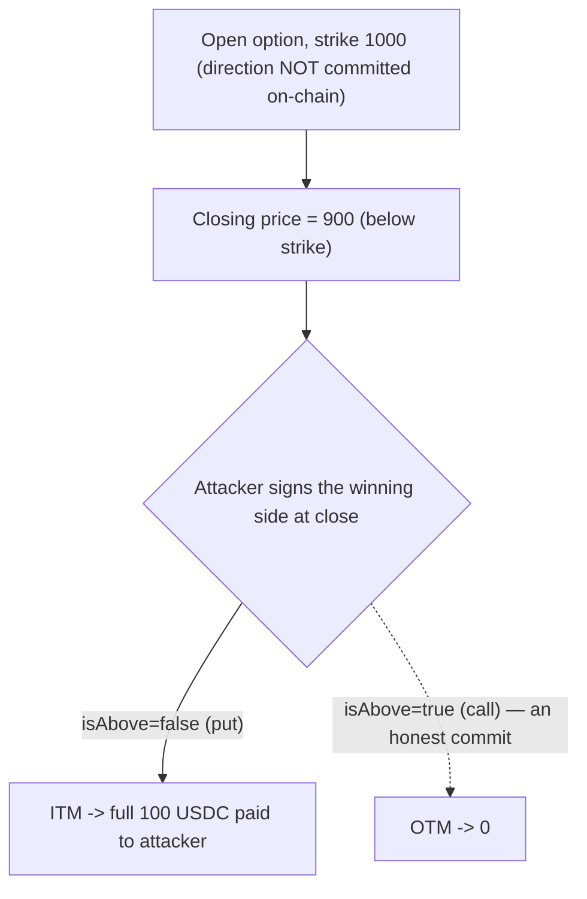

# Buffer market direction is chosen at close, guaranteeing a winning trade

> **Vulnerability classes:** vuln/signature/replay · impact/loss-of-funds/locked-funds · reward-accounting
>
> **Reproduction:** the test deploys the REAL audited Buffer v2.5 `BufferRouter` +
> `BufferBinaryOptions` + `BufferBinaryPool` and drives the real `closeAnytime` path with
> private keeper mode disabled. Because the trade DIRECTION is never committed on-chain at open,
> the trader signs whichever direction is winning after seeing the closing price — draining LP
> funds on a trade that should have lost.

<!-- source-auditvault: https://github.com/Auditware/AuditVault/blob/main/findings/55635-h-03-market-direction-signature-can-be-abused-if-privatekeep.md -->
<!-- date: 2023-07 -->

## Root cause

Neither the `QueuedTrade` nor the `Option` struct stores the market direction (`isAbove`). The
direction is only supplied and checked at close time, in
[`BufferRouter.closeAnytime`](src/core/BufferRouter.sol):

```solidity
if (!Validator.verifyMarketDirection(params, queuedTrade, optionInfo.signer)) {
    emit FailUnlock(params.optionId, params.targetContract, "Router: Wrong market direction");
    continue;
}
```

`verifyMarketDirection` only checks that `params.isAbove` matches a signature from
`optionInfo.signer` — which is the trader's **own** 1CT key. Since the direction was never
committed at open, and the trader controls their own signing key, they simply observe the
closing price and sign whichever direction wins. With private keeper mode disabled the trader
can call `closeAnytime` themselves.

## Exploit walkthrough (numbers from the test)

- An LP seeds the pool with 1,000 USDC. A trader opens an ETH/USD option, strike `1000`, locking
  100 USDC. The closing price ends **below** strike at `900`.
- **Honest control:** a trader who had committed to a call (`isAbove = true`) loses — the option
  is out-of-the-money and expires worthless, paying **0**.
- **Exploit:** on an identical option at the identical price, the attacker signs a **put**
  (`isAbove = false`) at close. Now `!isAbove && closingPrice < strike` is true, so the option is
  in-the-money and pays the **full 100 USDC**.
- The attacker wins on every trade regardless of price direction, draining LP funds risk-free.



The negative control (an honest committed call paying 0 at the same price) proves the win comes
purely from choosing the direction after the outcome is known.

## Fix

Commit the direction at open — e.g. store a hash of `(direction, salt)` with the queued trade and
reveal it at close. Buffer's remediation
([PR #4](https://github.com/Buffer-Finance/Buffer-Protocol-v2_5/pull/4/)) removes the ability to
disable private keeper mode.

## Reproduction

- Registry PoC: `_shared/run-poc/run_poc.sh 55635-h-03-market-direction-signature-can-be-abused-if-privatekeep_exp -vvvvv`
- Real audited source under `src/` at commit `84b6060b4447b2550de595202e8820c7f515988b`.
