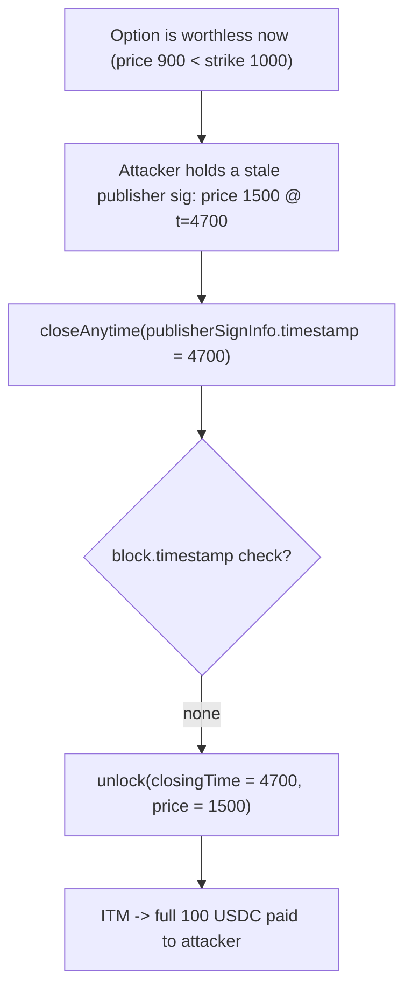

# Buffer `closeAnytime` never validates the closing timestamp against the current time

> **Vulnerability classes:** vuln/wrong-condition · vuln/timestamp-dependence · impact/loss-of-funds/direct-drain · novelty/variant
>
> **Reproduction:** the test deploys the REAL audited Buffer v2.5 `BufferRouter` +
> `BufferBinaryOptions` + `BufferBinaryPool` and drives the real `closeAnytime` path with
> private keeper mode disabled. A currently out-of-the-money option is settled using a STALE,
> favorable price signature from the past — collecting the full locked amount from LPs.

<!-- source-auditvault: https://github.com/Auditware/AuditVault/blob/main/findings/55636-h-04-closeanytime-timestamp-is-never-validated-against-curre.md -->
<!-- date: 2023-07 -->

## Root cause

In [`BufferRouter.closeAnytime`](src/core/BufferRouter.sol) the closing time handed to the
options contract is taken straight from the publisher (pricing) signature and is **never
checked against `block.timestamp`**:

```solidity
optionsContract.unlock(
    params.optionId,
    params.closingPrice,
    publisherSignInfo.timestamp,   // @> used as the closing time — never validated vs now
    params.isAbove
)
```

The publisher (price oracle) continuously signs `(assetPair, timestamp, price)` tuples. Because
`closeAnytime` never requires `publisherSignInfo.timestamp` to be anywhere near the current
time, a trader (or, per the finding, a malicious/compromised keeper) can present ANY historical
price signature the oracle ever produced. They simply pick the one most favorable to them.

## Exploit walkthrough (numbers from the test)

- An LP seeds the pool with 1,000 USDC. A trader opens an ETH/USD call, strike `1000`, locking
  100 USDC. Time now is far past expiry (`block.timestamp = 50000`, `expiration = 4600`).
- **Honest close (control):** at the current fair price of `900` (below strike) the option is
  worthless — it expires and pays **0**.
- **Exploit:** the attacker submits a stale publisher signature for price `1500` (deep ITM)
  stamped at `t = 4700`. `closeAnytime` accepts it despite `4700 << 50000`, and because
  `closingTime (4700) >= expiration (4600)` the option exercises for the **full 100 USDC**.
- The pool pays out the full 100 USDC of LP liquidity on an option that is worthless at the
  real current price.



The negative control in the test (an honest close at the current price paying 0) proves the
payout comes purely from the unvalidated stale timestamp.

## Fix

Validate that the exercise/closing timestamp is within a small margin of `block.timestamp`.
Buffer's remediation ([PR #4](https://github.com/Buffer-Finance/Buffer-Protocol-v2_5/pull/4/))
removes the ability to disable private keeper mode — but, as the auditor notes, a malicious or
compromised keeper can still exploit this.

## Reproduction

- Registry PoC: `_shared/run-poc/run_poc.sh 55636-h-04-closeanytime-timestamp-is-never-validated-against-curre_exp -vvvvv`
- Real audited source under `src/` at commit `84b6060b4447b2550de595202e8820c7f515988b`.
