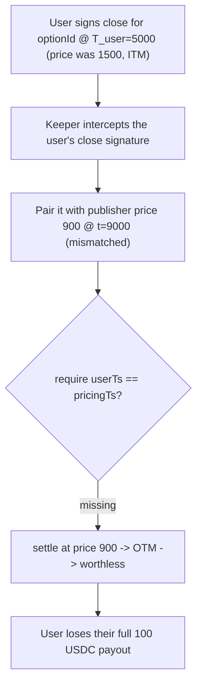

# Buffer `closeAnytime` never ties the user's close signature to the pricing timestamp

> **Vulnerability classes:** vuln/wrong-condition · vuln/timestamp-dependence · impact/loss-of-funds/direct-drain
>
> **Reproduction:** the test deploys the REAL audited Buffer v2.5 `BufferRouter` +
> `BufferBinaryOptions` + `BufferBinaryPool` and drives the real `closeAnytime` path. A user's
> valid close signature is paired by a malicious keeper with publisher pricing from a completely
> different time, settling the user's winning option at a stale, worthless price.

<!-- source-auditvault: https://github.com/Auditware/AuditVault/blob/main/findings/55637-h-05-closeanytime-timestamp-is-never-validated-against-prici.md -->
<!-- date: 2023-07 -->

## Root cause

`closeAnytime` verifies three independent signatures whose timestamps are **never required to
agree**:

- [`Validator.verifyCloseAnytime`](src/core/BufferRouter.sol) binds only
  `(assetPair, userSignInfo.timestamp, optionId)` — **not** the price.
- `Validator.verifyPublisher` binds `(assetPair, publisherSignInfo.timestamp, closingPrice)`.
- `unlock(...)` then settles using `publisherSignInfo.timestamp` and `closingPrice`.

Nothing ties `userSignInfo.timestamp` to `publisherSignInfo.timestamp`. A user signs a close
authorization for their option at a moment when the price is favorable, but their signature does
not constrain *which* price the settlement uses. With private keeper mode disabled, a malicious
keeper (or a front-runner) can pair the user's valid close signature with publisher pricing from
an entirely different, unfavorable time.

## Exploit walkthrough (numbers from the test)

- A user owns an ETH/USD call, strike `1000`, locking 100 USDC. They sign a close authorization
  at `T_user = 5000`, when the price was `1500` (deep ITM) — expecting the full 100 USDC payout.
- **Control:** an identical option closed *correctly* — publisher price `1500` at `T_user` —
  pays the full **100 USDC**, proving the option is a winner.
- **Exploit:** the keeper reuses the user's `T_user` close signature but pairs it with a genuine
  publisher signature for price `900` at a **different** timestamp `9000`. Because `900 < strike`
  and `closingTime (9000) >= expiration (4600)`, the option expires **worthless**.
- The user receives **0** instead of the 100 USDC they signed to collect — a total loss of their
  in-the-money payout, purely because the pricing timestamp was decoupled from their signature.

## Fix

Require the pricing-data timestamp and the `closeAnytime` (user) timestamp to match. Buffer's
remediation ([PR #4](https://github.com/Buffer-Finance/Buffer-Protocol-v2_5/pull/4/)) removes
the ability to disable private keeper mode — but, as the auditor notes, a malicious or
compromised keeper can still exploit this.

## Reproduction

- Registry PoC: `_shared/run-poc/run_poc.sh 55637-h-05-closeanytime-timestamp-is-never-validated-against-prici_exp -vvvvv`
- Real audited source under `src/` at commit `84b6060b4447b2550de595202e8820c7f515988b`.
