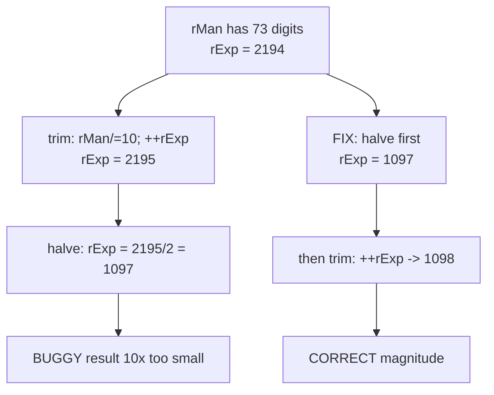

# Forte Float128 — [H-01] Early 72-digit adjustment in sqrt wrong exponent

> **Vulnerability classes:** integer-bounds · variant · misassumption/math-is-safe

> **Reproduction:** self-contained Foundry PoC with **only `forge-std`** — no fork,
> no RPC. Full trace: [output.txt](output.txt).

<!-- non-defihacklabs -->
<!-- source-auditvault: https://github.com/Auditware/AuditVault/blob/main/findings/55703-h-01-early-72-digit-adjustment-in-sqrt-will-lead-to-incorrec.md -->
<!-- date: 2025-04 -->

---

## Key info

| | |
|---|---|
| **Impact** | **HIGH** — sqrt of large floats returns a value **10× too small** (exponent off-by-one) |
| **Protocol** | Forte Float128 solidity library |
| **Vulnerable code** | `Float128.sqrt` large-number branch — digit trim before exponent halve |
| **Bug class** | Incorrect operation order / integer-division loss |
| **Finding** | Code4rena 2025-04-forte-float128-solidity-library · #55703 · **0xcrazyboy999** |
| **Report** | [code4rena.com/reports/2025-04-forte-float128-solidity-library](https://code4rena.com/reports/2025-04-forte-float128-solidity-library) |
| **Source** | [AuditVault](https://github.com/Auditware/AuditVault/blob/main/findings/55703-h-01-early-72-digit-adjustment-in-sqrt-will-lead-to-incorrec.md) |
| **Compiler** | `^0.8.24` |

---

## TL;DR

1. Large-path `sqrt` computes a 73-digit `rMan` via `Uint512.sqrt512`.
2. The code trims to 72 digits (`rMan /= 10; ++rExp`) **before** `rExp /= 2`.
3. Integer division drops the `+1` (`2195/2 = 1097` instead of `1098`) → result is **10× too small**.

---

## The vulnerable code

```solidity
if (rMan > MAX_L_DIGIT_NUMBER) {
    rMan /= BASE;
    ++rExp;
}
rExp = (rExp) / 2; // @> VULN: halve AFTER 73-digit trim
```

**Fix:** halve first, then trim:

```diff
+ rExp = (rExp) / 2;
  if (rMan > MAX_L_DIGIT_NUMBER) {
      rMan /= BASE;
      ++rExp;
  }
- rExp = (rExp) / 2;
```

---

## Root cause

Halving and digit-normalization do not commute under integer division. Incrementing
`rExp` then dividing by 2 loses the carry that should survive into the final exponent.

## Preconditions

- Input large enough to take the `Uint512` sqrt path with a 73-digit intermediate mantissa
  (finding PoC: real value `3.82e2338`).

## Attack walkthrough

1. Build post-parity intermediates for the PoC float (`aMan` 73 digits, `aExp = 2266`).
2. Run the buggy large path → exponent **1097**.
3. Run the fixed order → exponent **1098**, same mantissa.
4. Harm: off-by-one exponent = 10× magnitude error.

## Diagrams



## Impact

Any protocol using Float128 `sqrt` on large values (prices, rates, geometric means)
gets a systematically wrong result — not rounding dust, a full order-of-magnitude error.

## Taxonomy (AuditVault)

- `[[integer-bounds]]` · `[[variant]]`

## Sources

- [AuditVault finding #55703](https://github.com/Auditware/AuditVault/blob/main/findings/55703-h-01-early-72-digit-adjustment-in-sqrt-will-lead-to-incorrec.md)
- [Code4rena report](https://code4rena.com/reports/2025-04-forte-float128-solidity-library)
- Reduced from [code-423n4/2025-04-forte](https://github.com/code-423n4/2025-04-forte) `@f3a4c51` / `src/Float128.sol` L735–L742
