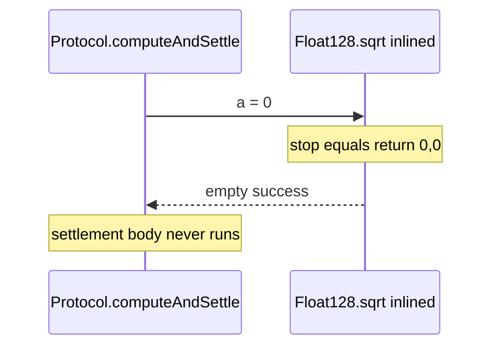

# Forte Float128 — [H-02] Sqrt silently stops the entire call frame on packed 0

> **Vulnerability classes:** integer-bounds · logic/wrong-condition · impact/dos/selective · misassumption/math-is-safe

> **Reproduction:** self-contained Foundry PoC with **only `forge-std`** — no fork,
> no RPC. Full trace: [output.txt](output.txt).

<!-- non-defihacklabs -->
<!-- source-auditvault: https://github.com/Auditware/AuditVault/blob/main/findings/55704-h-02-sqrt-function-silently-reverts-the-entire-control-flow.md -->
<!-- date: 2025-04 -->

---

## Key info

| | |
|---|---|
| **Impact** | **HIGH** — `sqrt(0)` terminates the whole call frame with empty success; post-sqrt logic never runs |
| **Protocol** | Forte Float128 solidity library |
| **Vulnerable code** | `Float128.sqrt` zero guard — Yul `stop()` |
| **Bug class** | Wrong control-flow primitive (`stop` vs `return 0`) |
| **Finding** | Code4rena 2025-04-forte-float128-solidity-library · #55704 · **0xpetern** |
| **Report** | [code4rena.com/reports/2025-04-forte-float128-solidity-library](https://code4rena.com/reports/2025-04-forte-float128-solidity-library) |
| **Source** | [AuditVault](https://github.com/Auditware/AuditVault/blob/main/findings/55704-h-02-sqrt-function-silently-reverts-the-entire-control-flow.md) |
| **Compiler** | `^0.8.24` |

---

## TL;DR

1. Mathematically, `sqrt(0) = 0`.
2. Float128 uses assembly `stop()` on packed zero — equivalent to `return(0,0)` for the **entire call frame**.
3. Because `sqrt` is `internal pure`, it is inlined: any protocol function that calls `sqrt(0)` then settles/transfers **silently skips** the rest while still reporting success to its caller.

---

## The vulnerable code

```solidity
if iszero(a) {
    stop() // @> VULN: ends the whole call frame
}
```

**Fix:**

```diff
  if iszero(a) {
-     stop()
+     r := 0
+     leave
  }
```

---

## Root cause

`stop()` is not a function-local return. It aborts the current message call with empty
returndata. Inlined into a protocol external function, that kills settlement code that
follows `sqrt`.

## Preconditions

- A call path invokes `sqrt` with packedFloat `0` (e.g. empty balance, zero rate).

## Attack walkthrough

1. Non-zero control path: guard falls through, settlement flag set.
2. Zero path: `stop()` succeeds the subcall with **empty** returndata.
3. Settlement body never runs (`settled` stays false) — silent partial execution.

## Diagrams



## Impact

Financial protocols that call `sqrt` mid-function can leave state half-updated or skip
payouts without a revert — hard-to-debug silent failures.

## Taxonomy (AuditVault)

- `[[integer-bounds]]` · `[[logic/wrong-condition]]` · `[[impact/dos/selective]]` · `[[misassumption/math-is-safe]]`

## Sources

- [AuditVault finding #55704](https://github.com/Auditware/AuditVault/blob/main/findings/55704-h-02-sqrt-function-silently-reverts-the-entire-control-flow.md)
- [Code4rena report](https://code4rena.com/reports/2025-04-forte-float128-solidity-library)
- Reduced from [code-423n4/2025-04-forte](https://github.com/code-423n4/2025-04-forte) `@4d6694f` / `src/Float128.sol` ~L712
