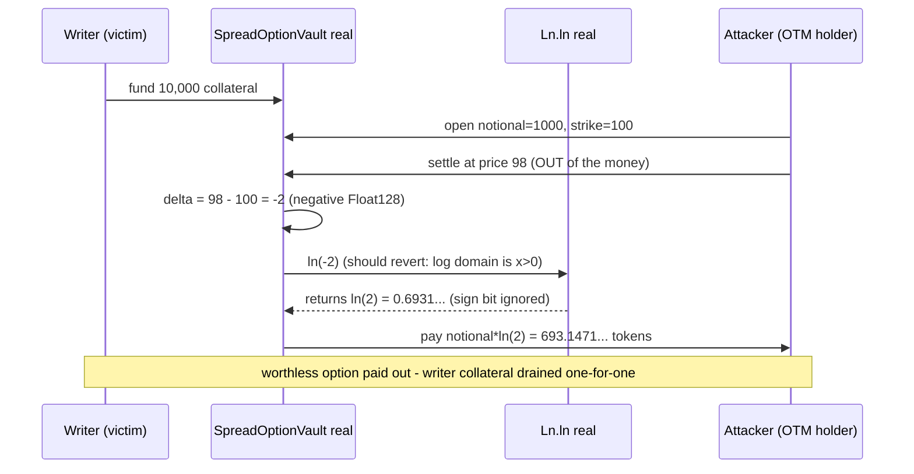

# Forte Float128 `Ln.ln` silently accepts non-positive inputs (mispriced settlement / stolen collateral)

> **Vulnerability classes:** vuln/math/missing-input-validation · vuln/defi/mispricing
>
> **Reproduction:** the test deploys the REAL (byte-identical, audited-commit) `Float128` + `Ln` library and a minimal REAL consumer (`SpreadOptionVault`) that prices a cash-settled log-contract option as `notional * ln(settlePrice - strike)`. It shows an **out-of-the-money** option (a worthless position that must pay `0`) being paid `693.147180559945309417` collateral tokens — drained one-for-one from an honest writer — purely because `Ln.ln` returns `ln(|-2|) = ln(2)` instead of reverting on the invalid (negative) log input.

<!-- source-auditvault: https://github.com/Auditware/AuditVault/blob/main/findings/55705-h-03-natural-logarithm-function-silently-accepts-invalid-non.md -->

## Root cause

The natural-log entry point [`Ln.ln`](src/Ln.sol#L63-L77) extracts the mantissa with a mask that **omits the sign bit** and never checks the value's sign or zero-ness:

```solidity
function ln(packedFloat input) public pure returns (packedFloat result) {
    uint mantissa;
    int exponent;
    bool inputL;
    assembly {
        inputL := gt(and(input, MANTISSA_L_FLAG_MASK), 0)
        mantissa := and(input, MANTISSA_MASK)          // L69 - root cause: MANTISSA_SIGN_MASK (bit 240) is ignored
        exponent := sub(shr(EXPONENT_BIT, and(input, EXPONENT_MASK)), ZERO_OFFSET)
    }
    // ... (special-case for the smallest representable number) ...
    result = ln_helper(mantissa, exponent, inputL);     // proceeds unconditionally, even for input <= 0
}
```

`MANTISSA_MASK` covers bits `0..239`; the sign lives in `MANTISSA_SIGN_MASK` (bit `240`), which `ln` never reads. So for a **negative** input the function computes `ln(|input|)` (e.g. `ln(-2)` returns exactly `ln(2) = 0.69314718055994530941723212145817656807`), and for **zero** it returns a finite garbage value (`-18781.450104...`, when the true value is `-∞`). The log domain is `x > 0`; a mathematical library is expected to fail explicitly on an invalid input, but this one silently returns a plausible, wrong, real number.

The recommended fix (accepted by the Forte team) reverts when `input == 0` or when `MANTISSA_SIGN_MASK` is set.

## Why it is exploitable (the consumer path)

Any contract that trusts `ln` to police its own domain will silently misprice. `SpreadOptionVault` is a minimal, faithful example: it settles a "log-contract" option as `notional * ln(settlePrice - strike)`, which is meaningful only when the option is **in the money** (`settlePrice > strike`, so the log argument is positive). Trusting the library, the vault does **not** re-check `delta > 0`:

```solidity
packedFloat delta = settlePrice.sub(p.strike);          // NEGATIVE when out of the money
packedFloat payoffPF = p.notional.mul(Ln.ln(delta));    // ln SHOULD revert here for delta <= 0
```

Because `Ln.ln(delta)` does not revert for `delta <= 0`, an **out-of-the-money** holder (whose option is worthless and should pay `0`) is paid the **same** amount as an in-the-money holder — draining the writers' collateral.

## Exploit walkthrough (real numbers)

1. A writer backs the vault with **10,000** collateral tokens (a real ERC20).
2. **Control (in the money):** a holder with `notional = 1000`, `strike = 100` settles at `settlePrice = 102`. `delta = +2`, payoff `= 1000 * ln(2) = 693.147180559945309417` tokens — a legitimate payout.
3. **Theft (out of the money):** the attacker holds the same `notional = 1000`, `strike = 100` and settles at `settlePrice = 98`. The option is worthless and must pay `0`. But `delta = 98 - 100 = -2` (a negative `Float128`), and `Ln.ln(-2)` returns `ln(2)` — identical to the in-the-money case. The vault pays the attacker **693.147180559945309417** tokens.
4. **Harm:** the attacker's ERC20 balance rises by `693.147180559945309417` and the vault's collateral falls by exactly the same amount — a real theft from the honest writer on a position that should have paid nothing.

The test also asserts the mechanism directly: `ln(-2)` mantissa/exponent equal `ln(+2)` (proving the sign bit was discarded), and `ln(0)` returns the finite value `-18781450104493291890957123580748043517e-33` from the finding.



## Reproduction

```bash
_shared/run-poc/run_poc.sh 55705-h-03-natural-logarithm-function-silently-accepts-invalid-non_exp -vvvvv
```

Expected result: `3 passed`. See [`test/55705-h-03-natural-logarithm-function-silently-accepts-invalid-non_exp.sol`](test/55705-h-03-natural-logarithm-function-silently-accepts-invalid-non_exp.sol). The real audited sources — [`src/Ln.sol`](src/Ln.sol), [`src/Float128.sol`](src/Float128.sol), [`src/Types.sol`](src/Types.sol), [`lib/Uint512.sol`](lib/Uint512.sol) — are vendored **byte-identical** to the audited commit. `Ln` is a `public`-function library, so it is linked at a fixed address (`0x…6c6e`) via `foundry.toml` and `vm.etch`ed in the test. The only non-audited code is the minimal consumer under [`src/consumer/`](src/consumer/) (`MiniERC20`, `SpreadOptionVault`) that demonstrates the harm — the vulnerable `ln` on the exploit path is the real library.

## Sources

- [AuditVault finding #55705](https://github.com/Auditware/AuditVault/blob/main/findings/55705-h-03-natural-logarithm-function-silently-accepts-invalid-non.md)
- [Forte `Ln.sol` @ `4d6694f6`](https://github.com/code-423n4/2025-04-forte/blob/4d6694f68e80543885da78666e38c0dc7052d992/src/Ln.sol#L63-L77)
- [Code4rena 2025-04 Forte (Float128 Solidity library) report](https://code4rena.com/reports/2025-04-forte-float128-solidity-library)
