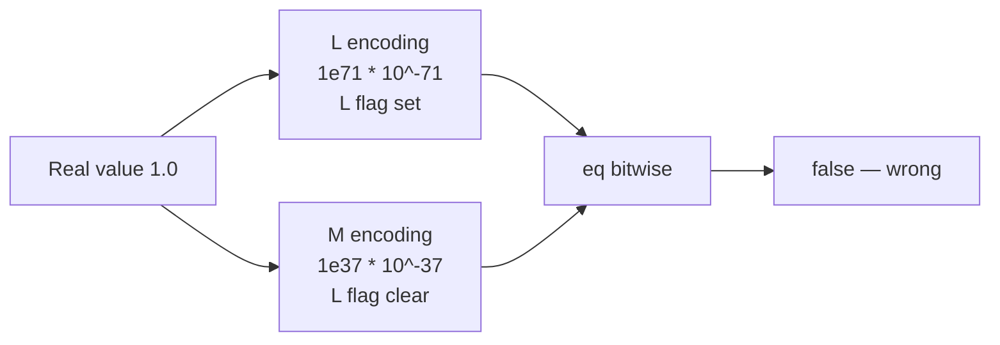

# Forte Float128 — [H-04] eq ignores L_MANTISSA_FLAG / dual encodings

> **Vulnerability classes:** integer-bounds · logic/wrong-condition · data-corruption/accounting-error · misassumption/math-is-safe

> **Reproduction:** self-contained Foundry PoC with **only `forge-std`** — no fork,
> no RPC. Full trace: [output.txt](output.txt).

<!-- non-defihacklabs -->
<!-- source-auditvault: https://github.com/Auditware/AuditVault/blob/main/findings/55706-h-04-unwrapping-while-equating-inside-the-eq-function-fails.md -->
<!-- date: 2025-04 -->

---

## Key info

| | |
|---|---|
| **Impact** | **HIGH** — `eq` returns false for two encodings of the same real value |
| **Protocol** | Forte Float128 solidity library |
| **Vulnerable code** | `Float128.eq` — bitwise unwrap comparison |
| **Bug class** | Equality of representations instead of values |
| **Finding** | Code4rena 2025-04-forte-float128-solidity-library · #55706 · **patitonar** |
| **Report** | [code4rena.com/reports/2025-04-forte-float128-solidity-library](https://code4rena.com/reports/2025-04-forte-float128-solidity-library) |
| **Source** | [AuditVault](https://github.com/Auditware/AuditVault/blob/main/findings/55706-h-04-unwrapping-while-equating-inside-the-eq-function-fails.md) |
| **Compiler** | `^0.8.24` |

---

## TL;DR

1. Mantissas may be M (38 digits) or L (72 digits); the L flag is bit 241 of the packed word.
2. `eq` only checks `unwrap(a) == unwrap(b)`.
3. `1.0` encoded as L (`1e71 * 10^-71`) and as M (`1e37 * 10^-37`) has different bits → `eq` is false.

---

## The vulnerable code

```solidity
function eq(packedFloat a, packedFloat b) internal pure returns (bool retVal) {
    retVal = packedFloat.unwrap(a) == packedFloat.unwrap(b); // @> VULN
}
```

**Fix:** normalize (decode + strip trailing zeros / align exponents) before comparing.

---

## Root cause

Packed floats are a **redundant** encoding: the same real number has many bit patterns.
Bitwise equality is not numerical equality.

## Preconditions

- Two packed floats that represent the same real value with different M/L encodings
  (common when one path keeps L precision and another normalizes to M).

## Attack walkthrough

1. `packed1` = real `toPackedFloat(1e71, -71)` → L encoding of 1.0.
2. `packed2` = real `toPackedFloat(1, 0)` → M encoding of 1.0.
3. `eq(packed1, packed2)` returns **false**.

## Diagrams



## Impact

Any branch that trusts `eq` for collateral ratios, limit orders, or invariant checks can
misclassify equal values as unequal (or never take the equal path).

## Taxonomy (AuditVault)

- `[[integer-bounds]]` · `[[logic/wrong-condition]]` · `[[data-corruption/accounting-error]]` · `[[misassumption/math-is-safe]]`

## Sources

- [AuditVault finding #55706](https://github.com/Auditware/AuditVault/blob/main/findings/55706-h-04-unwrapping-while-equating-inside-the-eq-function-fails.md)
- [Code4rena report](https://code4rena.com/reports/2025-04-forte-float128-solidity-library)
- Reduced from [code-423n4/2025-04-forte](https://github.com/code-423n4/2025-04-forte) `@4d6694f` / `src/Float128.sol` L1070–L1072
