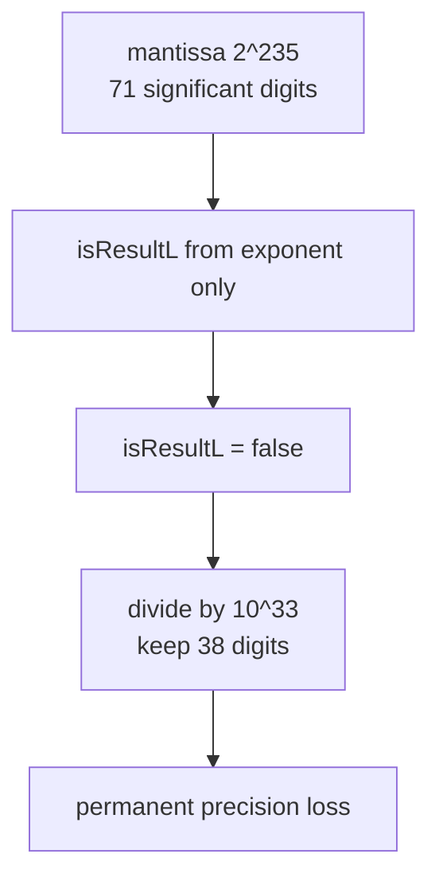

# Forte Float128 — [H-05] Precision loss in toPackedFloat for mid-range mantissas

> **Vulnerability classes:** integer-bounds · precision-loss · math-is-safe · fix-arithmetic

> **Reproduction:** self-contained Foundry PoC with **only `forge-std`** — no fork,
> no RPC. Full trace: [output.txt](output.txt).

<!-- non-defihacklabs -->
<!-- source-auditvault: https://github.com/Auditware/AuditVault/blob/main/findings/55707-h-05-precision-loss-in-topackedfloat-function-when-mantissa.md -->
<!-- date: 2025-04 -->

---

## Key info

| | |
|---|---|
| **Impact** | **HIGH** — up to **33 significant digits** permanently destroyed at encode time |
| **Protocol** | Forte Float128 solidity library |
| **Vulnerable code** | `Float128.toPackedFloat` — `isResultL` ignores digit count |
| **Bug class** | Precision loss / wrong format selection |
| **Finding** | Code4rena 2025-04-forte-float128-solidity-library · #55707 · **hecker_trieu_tien** |
| **Report** | [code4rena.com/reports/2025-04-forte-float128-solidity-library](https://code4rena.com/reports/2025-04-forte-float128-solidity-library) |
| **Source** | [AuditVault](https://github.com/Auditware/AuditVault/blob/main/findings/55707-h-05-precision-loss-in-topackedfloat-function-when-mantissa.md) |
| **Compiler** | `^0.8.24` |

---

## TL;DR

1. Mantissas with **39–71 digits** sit between M-max (38) and L-min (72).
2. `toPackedFloat` decides M vs L from the **exponent alone**.
3. For `2^235` with exponent `-51`, the encoder force-downcasts to 38 digits and loses
   `608871777363092441300193790394368` of significance.

---

## The vulnerable code

```solidity
let isResultL := slt(MAXIMUM_EXPONENT, add(exponent, mantissaMultiplier)) // @> VULN
// FIX: isResultL := or(isResultL, gt(digitsMantissa, MAX_DIGITS_M))
```

---

## Root cause

Format selection ignores `digitsMantissa`. When `isResultL` stays false, the code divides
by `10^(digits-38)`, zeroing low-order digits that should have been kept in L form.

## Preconditions

- Mantissa in `(MAX_M_DIGIT_NUMBER, MIN_L_DIGIT_NUMBER)` and exponent low enough that
  `isResultL` remains false (finding PoC: `man = 2^235`, `expo = -51`).

## Attack walkthrough

1. Encode `2^235` at exponent `-51`.
2. Decode → 38-digit mantissa at exponent `-18`.
3. Reverse-normalize: recovered value **strictly less** than input by the concrete residue above.

## Diagrams



## Impact

`toPackedFloat` is the foundation of the library; lost digits poison subsequent `mul`,
`sqrt`, and comparisons — especially near the lower L boundary.

## Taxonomy (AuditVault)

- `[[integer-bounds]]` · `[[precision-loss]]` · `[[variant]]` · `[[math-is-safe]]` · `[[fix-arithmetic]]`

## Sources

- [AuditVault finding #55707](https://github.com/Auditware/AuditVault/blob/main/findings/55707-h-05-precision-loss-in-topackedfloat-function-when-mantissa.md)
- [Code4rena report](https://code4rena.com/reports/2025-04-forte-float128-solidity-library)
- Reduced from [code-423n4/2025-04-forte](https://github.com/code-423n4/2025-04-forte) `@f0d7904` / `src/Float128.sol` ~L1102
