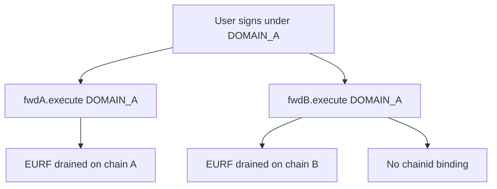

# Next Generation — Cross-chain signature replay via user-supplied domainSeparator

> **Reproduction:** self-contained Foundry PoC (forge-std only) — no fork.
> Full trace: [output.txt](output.txt).

<!-- non-defihacklabs -->
<!-- source-auditvault: https://github.com/Auditware/AuditVault/blob/main/findings/56703-h-01-cross-chain-signature-replay-attack-due-to-user-supplie.md -->
<!-- date: 2025-01 -->

**AuditVault taxonomy:** lang/solidity · platform/code4rena · severity/high · sector/bridge · genome: permit-fork-replay · replay · cross-chain-message

---

## Key info

| | |
|---|---|
| **Impact** | **HIGH** — domain A accepted on chain B → unauthorized EURF transfers cross-chain |
| **Protocol** | Next Generation |
| **Bug class** | User-supplied `domainSeparator` not bound to `block.chainid` |
| **Finding** | Code4rena 2025-01-next-generation H-01 · #56703 |
| **Report** | https://code4rena.com/reports/2025-01-next-generation |
| **Source** | [AuditVault](https://github.com/Auditware/AuditVault/blob/main/findings/56703-h-01-cross-chain-signature-replay-attack-due-to-user-supplie.md) |
| **Status** | Audit finding — reproduced as a standalone local synthetic |
| **Compiler** | `^0.8.24` (PoC) |

---

## TL;DR

`_verifySig` takes `domainSeparator` from the caller. Two chain deployments both accept the same domain label; independent nonces allow draining EURF on each chain under that domain.

**HARM:** attacker receives full user EURF balance on both modeled chains.

---

## Root cause

Domain separator is not computed on-chain with `chainid` / verifyingContract; no deadline.

## Preconditions

Same CREATE2-style deployment intent across chains; user has matching nonces and balances.

## Attack walkthrough

Execute meta-tx on chain A with DOMAIN_A → replay DOMAIN_A on chain B for independent nonce 0.

## Diagrams

## Impact

Cross-chain unauthorized transfers of EURF via gasless forwarder.

## Sources

- [AuditVault finding](https://github.com/Auditware/AuditVault/blob/main/findings/56703-h-01-cross-chain-signature-replay-attack-due-to-user-supplie.md)
- Report: https://code4rena.com/reports/2025-01-next-generation
- Reduced source provenance: github.com/code-423n4/2025-01-next-generation@499cfa50 contracts/Forwarder.sol
