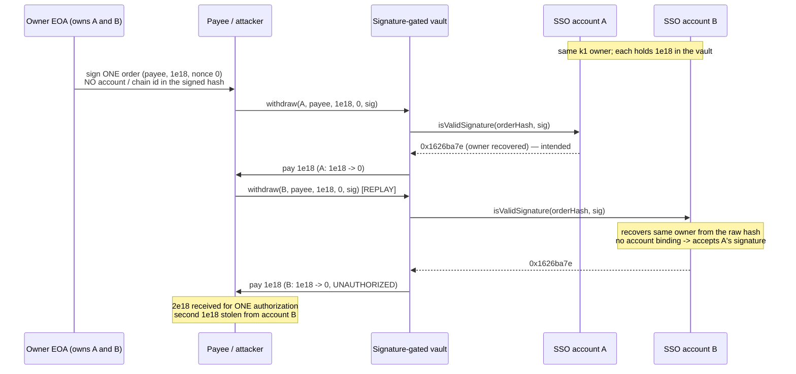

# zkSync SSO `ERC1271Handler.isValidSignature` accepts an owner signature with no account/chain binding (replay)

> **Vulnerability classes:** vuln/signature/replay · vuln/account/erc1271 · impact/loss-of-funds
>
> **Reproduction:** the test deploys the REAL audited `ERC1271Handler` (byte-identical,
> pulling in the real `OwnerManager` k1-owner set), has an owner EOA produce a genuinely-valid
> 65-byte ECDSA signature (the test holds the owner key — the finding is the MISSING binding,
> not the crypto), and replays that single signature against a SECOND account owned by the same
> EOA and against a different chain id — draining a second account through a real ERC-1271
> consumer that the owner never authorized.

<!-- source-auditvault: https://github.com/Auditware/AuditVault/blob/main/findings/56710-potential-signature-replay-attack-in-erc1271handler-openzepp.md -->
<!-- date: 2025 -->

## Root cause

`ERC1271Handler.isValidSignature(bytes32 hash, bytes signature)`
([`src/handlers/ERC1271Handler.sol`](src/handlers/ERC1271Handler.sol#L25)) validates a
65-byte EOA owner signature like this:

```solidity
if (signature.length == 65) {
  (address signer, ECDSA.RecoverError err) = ECDSA.tryRecover(hash, signature);
  return
    signer == address(0) || err != ECDSA.RecoverError.NoError || !_isK1Owner(signer) ? bytes4(0) : _ERC1271_MAGIC;
}
```

The signer is recovered directly from the **raw `hash`** and the only additional check is
`_isK1Owner(signer)`. There is **no binding to the verifying account and no binding to the
chain id**. A recent change removed the EIP-712 typed-data wrapping (`_hashTypedDataV4`, which
mixed in `block.chainid` and `address(this)`), so the same digest is accepted:

- **across every account the owner controls** — an EOA that owns several SSO accounts produces
  one signature that validates on *all* of them (`_isK1Owner(signer)` is true on each); and
- **across chains** — the same account address on chain A and chain B validates the identical
  signature, because the chain id is no longer part of the signed material.

ERC-1271 consumers cannot compensate for this: a consumer that (reasonably) hashes an order
without the paying account, or that deploys at the same address on two chains, produces the
same digest for both contexts. The account is the only layer that can bind the signature to
`(account, chainid)`, and it does not. The fix (finding's recommendation, later Matter Labs
PR #439) is ERC-7739 defensive rehashing, which nests the digest under an EIP-712 domain
carrying the account address and chain id.

## Exploit walkthrough (numbers from the test)

An owner EOA controls two real SSO accounts, `A` and `B`. A signature-gated vault credits
each account with `1e18` of funds and pays out on a valid ERC-1271 signature over an order
`= keccak256(abi.encode(payee, amount, nonce))`. The vault keeps its OWN per-account replay
guard (keyed by `(account, orderHash)`) — the standard thing a careful integrator does — and
relies on the account to bind the signature to itself.

1. **One authorization.** The owner signs a single order "pay `1e18` to the payee, nonce 0".
   The order does not name a paying account (the account is supposed to bind that).
2. **Authorized settlement from A.** `vault.withdraw(A, payee, 1e18, 0, sig)` succeeds —
   `A.isValidSignature(orderHash, sig) == 0x1626ba7e`. Account `A` pays out `1e18` (intended).
3. **Replay against B.** `vault.withdraw(B, payee, 1e18, 0, sig)` reuses the *identical*
   signature. The vault's per-account guard does not stop it (different account key), and
   `B.isValidSignature(orderHash, sig)` also returns the magic value because `B` shares the
   owner and performs no account binding. Account `B` is drained: **`1e18 → 0`.**
4. **Harm.** One owner signature produced two payouts; the second `1e18` is **stolen from
   account B**, which the owner never authorized to pay anything.

`test_CrossChainReplay_SameAccount` additionally proves the chain-id half: the same account
returns `0x1626ba7e` for the identical signature under `chainId = 1` and `chainId = 137`, and
a chain-1 signature drains the account's chain-137 balance.

`test_Fix_BindsAccountAndChain_RejectsReplay` is the negative control: with the finding's fix
(bind `block.chainid + address(this)` into the signed digest, ERC-7739 style), account `B`
rejects the replayed signature (`isValidSignature` returns `0`) and the vault withdrawal
reverts `"vault: bad sig"` — proving the loss is caused by the missing binding, not the setup.

## Reproduction

```bash
cd 56710-potential-signature-replay-attack-in-erc1271handler-openzepp_exp
../_shared/run-poc/run_poc.sh 56710-potential-signature-replay-attack-in-erc1271handler-openzepp_exp -vvvvv
```

Expected result: `4 passed`. `test_CrossAccountReplay_DrainsSecondAccount` asserts account B's
`1e18` is drained by a signature the owner only ever produced once (payee doubles the payout
to `2e18`); `test_CrossChainReplay_SameAccount` asserts the signature is valid across chain
ids; `test_Fix_BindsAccountAndChain_RejectsReplay` asserts the bound (fixed) account rejects
the replay; `testFuzz_CrossAccountReplay` asserts the replay drains B for any payee/amount/nonce.
See [`test/56710-potential-signature-replay-attack-in-erc1271handler-openzepp_exp.sol`](test/56710-potential-signature-replay-attack-in-erc1271handler-openzepp_exp.sol).



## Sources

- [AuditVault finding #56710](https://github.com/Auditware/AuditVault/blob/main/findings/56710-potential-signature-replay-attack-in-erc1271handler-openzepp.md)
- [OpenZeppelin — SSO Account OIDC Recovery Solidity Audit](https://blog.openzeppelin.com/sso-account-oidc-recovery-solidity-audit)
- [`ERC1271Handler.isValidSignature` @ audited commit ed21d09](https://github.com/matter-labs/zksync-sso-clave-contracts/blob/ed21d09add8da99d9c82d0f7c30659625c6636e6/src/handlers/ERC1271Handler.sol#L25)
- [EIP-712 removal in the alternative validation method (PR #391)](https://github.com/matter-labs/zksync-sso-clave-contracts/pull/391/files)
- [Fix: ERC-7739 via Solady ERC1271 (PR #439)](https://github.com/matter-labs/zksync-sso-clave-contracts/pull/439)
- [ERC-7739 — defensive rehashing for ERC-1271](https://eips.ethereum.org/EIPS/eip-7739)
