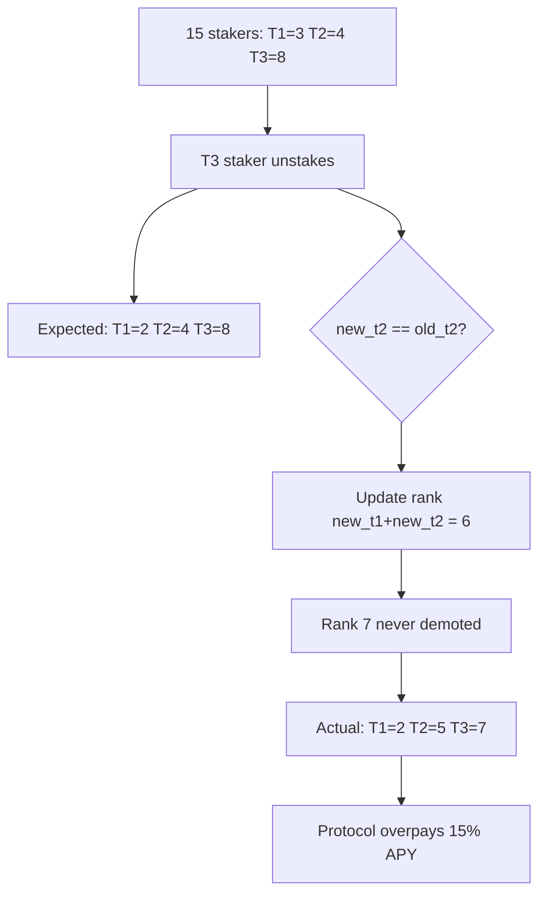

# LayerEdge — Incorrect tier tracking when tier 3 staker exits

> **Vulnerability classes:** cross-contract-state-consistency · direct-drain · reward-accounting

> **Reproduction:** self-contained Foundry PoC with **only `forge-std`** — no fork.
> Full trace: [output.txt](output.txt). PoC:
> [test/56947-h-1-incorrect-tier-tracking-when-tier-3-staker-exits-in-a-ce_exp.sol](test/56947-h-1-incorrect-tier-tracking-when-tier-3-staker-exits-in-a-ce_exp.sol).

<!-- non-defihacklabs -->
<!-- source-auditvault: https://github.com/Auditware/AuditVault/blob/main/findings/56947-h-1-incorrect-tier-tracking-when-tier-3-staker-exits-in-a-ce.md -->
<!-- date: 2025-05 -->

---

## Key info

| | |
|---|---|
| **Impact** | **HIGH** — one extra Tier-2 forever; protocol overpays APY (15% of MIN_STAKE / year) |
| **Protocol** | LayerEdge Staking |
| **Vulnerable code** | `LayerEdgeStaking._checkBoundariesAndRecord` — `isRemoval` branch when `new_t2 == old_t2` |
| **Bug class** | Off-by-one tier boundary on T3 exit |
| **Finding** | Sherlock 2025-05-layeredge · #56947 · H-1 · reporter **newspacexyz** |
| **Report** | [sherlock-audit/2025-05-layeredge-judging](https://github.com/sherlock-audit/2025-05-layeredge-judging) |
| **Source** | [AuditVault](https://github.com/Auditware/AuditVault/blob/main/findings/56947-h-1-incorrect-tier-tracking-when-tier-3-staker-exits-in-a-ce.md) |
| **Status** | Fixed in [Layer-Edge/edgen-staking#7](https://github.com/Layer-Edge/edgen-staking/pull/7) |
| **Compiler** | `^0.8.24` (PoC) |

---

## TL;DR

1. With 15 stakers, tiers are correctly (3, 4, 8).
2. A Tier-3 staker fully unstakes → expected (2, 4, 8).
3. Because `new_t2 == old_t2`, the removal path only rewrites rank `new_t1 + new_t2` (6).
4. Rank 7 (the true last Tier-2) is never demoted → live tiers become **(2, 5, 7)**.
5. Protocol pays 35% APY to one extra staker instead of 20% → **450 EDGEN / year** overpay on MIN_STAKE.

---

## The vulnerable code

```solidity
// Handle case where Tier 2 count stays the same
else if (isRemoval) {
    _findAndRecordTierChange(new_t1 + new_t2, n); // @> VULN
    // FIX: _findAndRecordTierChange(old_t1 + old_t2, n);
}
```

From `edgen-staking/src/stake/LayerEdgeStaking.sol` (Sherlock audit commit).

---

## Root cause

On removal, when the Tier-2 *count* is unchanged, the code assumes the demotion boundary is `new_t1 + new_t2`. That is correct only when a T1/T2 staker left (shrinking the current T1+T2 set). When a **T3** leaves, the current T1+T2 set is still the *old* size, so the staker who must demote is at rank `old_t1 + old_t2`.

---

## Preconditions

- Enough stakers that a T3 exit keeps `new_t2 == old_t2` (classic: 15 → 14).
- Exiting user is currently Tier-3 (below the T1+T2 boundary).

---

## Attack walkthrough

1. Stake 15 users at MIN_STAKE → tiers 3/4/8 (add path fixed for a consistent start).
2. Rank-10 (T3) unstakes fully.
3. Boundary handler writes rank 6 only; rank 7 stays T2.
4. Measure one-year overpay on the extra T2: `MIN_STAKE * 15% = 450e18`.

---

## Diagrams



---

## Impact

Incorrect tier tracking; protocol treasury pays higher Tier-2 APY to one staker who should be Tier-3. Ongoing until a later rebalance happens to touch the correct rank.

---

## Taxonomy

- `genome: cross-contract-state-consistency`, `direct-drain`
- `severity/high` · `sector/staking` · `platform/sherlock`

---

## Sources

- [AuditVault finding #56947](https://github.com/Auditware/AuditVault/blob/main/findings/56947-h-1-incorrect-tier-tracking-when-tier-3-staker-exits-in-a-ce.md)
- [Sherlock judging issue #83](https://github.com/sherlock-audit/2025-05-layeredge-judging/issues/83)
- Vulnerable source: `sherlock-audit/2025-05-layeredge` → `edgen-staking/src/stake/LayerEdgeStaking.sol` (`_checkBoundariesAndRecord`)
- Fix: [Layer-Edge/edgen-staking#7](https://github.com/Layer-Edge/edgen-staking/pull/7)
