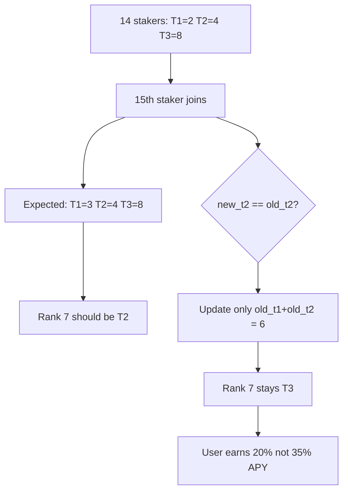

# LayerEdge — When stakerCountInTree increases, some users receive less interest

> **Vulnerability classes:** reward-accounting · logic/reward-calculation · fix-arithmetic

> **Reproduction:** self-contained Foundry PoC with **only `forge-std`** — no fork.
> Full trace: [output.txt](output.txt). PoC:
> [test/56948-h-2-when-stakercountintree-increases-some-users-may-receive_exp.sol](test/56948-h-2-when-stakercountintree-increases-some-users-may-receive_exp.sol).

<!-- non-defihacklabs -->
<!-- source-auditvault: https://github.com/Auditware/AuditVault/blob/main/findings/56948-h-2-when-stakercountintree-increases-some-users-may-receive.md -->
<!-- date: 2025-05 -->

---

## Key info

| | |
|---|---|
| **Impact** | **HIGH** — rank-7 staker stuck on Tier-3, earns 20% APY instead of 35% |
| **Protocol** | LayerEdge Staking |
| **Vulnerable code** | `LayerEdgeStaking._checkBoundariesAndRecord` — `!isRemoval` branch when `new_t2 == old_t2` |
| **Bug class** | Missed promotion at new T2 boundary on stake |
| **Finding** | Sherlock 2025-05-layeredge · #56948 · H-2 · reporter **lukris02** |
| **Report** | [sherlock-audit/2025-05-layeredge-judging](https://github.com/sherlock-audit/2025-05-layeredge-judging) |
| **Source** | [AuditVault](https://github.com/Auditware/AuditVault/blob/main/findings/56948-h-2-when-stakercountintree-increases-some-users-may-receive.md) |
| **Status** | Valid high; mitigation proposed in finding |
| **Compiler** | `^0.8.24` (PoC) |

---

## TL;DR

1. Staking grows from 14 → 15 users: tiers should go (2,4,8) → (3,4,8).
2. Rank 7 must promote T3 → T2.
3. Because `new_t2 == old_t2`, the add path only updates `old_t1 + old_t2` (rank 6).
4. Rank 7 stays Tier-3 → **20% APY instead of 35%** → **450 EDGEN underpaid per year** on MIN_STAKE.

---

## The vulnerable code

```solidity
} else if (!isRemoval) {
    _findAndRecordTierChange(old_t1 + old_t2, n); // @> VULN
    // FIX: _findAndRecordTierChange(new_t1 + new_t2, n);
}
```

From `edgen-staking/src/stake/LayerEdgeStaking.sol#L896-897` (Sherlock audit tree).

---

## Root cause

When `stakerCountInTree` increases and the Tier-2 *count* is unchanged, the T1+T2 boundary can still move because Tier-1 grew. The code only refreshes the *old* boundary rank, missing the new boundary that should be promoted from T3 to T2.

---

## Preconditions

- A stake that increases `stakerCountInTree` where `new_t2 == old_t2` but `new_t1 + new_t2 > old_t1 + old_t2` (e.g. 14 → 15).

---

## Attack walkthrough

1. Stake 15 users in order (passes through the buggy 14→15 transition).
2. User at rank 7 still has stored Tier-3.
3. One-year claim at 20% APY pays 600e18 instead of 1050e18.
4. Shortfall **450e18** remains in the rewards reserve.

---

## Diagrams



---

## Impact

Eligible stakers permanently under-earn until some later boundary touch rewrites their tier. Concrete underpayment: 15 percentage points of stake per year.

---

## Taxonomy

- `genome: reward-accounting`, `logic/reward-calculation`, `loss-of-funds/reward-theft`
- `severity/high` · `sector/staking` · `platform/sherlock`

---

## Sources

- [AuditVault finding #56948](https://github.com/Auditware/AuditVault/blob/main/findings/56948-h-2-when-stakercountintree-increases-some-users-may-receive.md)
- [Sherlock judging issue #230](https://github.com/sherlock-audit/2025-05-layeredge-judging/issues/230)
- Vulnerable source: `sherlock-audit/2025-05-layeredge` → `edgen-staking/src/stake/LayerEdgeStaking.sol#L896`
