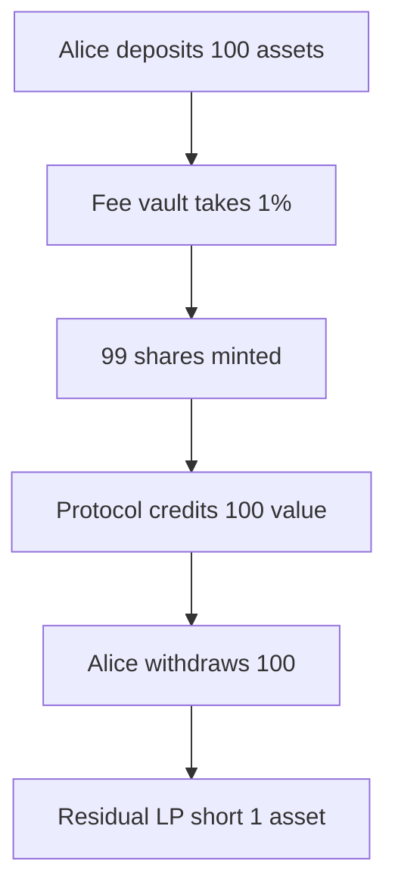

# Burve — Incorrect handling of ERC4626 vaults with fees

> **Vulnerability classes:** fee-accounting · direct-drain

> **Reproduction:** self-contained Foundry PoC, offline, forge-std only.
> Full trace: [output.txt](output.txt).

<!-- non-defihacklabs -->
<!-- source-auditvault: https://github.com/Auditware/AuditVault/blob/main/findings/56950-h-1-incorrect-handling-of-erc4626-vaults-with-fees-sherlock.md -->
<!-- date: 2025-04 -->

---

## Key info

| | |
|---|---|
| **Impact** | **HIGH** — depositors extract full value while fee hole hits residual LPs |
| **Protocol** | Burve multi-token pool (ValueFacet → ERC4626 vertex) |
| **Vulnerable code** | `ValueFacet.addValue` deposits exact `realNeeded` into fee-taking ERC4626 |
| **Bug class** | Fee-on-deposit not covered / not accounted |
| **Finding** | Sherlock 2025-04-burve · #56950 · H-1 · newspacexyz et al. |
| **Report** | [sherlock-audit/2025-04-burve-judging](https://github.com/sherlock-audit/2025-04-burve-judging) |
| **Fix** | [itos-finance/Burve#71](https://github.com/itos-finance/Burve/pull/71) |
| **Compiler** | `^0.8.24` (PoC) |

---

## TL;DR

1. Pool deposits user tokens into an ERC4626 that takes a 1% deposit fee.
2. Protocol still credits full `value` despite fewer shares minted.
3. User withdraws full credited value; 1% hole is socialized onto residual LPs.
4. **HARM:** residual insolvency (seed short 1e18 after Alice's round-trip).

---

## The vulnerable code

```solidity
function addValue(address recipient, uint256 value) external {
    token.transferFrom(msg.sender, address(this), realNeeded);
    vault.deposit(realNeeded, address(this)); // @> VULN: no fee coverage; full value credited
    valueOf[recipient] += value;
    totalValue += value;
}
```

**Fix:** transfer extra tokens to cover fees, or credit only net shares.

---

## Root cause

Nominal value is booked 1:1 with pre-fee assets; vault fee is ignored.

## Attack walkthrough

1. Seed pool: 1000 assets = 1000 value.
2. Alice deposits 100; vault mints 99 shares; Alice credited 100 value.
3. Alice withdraws 100 → redeems 100 shares from residual.
4. **HARM:** seed left with 999 assets against 1000 credited value.

## Diagrams



## Impact

Users avoid underlying vault fees; last withdrawers eat the shortfall.

## Sources

- [AuditVault finding #56950](https://github.com/Auditware/AuditVault/blob/main/findings/56950-h-1-incorrect-handling-of-erc4626-vaults-with-fees-sherlock.md)
- [Sherlock issue #70](https://github.com/sherlock-audit/2025-04-burve-judging/issues/70)
- Source: `sherlock-audit/2025-04-burve@44cba36` ValueFacet.sol
