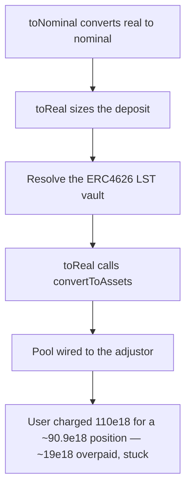

# Burve: `ERC4626ViewAdjustor` reverses `toNominal`/`toReal`, inflating LST deposits

> **Vulnerability classes:** vuln/logic · vuln/accounting
>
> **Reproduction:** a faithful minimal reproduction of the vulnerable finding — the `toNominal`/`toReal` conversion helpers are reproduced **verbatim** (the vulnerable line marked `@>`) with faithful minimal doubles (an ERC4626 LST vault with a real 1.1x peg and a pool that sizes a single-token deposit via `toReal`); local deploy, no fork.

<!-- source-auditvault: https://github.com/sherlock-audit/2025-04-burve-judging/issues/113 -->

## Root cause

The adjustor's two conversion helpers are swapped: `toNominal` (real→nominal) calls `convertToShares` and `toReal` (nominal→real) calls `convertToAssets`, so every conversion applies the ERC4626 share/asset peg in the *wrong* direction. When the pool sizes a single-token LST deposit through `toReal`, it therefore pulls roughly `1.1x` too many shares from the user. The two helpers, reproduced verbatim from the finding:

```solidity
    function toNominal(
        address token,
        uint256 real,
        bool
    ) external view returns (uint256 nominal) {
        IERC4626 vault = getVault(token);
        return vault.convertToShares(real);
    }

    function toReal(
        address token,
        uint256 nominal,
        bool
    ) external view returns (uint256 real) {
        IERC4626 vault = getVault(token);
@>      return vault.convertToAssets(nominal);
    }
```

`toReal` is meant to convert a nominal (base-denominated) value into the real share amount, which requires `convertToShares`. Returning `convertToAssets` instead inflates the result: the pool pulls the inflated share amount straight from the user.

## Why it's exploitable here

Following the finding's worked example, with an LST vault where `1 share = 1.1 base tokens` (`convertToAssets(x) = x * 1.1`, `convertToShares(x) = x / 1.1`):

1. Alice adds `100e18` of nominal value via a single LST token. The pool calls `toReal(100e18)` to size the real share amount to pull.
2. The fair amount is `convertToShares(100e18) = 100e18 / 1.1 ≈ 90.9e18` shares.
3. The buggy `toReal` returns `convertToAssets(100e18) = 110e18` shares instead — the peg applied backwards.
4. `addValueSingle` pulls the full `110e18` shares from Alice. She is charged `110e18` for a position worth only `~90.9e18`, overpaying `~19.09e18` shares that sit stuck in the pool — a direct loss of funds.

## Attack path



## Marked-line walkthrough (Playground)

The EVM Playground pins each step to the exact executed source line in `0xbd4fd5a3…`:

1. **L133** — toNominal converts real to nominal: toNominal is declared to turn a real (share) amount into a nominal (base) value; like toReal, its conversion body is wired backwards.
2. **L138** — toReal sizes the deposit: The pool calls toReal to convert the nominal value it wants to add into the real share amount to pull from the user.
3. **L139** — Resolve the ERC4626 LST vault: toReal resolves the ERC4626 LST vault for the token so it can query the peg between shares and assets.
4. **L140** — toReal calls convertToAssets: Root cause: toReal (nominal-to-real) returns convertToAssets instead of convertToShares, applying the peg backwards so the required share amount is inflated ~1.1x.
5. **L150** — Pool wired to the adjustor: Setup: the pool manager stores the E4626ViewAdjustor it will use to size single-token LST deposits.
6. **L154** — addValueSingle pulls inflated shares: addValueSingle sizes the deposit via the buggy toReal and pulls 110e18 shares for a ~90.9e18 position, so the user overpays ~19e18 shares.

## PoC

Registry (Foundry, local deploy — verbatim vulnerable source + harm-asserting test):

```bash
cd 56951-burve-incorrect-implementation-of-erc4626viewadjustor_exp && forge test -vvv
```

The browser Playground replays the same synthetic opcode-for-opcode and measures the harm: **add 100e18 of nominal value, get charged the inflated 110e18 shares instead of the fair ~90.9e18, overpaying ~19e18 shares stuck in the pool**. Both gates are green (registry `forge test` PASS + Playground `_verify-poc` **VERDICT: PASS**).
