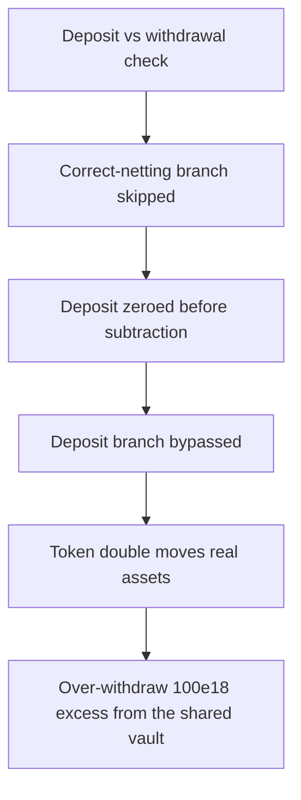

# Burve: incorrect netting zeroes the deposit and over-withdraws

> **Vulnerability classes:** vuln/logic · vuln/accounting
>
> **Reproduction:** a faithful minimal reproduction of the vulnerable finding — the vulnerable `commit` netting branch is reproduced **verbatim** (marked `@>`) with faithful minimal ERC20/ERC4626 doubles; local deploy, no fork.

<!-- source-auditvault: https://github.com/sherlock-audit/2025-04-burve-judging/issues/174 -->

## Root cause

When `commit` has both a pending deposit and a pending withdrawal, it tries to net them so the vault only moves (and pays fees on) the difference. In the `assetsToWithdraw > assetsToDeposit` branch it sets `assetsToDeposit = 0` **before** the next line subtracts it, so `assetsToWithdraw -= assetsToDeposit` subtracts 0 — the netting is a no-op and the full withdrawal is executed. The verbatim vulnerable source:

```solidity
function commit(VaultE4626 storage self, VaultTemp memory temp) internal {
        uint256 assetsToDeposit = temp.vars[1];
        uint256 assetsToWithdraw = temp.vars[2];

        if (assetsToDeposit > 0 && assetsToWithdraw > 0) {
            // We can net out and save ourselves some fees.
            if (assetsToDeposit > assetsToWithdraw) {
                assetsToDeposit -= assetsToWithdraw;
                assetsToWithdraw = 0;
            } else if (assetsToWithdraw > assetsToDeposit) {
                assetsToDeposit = 0;  // @> zeroes the deposit BEFORE the next line subtracts it → netting is a no-op
                assetsToWithdraw -= assetsToDeposit;
            } else {
                // Perfect net!
                return;
            }
        }

        if (assetsToDeposit > 0) {
            // Temporary approve the deposit.
            SafeERC20.forceApprove(
                self.token,
                address(self.vault),
                assetsToDeposit
            );
            self.totalVaultShares += self.vault.deposit(
                assetsToDeposit,
                address(this)
            );
            SafeERC20.forceApprove(self.token, address(self.vault), 0);
        } else if (assetsToWithdraw > 0) {
            // We don't need to hyper-optimize the receiver.
            self.totalVaultShares -= self.vault.withdraw(
                assetsToWithdraw,
                address(this),
                address(this)
            );
        }
    }
```

Because `assetsToDeposit` is 0 after the swap-ordered lines, the `if (assetsToDeposit > 0)` deposit branch is skipped and the `else if (assetsToWithdraw > 0)` branch withdraws the **full** `assetsToWithdraw`, never the net amount.

## Why it's exploitable here

Following the finding's preconditions — both a pending deposit and a larger pending withdrawal at commit time — with the reproduction's concrete values:

1. The shared ERC4626 vault holds `BACKING = 1000e18` assets owned by the closure.
2. A pending deposit of `100e18` (`temp.vars[1]`) and a pending withdrawal of `300e18` (`temp.vars[2]`) are both queued — `assetsToWithdraw > assetsToDeposit`.
3. Correct netting would withdraw only `300e18 - 100e18 = 200e18`. Instead the bug leaves `assetsToWithdraw = 300e18` and withdraws the full amount.
4. `commit` pulls `300e18` out of the shared vault and over-decrements `totalVaultShares` by `300e18` — an excess of `100e18` (exactly the pending-deposit size) that should have been netted against the queued deposit rather than drained. On a vault that charges withdrawal fees, the protocol also pays fees on the full `300e18` instead of the `200e18` net.

## Attack path



## Marked-line walkthrough (Playground)

The EVM Playground pins each step to the exact executed source line in `0xce01759b…`:

1. **L82** — Deposit vs withdrawal check: commit() has a pending deposit (100e18) and a larger pending withdrawal (300e18), and first tests whether the deposit is the bigger side.
2. **L83** — Correct-netting branch skipped: This branch would net correctly by subtracting the withdrawal from the deposit, but the withdrawal (300e18) is larger, so it is skipped.
3. **L86** — Deposit zeroed before subtraction: Root cause: assetsToDeposit is set to 0 BEFORE the next line runs assetsToWithdraw -= assetsToDeposit, so it subtracts 0 and no netting occurs.
4. **L103** — Deposit branch bypassed: With the deposit now 0, the deposit-to-address(this) branch is skipped and commit falls through to withdraw the full 300e18 instead of the net 200e18.
5. **L127** — Token double moves real assets: Setup: the MiniToken ERC20 double performs real transfers, so the un-netted withdrawal pulls 100e18 of genuine assets out of the shared vault.
6. **L218** — Excess drain measured at sink: The 100e18 excess — the pending deposit that should have netted away — is minted to the SINK address, quantifying the over-withdrawal drain.

## PoC

Registry (Foundry, local deploy — verbatim vulnerable source + harm-asserting test):

```bash
cd 56952-burve-incorrect-netting-logic-leads-to-excessive-withdrawal-amounts_exp && forge test -vvv
```

The browser Playground replays the same synthetic opcode-for-opcode and measures the harm: **a queued 100e18 deposit + 300e18 withdrawal net to nothing, so commit withdraws the full 300e18 and over-drains the shared vault by 100e18**. Both gates are green (registry `forge test` PASS + Playground `_verify-poc` **VERDICT: PASS**).
