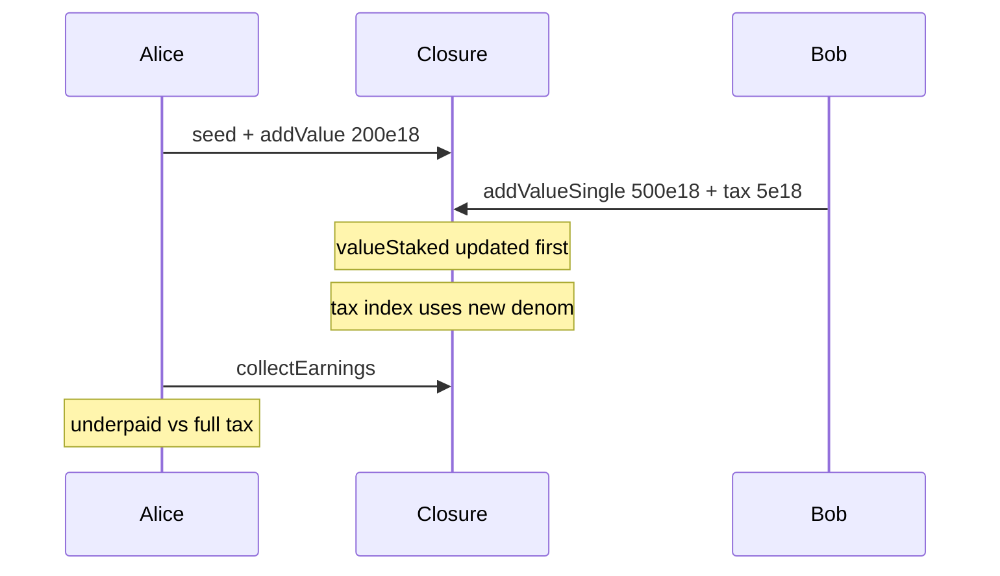

# Burve — Incorrect tax distribution when adding value single-sided

> **Vulnerability classes:** fee-accounting · reward-accounting · logic/fee-calculation

> **Reproduction:** self-contained Foundry PoC, offline, forge-std only.
> Full trace: [output.txt](output.txt).

<!-- non-defihacklabs -->
<!-- source-auditvault: https://github.com/Auditware/AuditVault/blob/main/findings/56953-h-4-incorrect-tax-distribution-when-adding-value-single-side.md -->
<!-- date: 2025-04 -->

---

## Key info

| | |
|---|---|
| **Impact** | **HIGH** — single-sided tax diluted; existing LPs underpaid; excess stuck |
| **Protocol** | Burve Closure / ValueFacet |
| **Vulnerable code** | `valueStaked += value` before `addEarnings(tax)` |
| **Bug class** | Order-of-operations in reward index update |
| **Finding** | Sherlock 2025-04-burve · #56953 · H-4 · future et al. |
| **Report** | [sherlock-audit/2025-04-burve-judging](https://github.com/sherlock-audit/2025-04-burve-judging) |
| **Fix** | [itos-finance/Burve#76](https://github.com/itos-finance/Burve/pull/76) |
| **Compiler** | `^0.8.24` (PoC) |

---

## TL;DR

1. Single-sided adds charge a tax meant for existing LPs.
2. `valueStaked` is incremented **before** tax is written into `earningsPerValueX128`.
3. New LP is already in the denominator and captures part of their own tax.
4. **HARM:** material dilution of Alice's fair tax share (Bob accrues > 0 of own tax).

---

## The vulnerable code

```solidity
valueOf[recipient] += value;
valueStaked += value; // @> VULN: updated BEFORE tax distribution
_addEarnings(tax);
// ...
earningsPerValueX128 += (tax << 128) / valueStaked; // @> VULN: includes new LP
```

**Fix:** distribute tax against previous `valueStaked`, then increment.

---

## Attack walkthrough

1. Seed + Alice stake 200e18 total; Alice holds 100% of prior stake.
2. Bob single-sides 500e18 with 1% tax (5e18).
3. Index uses denom 700e18 → Alice gets ~200/700 of tax; Bob accrues the rest.
4. **HARM:** Alice diluted by more than half of the tax she should fully receive.

## Diagrams



## Impact

Uneven fee distribution; disincentive to provide value; excess fee accounting stuck.

## Sources

- [AuditVault finding #56953](https://github.com/Auditware/AuditVault/blob/main/findings/56953-h-4-incorrect-tax-distribution-when-adding-value-single-side.md)
- [Sherlock issue #196](https://github.com/sherlock-audit/2025-04-burve-judging/issues/196)
- Source: `sherlock-audit/2025-04-burve@44cba36` Closure.sol
