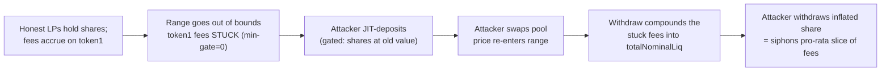

# Burve: an attacker captures unclaimed fees by timing a deposit around range re-entry

> **Vulnerability classes:** jit-liquidity · fee-accounting · frontrun/sandwich · share-inflation
>
> **Reproduction:** deploys the REAL audited Burve single-pool wrapper
> (`single/Burve.sol` at the Sherlock `2025-04-burve` audited commit
> `44cba36e2a0c3cd7b6999459bf7746db92f8cc0a`) with a faithful minimal Uniswap V3
> pool double for the opaque DEX venue (mint/burn amounts use the REAL vendored
> Uniswap `LiquidityAmounts` + `TickMath` math at a settable price) and minimal
> real ERC20s for the opaque tokens. Every line of Burve's fee-compounding and
> share accounting runs unmodified. No mainnet fork.

<!-- source-auditvault: https://github.com/Auditware/AuditVault/blob/main/findings/56954-h-5-attacker-captures-unclaimed-fees-by-timing-deposit-with.md -->
<!-- date: 2025-04 -->

## Root cause

Burve wraps a set of Uniswap V3 ranges and issues its own share token. Whenever a
user mints or burns, `compoundV3Ranges()` first collects the position's accrued
fees and folds them back into the position as **new liquidity added to
`totalNominalLiq` without minting new shares** — that is how fees are distributed
to shareholders (value-per-share rises).

The amount of fee liquidity that can be compounded is computed by
[`collectAndCalcCompound()`](src/single/Burve.sol#L848-L920), which is **min-gated
by BOTH tokens**:

```solidity
uint256 nominalLiq0 = amount0InUnitLiqX64 > 0 ? (collected0 << 64) / amount0InUnitLiqX64 : type(uint128).max;
uint256 nominalLiq1 = amount1InUnitLiqX64 > 0 ? (collected1 << 64) / amount1InUnitLiqX64 : type(uint128).max;
uint256 unsafeNominalLiq = nominalLiq0 < nominalLiq1 ? nominalLiq0 : nominalLiq1; // @> min of both
```

While the Burve range is **out of the underlying pool's range**, only one token is
usable to add liquidity, so the accrued fees sitting on the *other* token cannot be
compounded: `unsafeNominalLiq` collapses to ~0 and those fees **pile up idle on the
contract**. Because Burve ranges are immutable, this state is common and persistent.

When the pool price moves back into (or through) the range, the stuck-side token
becomes usable and the whole batch of previously-accrued fees compounds **at the
next mint/burn**. An attacker front-runs that moment:

1. JIT-deposit while still out of range — the deposit-time compound is gated to
   zero, so the attacker mints shares at the *un-inflated* `totalNominalLiq`.
2. Push the pool price back into the usable zone (a swap).
3. Immediately withdraw — the withdraw-time compound now converts the stuck fees
   into liquidity, inflating value-per-share, and the attacker redeems a pro-rata
   slice of fees **it was never an LP for**. Honest LPs who were present while the
   fees accrued are diluted by exactly that slice.



Vulnerable source: [`src/single/Burve.sol`](src/single/Burve.sol) — `collectAndCalcCompound()` / `compoundV3Ranges()`.

## Exploit walkthrough (real numbers, from the test)

State: a single range `[-60, 60]`, dead shares + honest LP `alice` holding 100,000
nominal-liq of shares, and **100 token1 of accrued fees** stuck on the contract
because the pool price is below the range (only token0 is usable).

1. Attacker JIT-deposits 40,000 nominal-liq (pays only token0, since below range).
   The deposit-time compound is gated — `totalNominalLiq` rises by exactly the
   attacker's own 40,000 and the 100 token1 fees stay idle on the contract.
2. Attacker pushes the pool price above the range (a swap).
3. Attacker withdraws. The withdraw-time compound converts the 100 token1 fees into
   liquidity, and the attacker redeems **28.37 token1 more than the fair (no-fee)
   value of its shares** — i.e. it captures **28.4%** (`40k / 141k` of total shares)
   of fees it never earned.

Controls proving the harm is the timing, not the setup:

- **No timing** (attacker withdraws while still out of range): captures **0** token1.
- **Honest-LP loss**: with an identical fee setup and identical price path, the
  honest LP `alice` withdraws **28.09 token1 less** when the attacker is present —
  matching the attacker's skim (the small remainder goes to the dead shares).

## Reproduction

```bash
cd 56954-h-5-attacker-captures-unclaimed-fees-by-timing-deposit-with_exp
forge test -vv
```

Expected: `3 passed`. See [`test/56954-h-5-attacker-captures-unclaimed-fees-by-timing-deposit-with_exp.sol`](test/56954-h-5-attacker-captures-unclaimed-fees-by-timing-deposit-with_exp.sol):
`test_attacker_capturesUnclaimedFees` (skim = 28.37 token1), `test_control_noTiming_noCapture`
(0 capture), and `test_honestLP_losesExactlyAttackerSkim` (honest LP loss == attacker skim).

## Sources

- [AuditVault finding #56954](https://github.com/Auditware/AuditVault/blob/main/findings/56954-h-5-attacker-captures-unclaimed-fees-by-timing-deposit-with.md)
- [Sherlock 2025-04-burve issue #288](https://github.com/sherlock-audit/2025-04-burve-judging/issues/288)
- [Audited `Burve.sol`](https://github.com/sherlock-audit/2025-04-burve/blob/44cba36e2a0c3cd7b6999459bf7746db92f8cc0a/Burve/src/single/Burve.sol#L848-L920)
