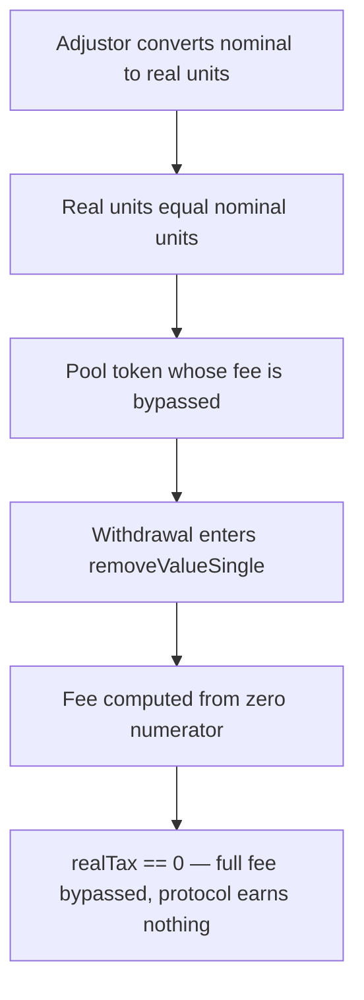

# Burve: Fee bypass in `ValueFacet.removeValueSingle`

> **Vulnerability classes:** vuln/logic · vuln/fee-calculation
>
> **Reproduction:** faithful minimal reproduction — the vulnerable fee computation of `removeValueSingle` is reproduced **verbatim** (marked `@>`) with faithful minimal doubles; local deploy, no fork.

<!-- source-auditvault: https://github.com/sherlock-audit/2025-04-burve-judging/issues/311 -->

## Root cause

In [`Burve/src/multi/facets/ValueFacet.sol`](https://github.com/sherlock-audit/2025-04-burve/blob/main/Burve/src/multi/facets/ValueFacet.sol#L214-L245) (`removeValueSingle`, L214-L245), the function's named return variable `removedBalance` is used as the numerator of the real-fee calculation **before it has been assigned** — so it is still `0`. `realTax` is therefore always `0`, no fee is collected, and the user is paid the full amount. The vulnerable lines, reproduced verbatim:

```solidity
function removeValueSingle(
    address recipient,
    uint16 _closureId,
    uint128 value,
    uint128 bgtValue,
    address token,
    uint128 minReceive
) external nonReentrant returns (uint256 removedBalance) {
    …
    (uint256 removedNominal, uint256 nominalTax) = c.removeValueSingle(
        value,
        bgtValue,
        vid
    );
    uint256 realRemoved = AdjustorLib.toReal(token, removedNominal, false);
    Store.vertex(vid).withdraw(cid, realRemoved, false);
    // BUG: removedBalance is still zero here
    uint256 realTax = FullMath.mulDiv(
@>      removedBalance,        // ← should be realRemoved
        nominalTax,
        removedNominal
    );
    c.addEarnings(vid, realTax);
    removedBalance = realRemoved - realTax;
    require(removedBalance >= minReceive, PastSlippageBounds());
    TransferHelper.safeTransfer(token, recipient, removedBalance);
}
```

`realTax = FullMath.mulDiv(removedBalance, nominalTax, removedNominal)` was intended to be `realTax = realRemoved * nominalTax / removedNominal`. Because `removedBalance` is still `0` at this point, `realTax == 0` always: `c.addEarnings(vid, 0)` collects nothing, and `removedBalance = realRemoved - 0` pays out the full amount.

## Why it's exploitable here

With a 1% fee (`FEE_RATE = 0.01e18`) and a single-token removal of `value = 1000e18`:

1. The closure fee accountant returns `removedNominal = 1000e18` and `nominalTax = 10e18` (the 1% fee that should be charged).
2. The 1:1 adjustor gives `realRemoved = 1000e18`, and the vertex reserve pays `1000e18` out to the facet.
3. `realTax = mulDiv(removedBalance /*==0*/, 10e18, 1000e18) = 0`, so `c.addEarnings(vid, 0)` starves the protocol fee pot.
4. `removedBalance = 1000e18 - 0 = 1000e18` is transferred to the user. The `10e18` fee the protocol was owed is bypassed entirely — 100% fee loss on every single-token removal.

## Attack path



## Marked-line walkthrough (Playground)

The EVM Playground pins each step to the exact executed source line in `0xbd4fd5a3…`:

1. **L52** — Adjustor converts nominal to real units: Setup: AdjustorLib.toReal maps a nominal removed amount to real token units — a 1:1 identity for this 18-decimal pool token.
2. **L53** — Real units equal nominal units: Setup: the adjustor returns the nominal amount unchanged, so realRemoved will equal removedNominal in this reproduction.
3. **L74** — Pool token whose fee is bypassed: Setup: MiniToken is the faithful ERC20 double for the single pool token whose removal fee the vulnerable facet fails to charge.
4. **L177** — Withdrawal enters removeValueSingle: Setup: removeValueSingle begins, wrapping the closure id for the single-token position the user is withdrawing.
5. **L186** — Fee computed from zero numerator: Root cause: realTax uses the still-unassigned return var removedBalance (== 0) as numerator instead of realRemoved, forcing the fee to zero.
6. **L188** — Real fee multiplied by zero: The intended fee nominalTax feeds mulDiv but is multiplied by the zero numerator, so addEarnings records nothing and the user keeps the full fee.

## PoC

Registry (Foundry, local deploy — verbatim vulnerable source + harm-asserting test):

```bash
cd 56955-burve-fee-bypass-in-valuefacet-removevaluesingle_exp && forge test -vvv
```

The browser Playground replays the same synthetic opcode-for-opcode and measures the harm: **remove 1000e18 single-token, the 1% (`10e18`) fee is collected as `0`, and the user is paid the full `1000e18`**. Both gates are green (registry `forge test` PASS + Playground `_verify-poc` **VERDICT: PASS**).
