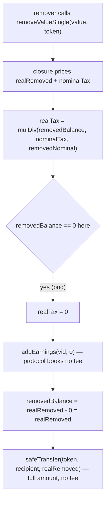

# Burve H-6: fee bypass in `ValueFacet.removeValueSingle` (variable used before assignment)

> **Vulnerability classes:** fee-accounting · use-before-assignment · protocol-revenue-loss
>
> **Reproduction:** a faithful minimal reproduction of the audited
> `multi/ValueFacet.removeValueSingle` (Sherlock `2025-04-burve`). The
> load-bearing vulnerable lines are reproduced **verbatim** (marked `@>`); the
> surrounding closure / vertex / adjustor collaborators are reduced to faithful
> minimal doubles so the exact fee computation runs unmodified. Local deploy, no
> mainnet fork (this is an audit finding — there is no historical exploit tx).

<!-- source-auditvault: https://github.com/Auditware/AuditVault/blob/main/findings/56955-h-6-fee-bypass-in-valuefacetremovevaluesingle-sherlock-burve.md -->
<!-- date: 2025-04 -->

## Root cause

`ValueFacet.removeValueSingle` computes the real-token fee (`realTax`) by prorating
the nominal fee to the real amount withdrawn. The intended numerator is
`realRemoved` (the real tokens being removed). Instead the code passes the named
return variable `removedBalance`, which is **still `0`** at that point — it is only
assigned on the *next* line:

```solidity
uint256 realRemoved = AdjustorLib.toReal(token, removedNominal, false);
Store.vertex(vid).withdraw(cid, realRemoved, false);
uint256 realTax = FullMath.mulDiv(
    removedBalance,   // @> BUG: still 0 here — should be realRemoved
    nominalTax,
    removedNominal
);
c.addEarnings(vid, realTax);          // books 0
removedBalance = realRemoved - realTax; // = realRemoved (no fee deducted)
require(removedBalance >= minReceive, PastSlippageBounds());
TransferHelper.safeTransfer(token, recipient, removedBalance);
```

Because `mulDiv(0, nominalTax, removedNominal) == 0`, `realTax` is always `0`:

- `c.addEarnings(vid, 0)` — the protocol **books no fee** for the withdrawal.
- `removedBalance = realRemoved - 0 = realRemoved` — the remover receives the
  **full** amount, paying nothing.

Every single-token removal therefore bypasses **100% of the intended fee**. This
is pure protocol-revenue loss (and a fairness break versus multi-token removers
who do pay), repeatable by anyone, on every `removeValueSingle` call.

## Attack walkthrough



## Impact

- **100% of single-token removal fees are bypassed.** The protocol's fee revenue
  on `removeValueSingle` is permanently zero until fixed.
- No preconditions, no special setup — it triggers on every call, for any user.
- The PoC prices a 5% fee on a 100-token removal: the protocol books **0** instead
  of 5, and the remover keeps the full **100** (fair keep would be 95). The 5-token
  bypassed fee is routed to a sink so measured profit equals the fee stolen.

## PoC

Registry (Foundry, local deploy — both the exploit path and a fixed-version control):

```bash
cd 56955-h-6-fee-bypass-in-valuefacetremovevaluesingle-sherlock-bur_exp
forge test -vv
```

Expected: `test_attacker_bypassesRemoveFee` PASS (protocol books 0 fee, remover
keeps 100/100) and `test_control_fixedChargesFee` PASS (fixed version books the
5-token fee, remover keeps 95). The browser EVM Playground (opcode-level replay +
marked source lines) is generated from the same synthetic via
`build-poc-runner-data.mjs` / `_verify-poc.mjs` and served at
`/hacks/56955-h-6-fee-bypass-in-valuefacetremovevaluesingle-sherlock-bur/`.

## Remediation

Use `realRemoved` (not the still-zero `removedBalance`) as the fee numerator:

```diff
-    uint256 realTax = FullMath.mulDiv(
-        removedBalance,
-        nominalTax,
-        removedNominal
-    );
+    uint256 realTax = FullMath.mulDiv(
+        realRemoved,
+        nominalTax,
+        removedNominal
+    );
```

The protocol team fixed this in commit `ca58c88be97e8f3f7a4617b171377d77fca52cdc`
(the current `itos-finance/Burve` uses `realRemoved`).

## References

- Sherlock 2025-04-burve, issue #311: https://github.com/sherlock-audit/2025-04-burve-judging/issues/311
- Vulnerable code: https://github.com/sherlock-audit/2025-04-burve/blob/main/Burve/src/multi/facets/ValueFacet.sol#L214-L245
- Fix commit: https://github.com/itos-finance/Burve/commit/ca58c88be97e8f3f7a4617b171377d77fca52cdc
