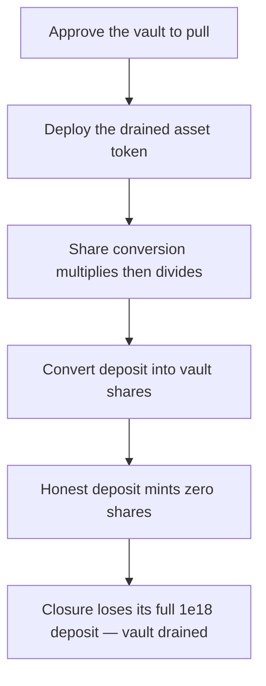

# Burve: `NoopVault` donation attack drains a Closure's assets

> **Vulnerability classes:** vuln/theft · vuln/erc4626-donation · mev/frontrun
>
> **Reproduction:** a faithful minimal reproduction of the vulnerable finding — the bare `NoopVault` vertex vault is reproduced **verbatim** (marked `@>`) with faithful minimal `ERC20`/`ERC4626` doubles that mirror OpenZeppelin's exact virtual-shares accounting; local deploy, no fork.

<!-- source-auditvault: https://github.com/sherlock-audit/2025-04-burve-judging/issues/387 -->

## Root cause

`NoopVault` is a bare OpenZeppelin `ERC4626` vertex vault with no donation protection — it seeds no initial share supply and adds no meaningful virtual-share offset (`_decimalsOffset` defaults to `0`). An attacker can front-run the vault's first use, mint the only share for 1 wei, then donate assets directly to inflate the share price, so the first honest Closure deposit mints zero shares and is lost. The vulnerable contract, reproduced verbatim:

```solidity
// SPDX-License-Identifier: BUSL-1.1
pragma solidity ^0.8.27;
import "openzeppelin-contracts/token/ERC20/extensions/ERC4626.sol";
import "openzeppelin-contracts/token/ERC20/ERC20.sol";

@>  contract NoopVault is ERC4626 {
    constructor(
        ERC20 asset,
        string memory name,
        string memory symbol
    ) ERC20(name, symbol) ERC4626(asset) {}
}
```

With no seeded supply and only the default `+1` virtual asset / `1` virtual share, the share-to-asset ratio is fully attacker-controllable on the first deposit.

## Why it's exploitable here

Following the finding's donation attack with the reproduction's concrete values:

1. The attacker front-runs the vault's first use: `deposit(1 wei)` mints the only share, so `totalSupply = 1` and `totalAssets = 1`.
2. The attacker donates `2e18` of the asset by a raw ERC20 `transfer` — no shares are minted, so `totalAssets` jumps to `2e18 + 1` while `totalSupply` stays `1`.
3. The honest Closure deposits `1e18`. `previewDeposit` computes `floor(1e18 × (1 + 1) / (2e18 + 1 + 1)) = floor(2e18 / (2e18 + 2)) = 0` shares.
4. The `1e18` still transfers into the vault, but the Closure holds `0` shares and redeems `0` — a full `1e18` loss. Repeated across every vertex, this drains the entire Closure.

## Attack path



## Marked-line walkthrough (Playground)

The EVM Playground pins each step to the exact executed source line in `0x671d353a…`:

1. **L50** — Approve the vault to pull: Setup: the ERC20 approve records an unlimited allowance so the vault can pull the caller's deposit — used for the attacker's 1-wei front-run.
2. **L84** — Deploy the drained asset token: Setup: the Exploit deploys the mintable BGT asset the attacker will front-run, donate into, and ultimately drain from the vault.
3. **L115** — Share conversion multiplies then divides: The vault's mulDiv forms assets × totalSupply, then divides by the donation-inflated totalAssets+1 — the math that floors the deposit to zero shares.
4. **L121** — Convert deposit into vault shares: previewDeposit routes through _convertToShares, valuing the 1e18 deposit against a totalAssets the attacker already inflated by a 2e18 donation.
5. **L137** — Honest deposit mints zero shares: The honest 1e18 deposit computes its shares BEFORE the asset transfers in, so the inflated price yields zero shares while the assets still move.
6. **L171** — Closure deposits into unguarded vault: Root cause: the honest Closure deposit enters the bare ERC4626 NoopVault (@> L159) with no virtual-share/donation guard, so its 1e18 mints zero shares.

## PoC

Registry (Foundry, local deploy — verbatim vulnerable source + harm-asserting test):

```bash
cd 56956-burve-noopvault-donation-attack-drains-assets-from-a-closure_exp && forge test -vvv
```

The browser Playground replays the same synthetic opcode-for-opcode and measures the harm: the attacker front-runs with 1 wei, donates 2e18, and the honest 1e18 Closure deposit mints **zero shares** and redeems nothing. Both gates are green (registry `forge test` PASS + Playground `_verify-poc` **VERDICT: PASS**).
