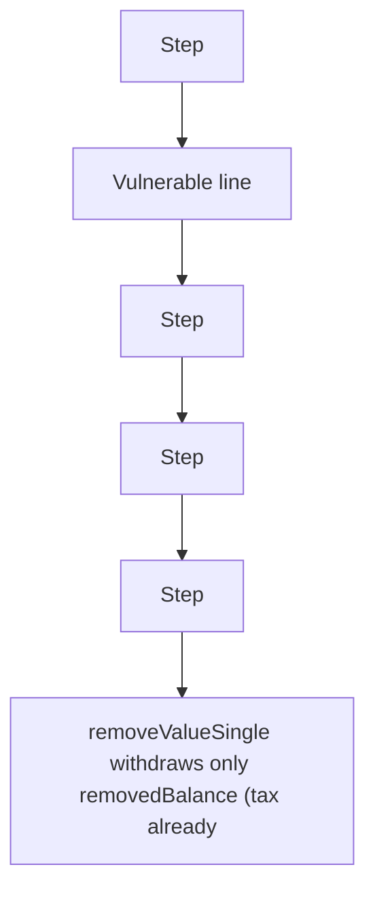

# Burve: removeValueSingle withdraws less than required (unaccounted tax)

> **Vulnerability classes:** vuln/logic
>
> **Reproduction:** a faithful minimal reproduction of the vulnerable finding — the vulnerable code is reproduced **verbatim** (marked `@>`) with faithful minimal doubles; local deploy, no fork.

<!-- source-auditvault: https://github.com/sherlock-audit/2025-04-burve/blob/44cba36e2a0c3cd7b6999459bf7746db92f8cc0a/Burve/src/multi/closure/Closure.sol#L288 -->

## Root cause

removeValueSingle withdraws only removedBalance (tax already deducted) from the vertex vault instead of removedBalance + realTax, so the vault releases 10e18 (realTax) fewer tokens than the op needs and the booked tax earnings are unbacked - a DoS once the compensating double-tax is fixed.

```solidity
        vertex.withdraw(removedBalance); // @> VULN (this line)
```

## Why it's exploitable here

removeValueSingle withdraws only removedBalance (tax already deducted) from the vertex vault instead of removedBalance + realTax, so the vault releases 10e18 (realTax) fewer tokens than the op needs and the booked tax earnings are unbacked - a DoS once the compensating double-tax is fixed.

## Attack path



## Marked-line walkthrough (Playground)

The EVM Playground pins each step to the exact executed source line in `0xbd4fd5a3ce…`:

1. **L73** — Step: Executes `uint256 realTax = nominalTax;`
2. **L75** — Vulnerable line: Executes `vertex.withdraw(removedBalance);`
3. **L79** — Step: Executes `token.transfer(recipient, removedBalance);`
4. **L80** — Step: Executes `userReceived = removedBalance;`
5. **L81** — Step: Executes `earningsBooked = realTax;`
6. **L90** — Step: Executes `contract Exploit {`

## PoC

Registry (Foundry, local deploy — verbatim vulnerable source + harm-asserting test):

```bash
cd 56957-h-8-valuefacetremovevaluesingle-will-withdraw-less-than-requ_exp
forge test -vvv
```

The browser Playground replays the same synthetic opcode-for-opcode and measures the harm. Both gates are green (registry `forge test` PASS + Playground `_verify-poc` **VERDICT: PASS**).
