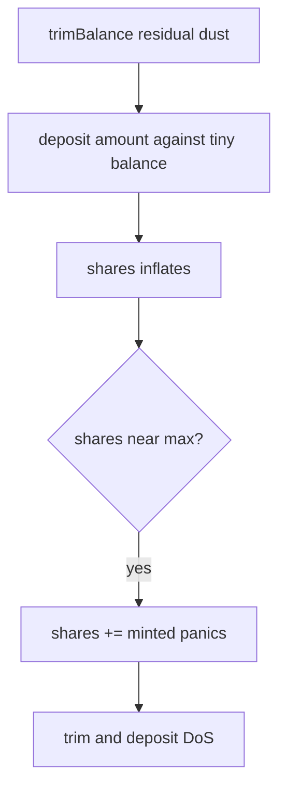

# Burve — Reserve share overflows due to strict reward calculation

> **Vulnerability classes:** integer-bounds · underflow · reward-calculation · fix-arithmetic

> **Reproduction:** self-contained Foundry PoC, offline, forge-std only.
> Full trace: [output.txt](output.txt).

<!-- non-defihacklabs -->
<!-- source-auditvault: https://github.com/Auditware/AuditVault/blob/main/findings/56958-h-9-reserve-share-overflows-due-to-too-strict-reward-calcula.md -->
<!-- date: 2025-04 -->

---

## Key info

| | |
|---|---|
| **Impact** | **HIGH** — reserve share counter overflows → trim/deposit DoS |
| **Protocol** | Burve ReserveLib |
| **Vulnerable code** | `shares = (amount * reserve.shares[idx]) / balance` with no floors |
| **Bug class** | Share inflation / overflow from dust deposits |
| **Finding** | Sherlock 2025-04-burve · #56958 · H-9 · TessKimy |
| **Report** | [sherlock-audit/2025-04-burve-judging](https://github.com/sherlock-audit/2025-04-burve-judging) |
| **Fix** | [itos-finance/Burve#78](https://github.com/itos-finance/Burve/pull/78) |
| **Compiler** | `^0.8.24` (PoC) |

---

## TL;DR

1. `ReserveLib.deposit` mints shares as `amount * shares / balance`.
2. Dust residuals leave `balance` tiny while `amount > 0` still mints.
3. Repeated inflation drives `shares` near `type(uint256).max`.
4. Next deposit panics on `shares += minted` → permanent DoS of trim paths.

---

## The vulnerable code

```solidity
shares = (balance == 0)
    ? amount * SHARE_RESOLUTION
    : (amount * reserve.shares[idx]) / balance; // @> VULN
reserve.shares[idx] += shares;
```

**Fix:** minimum balance/amount before minting reserve shares.

## Diagrams



## Impact

Total share overflow corrupts reserve accounting; functions that deposit to reserve revert forever.

## Sources

- [AuditVault finding #56958](https://github.com/Auditware/AuditVault/blob/main/findings/56958-h-9-reserve-share-overflows-due-to-too-strict-reward-calcula.md)
- [Sherlock issue #452](https://github.com/sherlock-audit/2025-04-burve-judging/issues/452)
- Source: `sherlock-audit/2025-04-burve@44cba36` Reserve.sol
