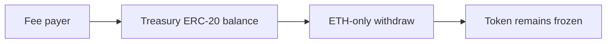

# ERC-20 fees are permanently locked in Treasury — frozen funds

> **Vulnerability classes:** vuln/dos/frozen-funds · vuln/logic/missing-check
>
> **Reproduction:** self-contained synthetic Foundry reduction; see [output.txt](output.txt).

<!-- non-defihacklabs -->
<!-- source-auditvault: https://github.com/Auditware/AuditVault/blob/main/findings/57056-erc-20-tokens-cannot-be-withdrawn-from-treasury-contract-tra.md -->
<!-- date: 2025-03 -->

## Key info

| Field | Value |
|---|---|
| **Loss** | ERC-20 fee balances sent to Treasury cannot be recovered |
| **Vulnerable contract** | `Treasury.withdraw` (ETH-only) |
| **Attacker EOA** | `0x1111111111111111111111111111111111111111` |
| **Attack contract** | `FeeToken` and `Treasury` via `Exploit` |
| **Attack tx** | `Exploit.run()` |
| **Chain / block / date** | Ethereum model · block 0 · 2025-03 |
| **Compiler** | `solc 0.8.24` (synthetic) |
| **Bug class** | Missing ERC-20 withdrawal path |

## TL;DR

The Treasury exposes a native-ETH withdrawal only. ERC-20 fee tokens accumulate at the contract and the attempted token recovery selector reverts, leaving the balance frozen.

## Background

Otim accepts registered ERC-20 fee tokens but the reviewed Treasury implementation only checks `address(this).balance`. This reduction models the asset-flow mismatch.

## The vulnerable code

```solidity
function withdraw(address target, uint256 value) external {
    (bool ok,) = payable(target).call{value: value}(""); // ETH only
    require(ok);
}
```

## Root cause

The contract has no owner-authorized `IERC20(token).transfer` recovery function, so token balances are not part of the withdrawal design.

## Preconditions

- Users pay fees with an ERC-20 accepted by the protocol.
- The token is transferred to Treasury.

## Attack walkthrough

1. `Exploit` mints 1,000 fee tokens to Treasury.
2. It calls the absent `withdrawToken` selector.
3. The `Proof` event at [output.txt:373](output.txt) shows all 1,000 tokens remain locked.

## Diagrams



## Remediation

Add an owner-authorized, checked ERC-20 withdrawal that rejects zero targets and emits an event; cover every supported fee asset with recovery tests.

## How to reproduce

```bash
cd evm-hack-registry/57056-erc-20-tokens-cannot-be-withdrawn-from-treasury-contract-tra_exp
forge test -vvvvv
```

## Sources

- [AuditVault finding](https://github.com/Auditware/AuditVault/blob/main/findings/57056-erc-20-tokens-cannot-be-withdrawn-from-treasury-contract-tra.md)
- [Trail of Bits Otim review](https://github.com/trailofbits/publications/blob/master/reviews/2025-03-otim-smart-wallet-securityreview.pdf)
- [Synthetic test](test/57056-erc-20-tokens-cannot-be-withdrawn-from-treasury-contract-tra.sol)

*Reference: https://github.com/trailofbits/publications/blob/master/reviews/2025-03-otim-smart-wallet-securityreview.pdf*
