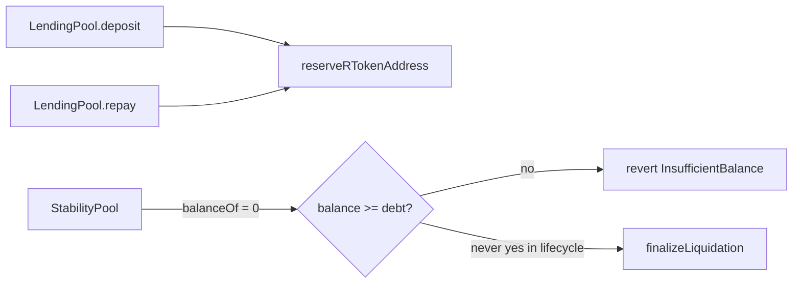

# Any attempt to liquidate a user will fail — StabilityPool never holds crvUSD

> **Vulnerability classes:** liquidation-logic · reward-accounting · permanent

> **Reproduction:** self-contained Foundry PoC with only `forge-std` — no fork.
> [output.txt](output.txt) · [test/57187-…_exp.sol](test/57187-any-attempt-to-liquidate-a-user-will-fail-because-stabilityp_exp.sol).

<!-- non-defihacklabs -->
<!-- source-auditvault: https://github.com/Auditware/AuditVault/blob/main/findings/57187-any-attempt-to-liquidate-a-user-will-fail-because-stabilityp.md -->
<!-- date: 2025-01 -->

**AuditVault taxonomy:** `lang/solidity` · `platform/codehawks` · `severity/high` · genome: `liquidation-logic` · `liquidation-underwater` · `permanent`

---

## Key info

| | |
|---|---|
| **Impact** | **HIGH** — every `liquidateBorrower` reverts `InsufficientBalance`; undercollateralized debt cannot be closed |
| **Protocol** | Core contracts (Codehawks) — `StabilityPool.liquidateBorrower` |
| **Vulnerable code** | Requires `crvUSDToken.balanceOf(this) >= scaledUserDebt` but SP never receives crvUSD |
| **Bug class** | Liquidity source mismatch / broken liquidation path |
| **Finding** | Codehawks · #57187 · reporter **s4muraii77** |
| **Report** | N/A (AuditVault capture) |
| **Source** | [AuditVault](https://github.com/Auditware/AuditVault/blob/main/findings/57187-any-attempt-to-liquidate-a-user-will-fail-because-stabilityp.md) |
| **Fix** | Hold crvUSD in SP, or pull from `reserveRTokenAddress` before repaying debt |
| **Compiler** | `^0.8.24` (PoC) |

---

## TL;DR

1. Operational deposits route crvUSD into the reserve, never into the StabilityPool.
2. A borrower has outstanding debt and should be liquidatable.
3. `liquidateBorrower` reads SP's crvUSD balance (always 0) and reverts `InsufficientBalance`.
4. Debt remains; solvency invariant is broken.

## Vulnerable code

```solidity
function liquidateBorrower(address userAddress) external onlyManagerOrOwner nonReentrant whenNotPaused {
    _update();
    uint256 userDebt = lendingPool.getUserDebt(userAddress);
    uint256 scaledUserDebt = WadRayMath.rayMul(userDebt, lendingPool.getNormalizedDebt());
    if (userDebt == 0) revert InvalidAmount();
    uint256 crvUSDBalance = crvUSDToken.balanceOf(address(this)); // @> VULN
    if (crvUSDBalance < scaledUserDebt) revert InsufficientBalance(); // @> VULN
    // ...
}
```

## Diagrams



## Impact

Liquidations are permanently bricked under normal operation → bad debt accumulates and protocol solvency breaks.

## Sources

- [AuditVault #57187](https://github.com/Auditware/AuditVault/blob/main/findings/57187-any-attempt-to-liquidate-a-user-will-fail-because-stabilityp.md)
- Reduced `StabilityPool.liquidateBorrower` from the finding (Codehawks / core contracts)
