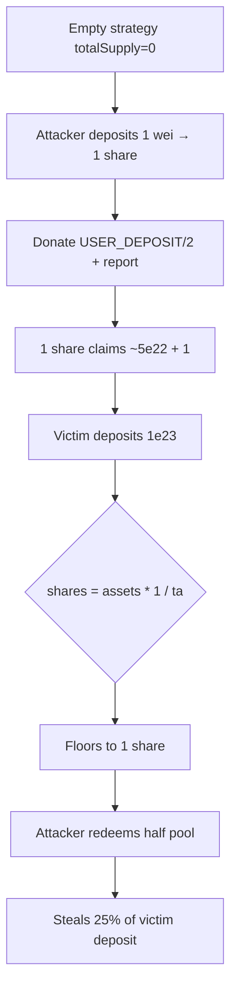

# Yearn yBOLD — Steal 25% of first depositor funds via share inflation

> **Vulnerability classes:** arithmetic/rounding · first-deposit · direct-drain · frontrun-exposure

> **Reproduction:** self-contained Foundry PoC with **only `forge-std`** — no fork.
> Full trace: [output.txt](output.txt). PoC:
> [test/57686-h-1-a-malicious-attacker-can-steal-25-of-the-funds-of-the-fi_exp.sol](test/57686-h-1-a-malicious-attacker-can-steal-25-of-the-funds-of-the-fi_exp.sol).

<!-- non-defihacklabs -->
<!-- source-auditvault: https://github.com/Auditware/AuditVault/blob/main/findings/57686-h-1-a-malicious-attacker-can-steal-25-of-the-funds-of-the-fi.md -->
<!-- date: 2025-05 -->

---

## Key info

| | |
|---|---|
| **Impact** | **HIGH** — attacker steals ~25% of the first honest deposit |
| **Protocol** | Yearn yBOLD / TokenizedStrategy (yv3 Liquity v2 SP strategy) |
| **Vulnerable code** | `TokenizedStrategy._convertToSharesFromTotals` — no dead-share floor; StrategyFactory seeds no deposit |
| **Bug class** | First-depositor / ERC4626 inflation |
| **Finding** | Sherlock 2025-05-yearn-ybold · #57686 · H-1 · reporter **Obsidian** |
| **Report** | [sherlock-audit/2025-05-yearn-ybold-judging](https://github.com/sherlock-audit/2025-05-yearn-ybold-judging) |
| **Source** | [AuditVault](https://github.com/Auditware/AuditVault/blob/main/findings/57686-h-1-a-malicious-attacker-can-steal-25-of-the-funds-of-the-fi.md) |
| **Status** | Valid high; mitigate with dead shares / min first deposit / deposit slippage |
| **Compiler** | `^0.8.24` (PoC) |

---

## TL;DR

1. Fresh strategy has `totalSupply = 0` and no burned dead shares.
2. Attacker deposits 1 wei → 1 share, then donates until `totalAssets = 1 + victimDeposit/2`.
3. Victim deposits `1e23`; `convertToShares` floors ≈1.999 → **1 share**.
4. Attacker redeems 1 of 2 shares for half the pool → **~25% of the victim deposit stolen**.

---

## The vulnerable code

```solidity
// Yearn TokenizedStrategy._convertToSharesFromTotals (simplified)
if (supply == 0) return assets;
// @> VULN: pure round-down, no dead-share floor / min first deposit
return assets.mulDiv(supply, totalAssets_, Math.Rounding.Down);
```

Strategy construction does **not** seed an initial deposit, so the empty vault is fully inflatable.

---

## Root cause

Share minting is classic ERC4626 round-down against `totalAssets` with no minimum liquidity. Donating assets (or the finding's deposit/redeem inflation loop) raises PPS so the next depositor's share count floors hard, while their full asset amount is still transferred in.

---

## Preconditions

- Newly deployed strategy (via `StrategyFactory`) with zero supply.
- Attacker can frontrun the first real deposit in the mempool.
- Optional: management sets `profitMaxUnlockTime = 0` so a 1-wei report is instant (not required if the attacker waits for unlock).

---

## Attack walkthrough

1. `deposit(1)` → 1 share.
2. Donate `USER_DEPOSIT/2` and `report()` → PPS ≈ half the pending deposit (terminal state of the finding's inflation loop).
3. Victim `deposit(1e23)` → 1 share (rounded down).
4. Attacker `redeem(1)` → ~7.5e22 assets; net profit ≈ 2.5e22 (**25%** of the deposit).

---

## Diagrams



---

## Impact

Direct theft of approximately one quarter of the first depositor's funds. Subsequent depositors are safer once supply is non-trivial, but every new strategy deployment is a fresh attack surface.

---

## Taxonomy

- `genome: arithmetic/rounding`, `first-deposit`, `direct-drain`, `frontrun-exposure`
- `severity/high` · `sector/vault` · `sector/yield-aggregator` · `platform/sherlock`

---

## Sources

- [AuditVault finding #57686](https://github.com/Auditware/AuditVault/blob/main/findings/57686-h-1-a-malicious-attacker-can-steal-25-of-the-funds-of-the-fi.md)
- [Sherlock judging issue #154](https://github.com/sherlock-audit/2025-05-yearn-ybold-judging/issues/154)
- Vulnerable source: `sherlock-audit/2025-05-yearn-ybold` → strategy inherits Yearn `TokenizedStrategy` convert/deposit; factory does not seed deposit
- Yearn `tokenized-strategy` `_convertToSharesFromTotals` (`assets.mulDiv(supply, totalAssets_, Down)`)
