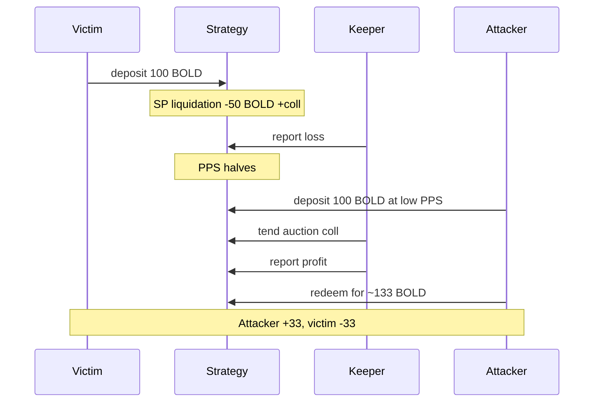

# Yearn yBOLD — Deposit after loss report free-rides collateral recovery

> **Vulnerability classes:** frontrun-exposure · direct-drain · liquidation-logic

> **Reproduction:** self-contained Foundry PoC with **only `forge-std`** — no fork.
> Full trace: [output.txt](output.txt). PoC:
> [test/57687-h-2-attacker-can-deposit-after-the-keeper-reports-a-loss-but_exp.sol](test/57687-h-2-attacker-can-deposit-after-the-keeper-reports-a-loss-but_exp.sol).

<!-- non-defihacklabs -->
<!-- source-auditvault: https://github.com/Auditware/AuditVault/blob/main/findings/57687-h-2-attacker-can-deposit-after-the-keeper-reports-a-loss-but.md -->
<!-- date: 2025-05 -->

---

## Key info

| | |
|---|---|
| **Impact** | **HIGH** — attacker free-rides recovery for ~33% of prior depositor funds (finding PoC ~32.5%) |
| **Protocol** | Yearn yBOLD Liquity v2 Stability Pool strategy |
| **Vulnerable code** | `report()` / `harvestAndReport` books loss from free BOLD only while unrealized coll gains exist |
| **Bug class** | Temporary PPS depression between loss report and coll auction |
| **Finding** | Sherlock 2025-05-yearn-ybold · #57687 · H-2 · reporters **0x15**, **Obsidian** |
| **Report** | [sherlock-audit/2025-05-yearn-ybold-judging](https://github.com/sherlock-audit/2025-05-yearn-ybold-judging) |
| **Source** | [AuditVault](https://github.com/Auditware/AuditVault/blob/main/findings/57687-h-2-attacker-can-deposit-after-the-keeper-reports-a-loss-but.md) |
| **Status** | Valid high; management can enable the loss path via health-check settings |
| **Compiler** | `^0.8.24` (PoC) |

---

## TL;DR

1. Victim deposits into the strategy.
2. Stability Pool liquidation burns BOLD; collateral gains are **unrealized**.
3. Keeper `report()` books a loss (PPS drops) because harvest only counts free BOLD.
4. Attacker deposits at the depressed PPS (mints excess shares).
5. `tend` auctions coll → BOLD; next `report` books profit; attacker redeems **more than deposited**.

---

## The vulnerable code

```solidity
function report() external returns (uint256 profit, uint256 loss) {
    // @> VULN: free BOLD only — unrealized coll gains ignored → temporary loss
    uint256 newTotalAssets = harvestAndReport();
    // FIX: mark coll to market, or delay loss until auction settles
    ...
}
```

Management can disable health checks / set a high loss limit so the temporary loss is accepted.

---

## Root cause

Strategy accounting is BOLD-only between liquidation and collateral auction. A `report` in that window socializes an *unrealized* loss into PPS. Late depositors mint cheap shares that claim the recovery when coll is sold.

---

## Preconditions

- Prior depositors in the strategy.
- A Stability Pool liquidation that reduces BOLD while leaving coll gains.
- Management allows the loss to report (`setDoHealthCheck(false)` or non-zero loss limit).
- Attacker can deposit after the loss report and before tend/report of the recovery.

---

## Attack walkthrough

1. Victim deposits 100e18.
2. Simulate liquidation: −50e18 BOLD, +50e18 unrealized coll value.
3. `report()` → totalAssets = 50e18 (loss booked).
4. Attacker deposits 100e18 → mints 200e18 shares at half PPS.
5. `tend` + `report` restore 50e18; attacker redeems ~133e18 → **+33e18 profit**, victim −33e18.

---

## Diagrams



---

## Impact

Prior depositors permanently lose a large fraction of assets to a well-timed deposit between loss report and collateral realization. Finding PoC shows >30% theft of a depositor's funds.

---

## Taxonomy

- `genome: frontrun-exposure`, `direct-drain`, `liquidation-logic`
- `severity/high` · `sector/vault` · `sector/yield-aggregator` · `platform/sherlock`

---

## Sources

- [AuditVault finding #57687](https://github.com/Auditware/AuditVault/blob/main/findings/57687-h-2-attacker-can-deposit-after-the-keeper-reports-a-loss-but.md)
- [Sherlock judging issue #155](https://github.com/sherlock-audit/2025-05-yearn-ybold-judging/issues/155)
- Vulnerable source: `sherlock-audit/2025-05-yearn-ybold` → `yv3-liquityv2-sp-strategy` Strategy harvest/report path vs Liquity SP coll gains
