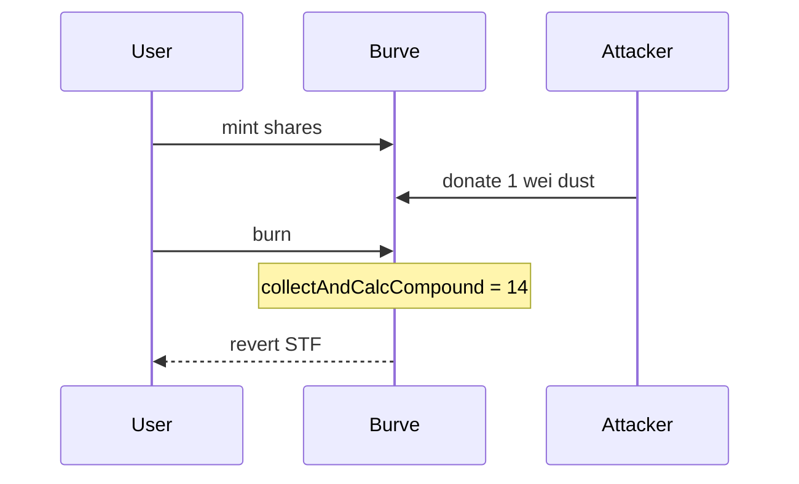

# Burve — DoS on `mint()` and `burn()` due to overestimation of available liquidity

> **Vulnerability classes:** dos-resistance · rounding-direction · fee-calculation · fix-arithmetic

> **Reproduction:** self-contained Foundry PoC, offline, forge-std only.
> Full trace: [output.txt](output.txt).

<!-- non-defihacklabs -->
<!-- source-auditvault: https://github.com/Auditware/AuditVault/blob/main/findings/57722-h-01-dos-on-mint-and-burn-due-to-overestimation-of-available.md -->
<!-- date: 2025-03 -->

---

## Key info

| | |
|---|---|
| **Impact** | **HIGH** — mint and burn revert while dust residual remains |
| **Protocol** | Burve single (Uniswap V3 multi-range compounder) |
| **Vulnerable code** | `collectAndCalcCompound` overestimates mintable liquidity from dust |
| **Bug class** | Liquidity overestimate → transfer fail ("STF") → DoS |
| **Finding** | Pashov Audit Group — Burve, Mar 2025 · #57722 · H-01 |
| **Report** | [Burve-security-review_2025-03-05](https://github.com/pashov/audits/blob/master/team/md/Burve-security-review_2025-03-05.md) |
| **Compiler** | `^0.8.24` (PoC) |

---

## TL;DR

1. Every `mint`/`burn` runs `compoundV3Ranges` → `collectAndCalcCompound`.
2. With 2 equal ranges and 1 wei residual, nominal liq is computed as 14.
3. Real mintable liquidity is 0 (1 wei cannot split across 2 ranges).
4. Compound tries to transfer more than available → `"STF"` → mint/burn DoS.

---

## The vulnerable code

```solidity
mintNominalLiq = nominal - 2 * rangeCount; // @> VULN: residual treated as fully mintable
// later:
if (req0 > residual0) revert("STF");
```

**Fix:** dust floor or caller-supplied compound liquidity cap.

## Diagrams



## Impact

Liveness failure on entry and exit; attacker can frontrun with dust donations.

## Sources

- [AuditVault finding #57722](https://github.com/Auditware/AuditVault/blob/main/findings/57722-h-01-dos-on-mint-and-burn-due-to-overestimation-of-available.md)
- [Pashov Burve review 2025-03-05](https://github.com/pashov/audits/blob/master/team/md/Burve-security-review_2025-03-05.md)
