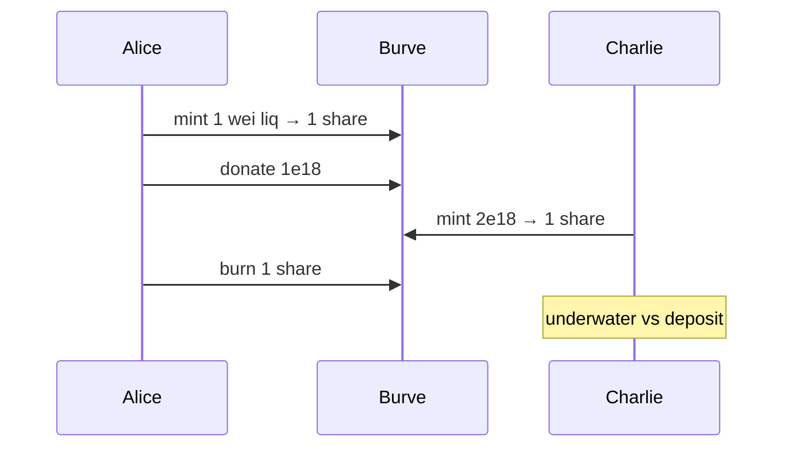

# Burve — First deposit front-running attack

> **Vulnerability classes:** frontrun-exposure · mev/frontrun · first-deposit

> **Reproduction:** self-contained Foundry PoC, offline, forge-std only.
> Full trace: [output.txt](output.txt).

<!-- non-defihacklabs -->
<!-- source-auditvault: https://github.com/Auditware/AuditVault/blob/main/findings/57723-h-02-first-deposit-front-running-attack-pashov-audit-group-n.md -->
<!-- date: 2025-03 -->

---

## Key info

| | |
|---|---|
| **Impact** | **HIGH** — victim mints only 1 share; attacker captures donated + victim liquidity |
| **Protocol** | Burve single (ERC-4626-like share vault) |
| **Vulnerable code** | share mint with no dead-share floor / virtual offset |
| **Bug class** | First-depositor inflation / donation attack |
| **Finding** | Pashov Audit Group — Burve, Mar 2025 · #57723 · H-02 |
| **Report** | [Burve-security-review_2025-03-05](https://github.com/pashov/audits/blob/master/team/md/Burve-security-review_2025-03-05.md) |
| **Compiler** | `^0.8.24` (PoC) |

---

## TL;DR

1. Alice mints 1 wei liquidity → 1 share (no dead shares).
2. Alice donates 1e18 of liquidity tokens, inflating `totalNominalLiq`.
3. Charlie mints 2e18 → `shares = 2e18 * 1 / (1e18+1) = 1`.
4. Alice burns her share and extracts ≥1e18 of value including Charlie's deposit.

---

## The vulnerable code

```solidity
if (totalShares == 0) {
    shares = mintNominalLiq; // @> VULN: no dead-share floor
} else {
    shares = (mintNominalLiq * totalShares) / totalNominalLiq; // @> VULN
}
```

**Fix:** dead shares on first deposit, or virtual shares/assets (OZ ERC4626).

## Diagrams



## Impact

Victim loses the majority of their deposit to the first-depositor attacker.

## Sources

- [AuditVault finding #57723](https://github.com/Auditware/AuditVault/blob/main/findings/57723-h-02-first-deposit-front-running-attack-pashov-audit-group-n.md)
- [Pashov Burve review 2025-03-05](https://github.com/pashov/audits/blob/master/team/md/Burve-security-review_2025-03-05.md)
