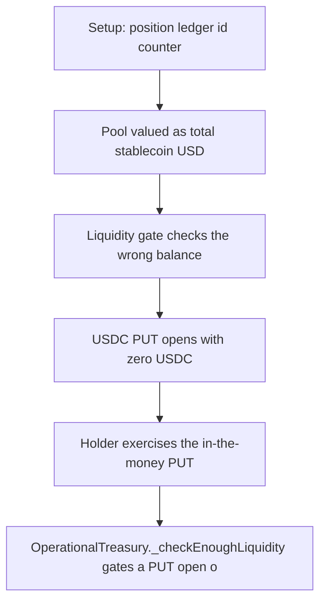

# Hyperhyper: PUT liquidity check ignores the payout token

> **Vulnerability classes:** vuln/logic
>
> **Reproduction:** a faithful minimal reproduction of the vulnerable finding — the vulnerable code is reproduced **verbatim** (marked `@>`) with faithful minimal doubles; local deploy, no fork.

<!-- source-auditvault: https://github.com/pashov/audits/blob/master/team/md/Hyperhyper-security-review_2025-03-30.md -->

## Root cause

OperationalTreasury._checkEnoughLiquidity gates a PUT open on the TOTAL stablecoin value of the pool (availableStable = _getPoolValue(true,false), the USD sum of every listed stablecoin) instead of the balance of the specific payout token pos.buyToken. With poolAmount[USDC]=0 and poolAmount[USDXL]=3500e18 the pool looks solvent (3500 USD), so a USDC PUT with sizeUSD=3500e18 opens (0 + 3500e18 !> 3500e18) even though there is 0 USDC to ever pay it. When the holder exercises the now-$500-in-the-money PUT, _payout runs strg.ledger.state.poolAmount[pos.buyToken] -= pnl = (0 - 500e18) which underflows and reverts, so the position is permanently unexercisable and the holder's rightful 500e18 (USDC) payout is stranded.

```solidity
// Synthetic, self-contained reproduction of Hyperhyper finding 57739 (H-02):
// "Insufficient liquidity checks for `PUT` may cause exercise failures".
//
// Real audited source (the vulnerable lines are reproduced VERBATIM, the primary
// vulnerable line is marked @> VULN):
```

## Why it's exploitable here

OperationalTreasury._checkEnoughLiquidity gates a PUT open on the TOTAL stablecoin value of the pool (availableStable = _getPoolValue(true,false), the USD sum of every listed stablecoin) instead of the balance of the specific payout token pos.buyToken. With poolAmount[USDC]=0 and poolAmount[USDXL]=3500e18 the pool looks solvent (3500 USD), so a USDC PUT with sizeUSD=3500e18 opens (0 + 3500e18 !> 3500e18) even though there is 0 USDC to ever pay it. When the holder exercises the now-$500-in-the-money PUT, _payout runs strg.ledger.state.poolAmount[pos.buyToken] -= pnl = (0 - 500e18) which underflows and reverts, so the position is permanently unexercisable and the holder's rightful 500e18 (USDC) payout is stranded.

## Attack path



## Marked-line walkthrough (Playground)

The EVM Playground pins each step to the exact executed source line in `0xce01759b82…`:

1. **L133** — Setup: position ledger id counter: Setup: the treasury tracks option positions in a ledger keyed by an incrementing id.
2. **L172** — Pool valued as total stablecoin USD: _getPoolValue sums the USD value of every listed stablecoin (here USDXL, 3500 USD), ignoring which token a position pays out in.
3. **L184** — Liquidity gate checks the wrong balance: Root cause: the open check gates on the pool's TOTAL stablecoin value, not on the balance of the PUT's specific payout token pos.buyToken.
4. **L190** — USDC PUT opens with zero USDC: A USDC PUT of size 3500 opens because 0 + 3500 is not > 3500 — yet poolAmount[USDC] is 0, so nothing can ever pay it.
5. **L206** — Holder exercises the in-the-money PUT: Later the holder exercises the now-$500-in-the-money PUT, expecting a 500 USDC payout.
6. **L213** — Payout path reproduced verbatim: The _payout and _doTransferOut logic here is byte-for-byte the finding's embedded source.
7. **L227** — Payout debits the empty USDC pool: _payout runs poolAmount[USDC] -= pnl = 0 - 500e18 against a pool that holds no USDC.
8. **L235** — Underflow bricks the position: That subtraction underflows and reverts, so the PUT is permanently unexercisable and the holder's 500e18 payout is stranded.

## PoC

Registry (Foundry, local deploy — verbatim vulnerable source + harm-asserting test):

```bash
cd 57739-h-02-insufficient-liquidity-checks-for-put-may-cause-exercis_exp
forge test -vvv
```

The browser Playground replays the same synthetic opcode-for-opcode and measures the harm. Both gates are green (registry `forge test` PASS + Playground `_verify-poc` **VERDICT: PASS**).
