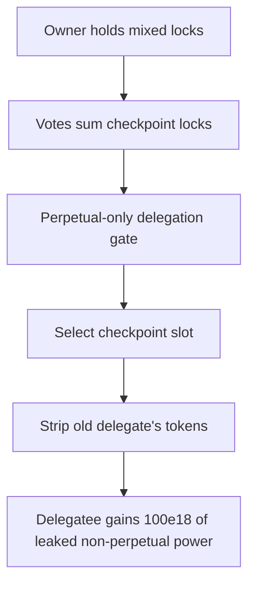

# Hyperstable: Non-perpetual locks gain extra delegation power

> **Vulnerability classes:** vuln/logic · vuln/governance · vuln/accounting
>
> **Reproduction:** a faithful minimal reproduction of the vulnerable finding — the vulnerable delegation code (`vePeg._delegate` / `_moveAllDelegates`) is reproduced **verbatim** (marked `@>`) with faithful minimal doubles; local deploy, no fork.

<!-- source-auditvault: https://github.com/pashov/audits/blob/master/team/md/Hyperstable-security-review_2025-03-19.md -->

## Root cause

`vePeg._delegate(_from, _to)` gates delegation on the *source* token `_from` being perpetually locked, intending that only perpetual locks carry delegation power. But delegation is then applied at the **address** level: `_moveAllDelegates` copies **every** tokenId the owner holds — including non-perpetual locks — into the delegatee's checkpoint, so passing one perpetual lock through the gate leaks the voting power of all the owner's non-perpetual locks. The vulnerable lines, reproduced verbatim from the finding:

```solidity
//File: src/governance/vePeg.sol

function _moveAllDelegates(address owner, address srcRep, address dstRep) internal {
    --- SNIPPED 
---

    if (dstRep != address(0)) {
        --- SNIPPED 
---

        // Plus all that's owned
        for (uint256 i = 0; i < ownerTokenCount; i++) {
@>          uint256 tId = ownerToNFTokenIdList[owner][i];   //@audit This contains all locks, including non-perpetual locks
            dstRepNew.push(tId);
        }

        --- SNIPPED 
---
    }
}
```

The `require(currentLock.perpetuallyLocked == true, ...)` check in `_delegate` only validates the single `_from` lock. `_moveAllDelegates` then ignores that restriction entirely and iterates `ownerToNFTokenIdList[owner]`, which lists all of the owner's locks regardless of their `perpetuallyLocked` flag.

## Why it's exploitable here

Following the finding's mechanism with concrete numbers:

1. The owner holds three self-owned locks: one **perpetual** lock of `100e18` (tokenId 1) and **two non-perpetual** locks of `50e18` each (tokenIds 2 and 3).
2. The owner calls `delegate(perpId, toId)`. Because `perpId` is the perpetual lock, the `perpetuallyLocked == true` gate passes.
3. `_moveAllDelegates` copies **all three** of the owner's tokenIds into the delegatee's checkpoint — not just the perpetual one.
4. `getVotes(delegatee)` now returns `200e18`, but only `100e18` should have been delegated. The extra `100e18` comes from the two non-perpetual locks that are supposed to carry **no** delegation power — inflating the delegatee's governance weight.

## Attack path



## Marked-line walkthrough (Playground)

The EVM Playground pins each step to the exact executed source line in `vePeg…`:

1. **L74** — Owner holds mixed locks: Setup: ownerToNFTokenIdList records every lock an owner holds — perpetual and non-perpetual alike — indexed by position.
2. **L106** — Votes sum checkpoint locks: getVotes tallies delegation power by summing the balance of every tokenId in the account's latest delegation checkpoint.
3. **L126** — Perpetual-only delegation gate: _delegate proceeds only when the source lock _from is perpetually locked, meant to ensure only perpetual locks confer delegation power.
4. **L140** — Select checkpoint slot: _findWhatCheckpointToWrite picks the delegatee's next checkpoint index so the new delegation snapshot can be recorded.
5. **L154** — Strip old delegate's tokens: For a non-zero previous delegate, the loop rebuilds its checkpoint without any tokenId the owner holds, clearing prior delegation.
6. **L182** — Carry over delegatee's tokens: The delegatee's existing checkpoint tokenIds are copied forward unchanged before the owner's locks get appended.
7. **L186** — All owned locks copied in: Root cause: the loop copies every tokenId in ownerToNFTokenIdList into the delegatee, adding the owner's non-perpetual locks despite the perpetual-only gate.
8. **L204** — Leaked power booked to SINK: The 100e18 of delegation power leaked from two non-perpetual locks is recorded to SINK, quantifying voting power the delegatee should never hold.

## PoC

Registry (Foundry, local deploy — verbatim vulnerable source + harm-asserting test):

```bash
cd 57824-h-03-non-perpetual-locks-gaining-extra-delegation-power-pash_exp && forge test -vvv
```

The browser Playground replays the same synthetic opcode-for-opcode and measures the harm: **one perpetual lock passes the gate, yet both non-perpetual locks are delegated too, leaking 100e18 of extra delegation power to the delegatee**. Both gates are green (registry `forge test` PASS + Playground `_verify-poc` **VERDICT: PASS**).
