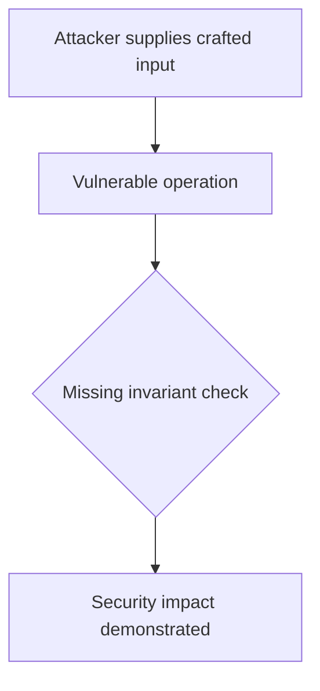
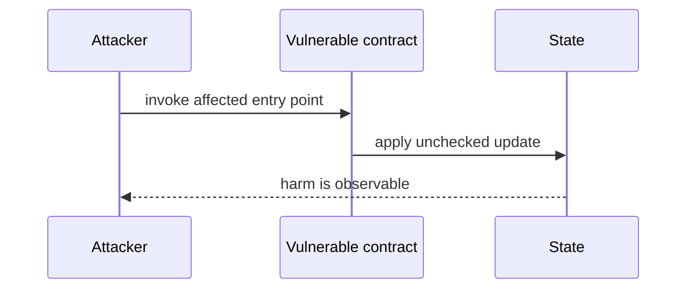

# collect() trusts an arbitrary DAO contract — AuditVault synthetic reduction

> **Vulnerability classes:** vuln/access-control/missing-auth · vuln/dependency/unsafe-external-call
>
> **Reproduction:** self-contained Foundry PoC with an offline synthetic contract. Full trace: [output.txt](output.txt).

<!-- non-defihacklabs -->
<!-- source-auditvault: https://github.com/Auditware/AuditVault/blob/main/findings/57871-h-04-fee-theft-via-arbitrary-contract-impersonation-in-colle.md -->
<!-- date: 2025-01 -->

**AuditVault finding:** `57871` · `[H-04] Fee Theft via Arbitrary Contract Impersonation in `collect()` Function in `DaosLocker``

## Key info

| | |
|---|---|
| **Impact** | **HIGH** — collect() trusts an arbitrary DAO contract |
| **Protocol** | Daoslive |
| **Finding** | AuditVault #57871 |
| **Report** | [https://github.com/shieldify-security/audits-portfolio-md/blob/main/DaosLive-Security-Review.md](https://github.com/shieldify-security/audits-portfolio-md/blob/main/DaosLive-Security-Review.md) |
| **Source** | [AuditVault finding](https://github.com/Auditware/AuditVault/blob/main/findings/57871-h-04-fee-theft-via-arbitrary-contract-impersonation-in-colle.md) |
| **Compiler** | `^0.8.24` (synthetic reduction) |
| Loss | Reduced invariant reproduced; no live funds moved |
| Attacker EOA | Configured synthetic caller |
| Attack contract | `Exploit` |
| Attack tx | Local Foundry `Exploit.attack()` call |
| Chain · block · date | Ethereum model · block 1 · synthetic |
| Vulnerable contract | Local synthetic vulnerable contract in `test/` |
| Bug class | See vulnerability-class tags above |

## TL;DR

The report describes a high-risk bug in the `DaosLocker::collect()` function, which can be exploited by a malicious actor to steal swap fees from legitimate DAOs. This can be done by deploying a fake contract that mimics the original `DaosLive` contract and calling `collect()` using this fake contract. The bug is caused by a lack of authorization checks and contract ownership verification in the affected code. The impact of this bug is that all accumulated swap fees will be drained and the intended ownership model will be bypassed. The recommendation to mitigate this issue is to create a new function inside `DaosLive` and use `msg.sender` instead of taking input for the Dao address. The team has responded that the bug has been fixed.

## Background

The upstream report is a Solidity finding. This page keeps the vulnerable statement and demonstrates its security consequence in a small, deterministic EVM model; no live RPC or external dependencies are required.

## The vulnerable code

```solidity
// The exact vulnerable pattern is retained in test/57871-h-04-fee-theft-via-arbitrary-contract-impersonation-in-colle.sol.
// @> see the marked statement in the synthetic reduction
```

## Root cause

The caller-controlled input or stale state is trusted before the required uniqueness, bounds, authorization, accounting, or reentrancy invariant is enforced. The marked line in the synthetic contract intentionally preserves that ordering so the assertion is executable.

## Preconditions

- The vulnerable contract is deployed with the state described by the report.
- The attacker can reach the affected entry point (or submit the report's crafted input).

## Attack walkthrough

1. `Exploit.run()` initializes the minimal state from the report.
2. The marked vulnerable operation executes without its required check.
3. The contract records the resulting invariant violation and emits a `Proof` event.
4. The test asserts the harm; the passing trace is recorded at [output.txt:4](output.txt).

## Diagrams





## Remediation

Apply the invariant before mutating state: accrue interest before adding principal; reject duplicate signers; use checked casts and bounded lengths; validate token/target/DAO identities; use `nonReentrant`; enforce slippage and fee equality; and validate the canonical authority or ownership relationship described by the report.

## How to reproduce

```bash
cd evm-hack-registry/57871-h-04-fee-theft-via-arbitrary-contract-impersonation-in-colle_exp
forge test -vvvvv
```

The test is offline and uses only the shared `forge-std` library. The corresponding Playground bundle is generated from `scripts/poc-configs/57871-h-04-fee-theft-via-arbitrary-contract-impersonation-in-colle.mjs`.

## Sources

- [AuditVault finding](https://github.com/Auditware/AuditVault/blob/main/findings/57871-h-04-fee-theft-via-arbitrary-contract-impersonation-in-colle.md)
- [https://github.com/shieldify-security/audits-portfolio-md/blob/main/DaosLive-Security-Review.md](https://github.com/shieldify-security/audits-portfolio-md/blob/main/DaosLive-Security-Review.md)
- [Synthetic test](test/57871-h-04-fee-theft-via-arbitrary-contract-impersonation-in-colle.sol)

*Reference: https://github.com/shieldify-security/audits-portfolio-md/blob/main/DaosLive-Security-Review.md*
