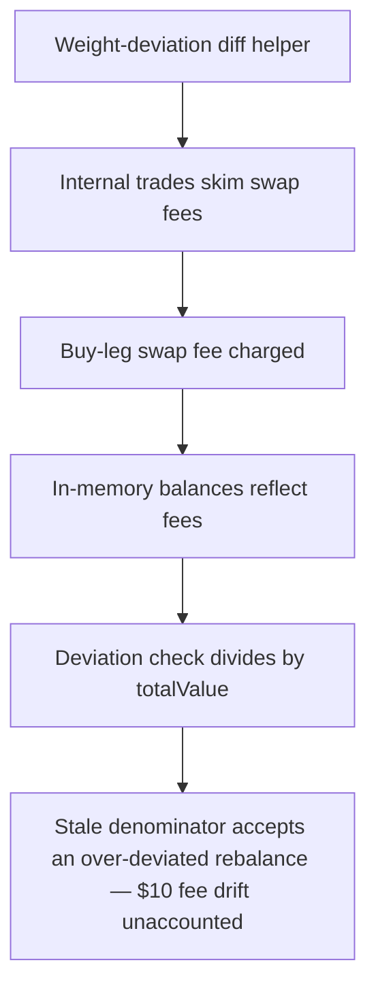

# Cove: stale basket USD value passes an over-deviated rebalance

> **Vulnerability classes:** vuln/logic · vuln/accounting · vuln/fee-calculation
>
> **Reproduction:** a faithful minimal reproduction of the vulnerable finding — the rebalance call sequence, the internal-trade fee block, and the deviation check of `BasketManagerUtils` are reproduced **verbatim** (the vulnerable omission marked `@>`) with faithful minimal doubles; local deploy, no fork.

<!-- source-auditvault: https://github.com/pashov/audits/blob/master/team/md/Cove-security-review_2024-12-30.md -->

## Root cause

In Cove's `BasketManagerUtils` rebalance library, `totalValues` — the per-basket USD value — is populated by `_initializeBasketData` and then handed to both `_validateExternalTrades` and `_isTargetWeightMet`. But `_processInternalTrades`, which charges a swap fee that lowers each basket's real USD value, is called **without** the `totalValues` array and never decrements it, so the later deviation check divides post-fee balances by a stale, too-high denominator. The vulnerable call order, reproduced verbatim:

```solidity
uint256[] memory totalValues = new uint256[](numBaskets);
// 2d array of asset balances for each basket
uint256[][] memory basketBalances = new uint256[][](numBaskets);
_initializeBasketData(self, baskets, basketAssets, basketBalances, totalValues);
// NOTE: for rebalance retries the internal trades must be updated as well
@>  _processInternalTrades(self, internalTrades, baskets, basketBalances);
_validateExternalTrades(self, externalTrades, baskets, totalValues, basketBalances);
if (!_isTargetWeightMet(self, baskets, basketTargetWeights, basketAssets, basketBalances, totalValues)) {
         revert TargetWeightsNotMet();
}
```

`_validateExternalTrades` and `_isTargetWeightMet` both receive `totalValues`; only `_processInternalTrades` is called without it — yet it is the one leg that actually reduces the baskets' USD value by charging swap fees. The array is therefore out of sync exactly where the deviation math relies on it.

## Why it's exploitable here

Following a concrete rebalance with assets priced at $1 and `swapFee = 100` (0.5% per leg). `fromBasket` holds A=5500, B=3000, C=1500 ($10,000), with target weights A 50% / B 25% / C 25%. The internal trade sells 1000 B and buys 1000 C:

1. `_initializeBasketData` records `totalValues = $10,000`.
2. `_processInternalTrades` charges `feeOnSell = 1000*100/20000 = 5 B` and `feeOnBuy = 5 C` ($10 total). `fromBasket` ends A=5500, B=2000, C=2495 — real value **$9,995**.
3. `_isTargetWeightMet` divides by the **stale $10,000**: A's weight = 5500/10000 = 55.0%, whose 5.0% gap from the 50% target is not greater than the 5% bound → the rebalance **passes**.
4. With the fee-corrected **$9,995** denominator, A's weight = 5500/9995 = 55.03%, a 5.03% gap that **exceeds** `_MAX_WEIGHT_DEVIATION` → the same trade should be **rejected**.

Identical post-trade balances, opposite verdicts — the only difference is the denominator. The stale check silently accepts a rebalance that breaches the deviation guard; the $10 of swap fees that `totalValues` never subtracted is recorded at the SINK as the quantified accounting drift.

## Attack path



## Marked-line walkthrough (Playground)

The EVM Playground pins each step to the exact executed source line in `0xe3a787a4…`:

1. **L50** — Weight-deviation diff helper: Setup: MathUtils.diff returns the absolute gap between a basket's target weight and its measured after-trade weight, compared against _MAX_WEIGHT_DEVIATION.
2. **L180** — Internal trades skim swap fees: _processInternalTrades settles the trade against the real ledger and skims swap fees into collectedSwapFees, lowering both baskets' actual USD value.
3. **L199** — Buy-leg swap fee charged: The verbatim fee block charges feeOnBuy = 1000*100/20000 = 5 C and emits SwapFeeCharged, so fromBasket receives only 995 C, not the full 1000.
4. **L214** — In-memory balances reflect fees: basketBalances credits fromBasket only buyAmount minus feeOnBuy (995 C), so the later deviation check sees true post-fee holdings.
5. **L228** — Deviation check divides by totalValue: _isTargetWeightMet divides each asset's post-fee USD value by the totalValue its caller passes; its correctness rests entirely on that denominator.
6. **L264** — totalValues omitted from trades: Root cause: _processInternalTrades is called without the totalValues array and never subtracts the fees it charges, so a stale, too-high denominator is reused.
7. **L283** — Funded basket rebalanced: Setup: FROM_BASKET holds $10,000 (A=5500, B=3000, C=1500); after the fee-charging trade its true value is $9,995 while totalValues still reads $10,000.

## PoC

Registry (Foundry, local deploy — verbatim vulnerable source + harm-asserting test):

```bash
cd 57953-h-01-incorrect-basket-usd-value-will-cause-incorrect-results_exp && forge test -vvv
```

The browser Playground replays the same synthetic opcode-for-opcode and measures the harm: **the stale-denominator deviation check accepts a rebalance whose fee-corrected weights breach `_MAX_WEIGHT_DEVIATION`, and the $10 of unaccounted swap fees is minted to the SINK**. Both gates are green (registry `forge test` PASS + Playground `_verify-poc` **VERDICT: PASS**).
