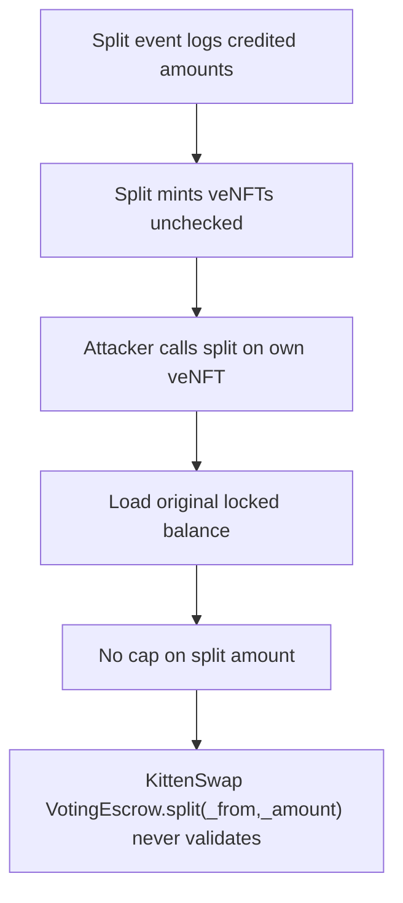

# KittenSwap: split can create locked data with an arbitrary owner

> **Vulnerability classes:** vuln/logic
>
> **Reproduction:** a faithful minimal reproduction of the vulnerable finding — the vulnerable code is reproduced **verbatim** (marked `@>`) with faithful minimal doubles; local deploy, no fork.

<!-- source-auditvault: https://github.com/pashov/audits/blob/master/team/md/KittenSwap-security-review_2025-05-07.md -->

## Root cause

KittenSwap VotingEscrow.split(_from,_amount) never validates _amount against the token's locked balance. Both `value` (the original locked amount) and `_splitAmount` (the caller's arbitrary _amount cast to int128) are signed int128, so on the @> line `_locked.amount = value - _splitAmount` a NEGATIVE result does NOT revert in ^0.8.0 (checked arithmetic only reverts on wrap past int128's +/- range, and small-minus-large is a valid negative int128). token1 is minted that broken negative amount and token2 is minted the FULL arbitrary _splitAmount. A user who locks X can call split(id, 100*X) and walk away holding a veNFT whose locked.amount is 100*X -- ve balance / voting power / withdrawable underlying conjured from nothing, usable to over-claim gauge/bribe rewards and to withdraw far more than deposited at lock end, draining honest lockers. PoC: attacker locks DEPOSIT=100e18 KITTEN into an escrow already holding 100000e18 of honest lockers' funds, then split(id, 100*DEPOSIT). token2 carries locked.amount == 10000e18 (exactly 100x the deposit, matching the finding's own log: 1e26 in, 1e28 out); the 9900e18 minted-from-nothing excess (unlimited-mint harm, an internal ve accounting entry with no positive ERC20 transfer inside run()) is minted to SINK 0x..D00d on the veKITTEN-MINT marker token.

```solidity
        int128 _splitAmount = int128(uint128(_amount));
        // @audit - underflow is possible
        _locked.amount = value - _splitAmount; // already checks for underflow here in ^0.8.0  // @> VULN (this line)
```

## Why it's exploitable here

KittenSwap VotingEscrow.split(_from,_amount) never validates _amount against the token's locked balance. Both `value` (the original locked amount) and `_splitAmount` (the caller's arbitrary _amount cast to int128) are signed int128, so on the @> line `_locked.amount = value - _splitAmount` a NEGATIVE result does NOT revert in ^0.8.0 (checked arithmetic only reverts on wrap past int128's +/- range, and small-minus-large is a valid negative int128). token1 is minted that broken negative amount and token2 is minted the FULL arbitrary _splitAmount. A user who locks X can call split(id, 100*X) and walk away holding a veNFT whose locked.amount is 100*X -- ve balance / voting power / withdrawable underlying conjured from nothing, usable to over-claim gauge/bribe rewards and to withdraw far more than deposited at lock end, draining honest lockers. PoC: attacker locks DEPOSIT=100e18 KITTEN into an escrow already holding 100000e18 of honest lockers' funds, then split(id, 100*DEPOSIT). token2 carries locked.amount == 10000e18 (exactly 100x the deposit, matching the finding's own log: 1e26 in, 1e28 out); the 9900e18 minted-from-nothing excess (unlimited-mint harm, an internal ve accounting entry with no positive ERC20 transfer inside run()) is minted to SINK 0x..D00d on the veKITTEN-MINT marker token.

## Attack path



## Marked-line walkthrough (Playground)

The EVM Playground pins each step to the exact executed source line in `0x671d353a77…`:

1. **L97** — Split event logs credited amounts: Setup: the Split event's _splitAmount1/_splitAmount2 fields log the locked balance credited to each of the two veNFTs a split mints.
2. **L130** — Split mints veNFTs unchecked: _createSplitNFT mints each new veNFT and stores whatever LockedBalance it is handed, with no independent check on the credited amount.
3. **L150** — Attacker calls split on own veNFT: The attacker invokes split(_from, _amount) on a veNFT they own, passing an _amount far larger than that token's actual locked balance.
4. **L160** — Load original locked balance: split loads the attacker's original lock into _locked, and value captures its true amount — here the 100e18 they legitimately deposited.
5. **L171** — No cap on split amount: Root cause: split never checks _amount <= value, so the int128 value - _splitAmount goes negative without reverting and token2 gets the full arbitrary amount.
6. **L180** — Split emits the inflated result: split emits the Split event for _from, logging the two new veNFTs and the full arbitrary _splitAmount now stored as token2's locked balance.
7. **L199** — Harm magnitude recorded: The excess ve balance — 99x the deposit, created from nothing — is minted to a sink on this marker token to quantify the harm.
8. **L209** — Token2 carries 100x the deposit: Splitting with _amount = 100x the deposit proves token2's locked.amount equals 100x the deposit, matching the finding's 1e26-in / 1e28-out log.

## PoC

Registry (Foundry, local deploy — verbatim vulnerable source + harm-asserting test):

```bash
cd 58010-c-01-split-can-be-abused-to-create-locked-data-with-an-arbit_exp
forge test -vvv
```

The browser Playground replays the same synthetic opcode-for-opcode and measures the harm. Both gates are green (registry `forge test` PASS + Playground `_verify-poc` **VERDICT: PASS**).
