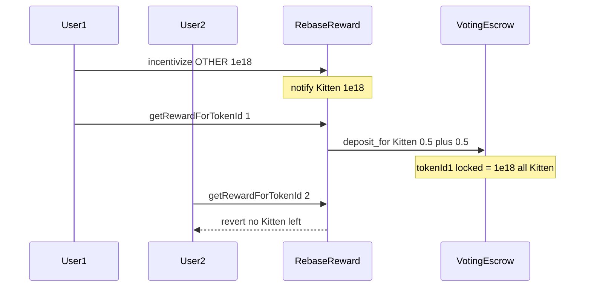

# KittenSwap — `RebaseReward` fails because of incorrect token handling

> **Vulnerability classes:** fot-slippage · specific-token-type · reward-theft

> **Reproduction:** self-contained Foundry PoC with only `forge-std` — no fork.
> [output.txt](output.txt) · [test/58065-…sol](test/58065-c-01-rebasereward-fails-because-of-incorrect-token-handling.sol).

<!-- non-defihacklabs -->
<!-- source-auditvault: https://github.com/Auditware/AuditVault/blob/main/findings/58065-c-01-rebasereward-fails-because-of-incorrect-token-handling.md -->
<!-- date: 2025-06 -->

**AuditVault taxonomy:** `lang/solidity` · `sector/governance` · `sector/options` · `sector/token` · `severity/high` · genome: `fot-slippage` · `specific-token-type`

---

## Key info

| | |
|---|---|
| **Impact** | **HIGH** — early claimer drains all Kitten rewards; non-Kitten incentives locked forever |
| **Protocol** | KittenSwap — `RebaseReward.getRewardForTokenId` / `incentivize` |
| **Vulnerable code** | `veKitten.deposit_for(_tokenId, reward)` for every reward token, not only Kitten |
| **Bug class** | Wrong token handling / reward accounting |
| **Finding** | Pashov Audit Group — KittenSwap 2025-06-12 · #58065 |
| **Report** | [KittenSwap-security-review_2025-06-12.md](https://github.com/pashov/audits/blob/master/team/md/KittenSwap-security-review_2025-06-12.md) |
| **Source** | [AuditVault](https://github.com/Auditware/AuditVault/blob/main/findings/58065-c-01-rebasereward-fails-because-of-incorrect-token-handling.md) |
| **Fix** | Override `incentivize` to Kitten-only, or transfer non-Kitten rewards as the actual token |
| **Compiler** | `^0.8.24` (PoC) |

---

## TL;DR

1. `notifyRewardAmount` only accepts Kitten, but `incentivize` accepts any token.
2. On claim, every reward token's share is deposited as Kitten via `deposit_for`.
3. Equal-weight user1 claims 50% Kitten + 50% Other-as-Kitten = 100% of Kitten.
4. User2's claim reverts (no Kitten left); Other tokens stay stuck in RebaseReward.

## Vulnerable code

```solidity
if (reward > 0) {
    veKitten.deposit_for(tokenId, reward); // @> VULN: always Kitten
}
```

## Root cause

Reward accounting is multi-token, but the payout path is single-token (Kitten lock into ve). Non-Kitten incentives inflate the Kitten claim amount.

## Preconditions

- At least two ve token IDs with positive RebaseReward weight.
- Someone calls `incentivize` with a non-Kitten token.
- Kitten is notified as the official reward.

## Attack walkthrough

1. Deposit equal weight for tokenId1 and tokenId2.
2. Incentivize 1e18 OTHER; notify 1e18 Kitten.
3. Claim for tokenId1 → locks 1e18 Kitten (all of it).
4. Claim for tokenId2 reverts; OTHER remains locked in the contract.

## Diagrams



## Impact

Honest voters lose their Kitten rebase; non-Kitten incentives are permanently stuck; ve balances are unfairly inflated for early claimers.

## Sources

- [AuditVault #58065](https://github.com/Auditware/AuditVault/blob/main/findings/58065-c-01-rebasereward-fails-because-of-incorrect-token-handling.md)
- [Pashov KittenSwap 2025-06-12](https://github.com/pashov/audits/blob/master/team/md/KittenSwap-security-review_2025-06-12.md)
- Reduced from Kittenswap/contracts review commit `65c8bdd` (report-quoted `_getReward` / `deposit_for` path)
