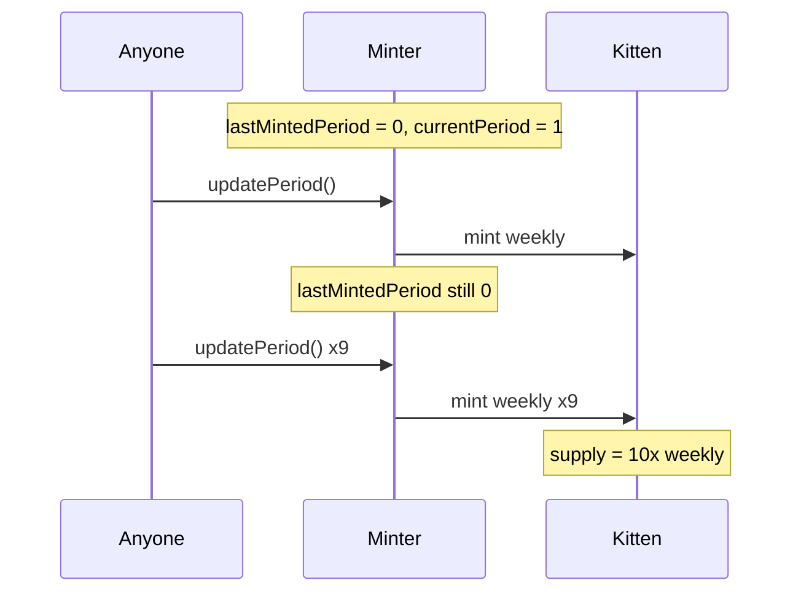

# KittenSwap — Lack of `lastMintedPeriod` update allows unlimited minting of Kitten

> **Vulnerability classes:** access-roles · specific-token-type · inflation

> **Reproduction:** self-contained Foundry PoC with only `forge-std` — no fork.
> [output.txt](output.txt) · [test/58066-…sol](test/58066-c-02-lack-of-lastmintedperiod-update-allows-unlimited-mintin.sol).

<!-- non-defihacklabs -->
<!-- source-auditvault: https://github.com/Auditware/AuditVault/blob/main/findings/58066-c-02-lack-of-lastmintedperiod-update-allows-unlimited-mintin.md -->
<!-- date: 2025-06 -->

**AuditVault taxonomy:** `lang/solidity` · `sector/farm` · `sector/token` · `severity/high` · genome: `access-roles` · `specific-token-type`

---

## Key info

| | |
|---|---|
| **Impact** | **HIGH** — Kitten emissions mint unbounded once the first period elapses |
| **Protocol** | KittenSwap — `Minter.updatePeriod` |
| **Vulnerable code** | `if (currentPeriod > lastMintedPeriod)` never followed by `lastMintedPeriod = currentPeriod` |
| **Bug class** | Missing state update / emission guard bypass |
| **Finding** | Pashov Audit Group — KittenSwap 2025-06-12 · #58066 |
| **Report** | [KittenSwap-security-review_2025-06-12.md](https://github.com/pashov/audits/blob/master/team/md/KittenSwap-security-review_2025-06-12.md) |
| **Source** | [AuditVault](https://github.com/Auditware/AuditVault/blob/main/findings/58066-c-02-lack-of-lastmintedperiod-update-allows-unlimited-mintin.md) |
| **Fix** | `lastMintedPeriod = currentPeriod` after the mint |
| **Compiler** | `^0.8.24` (PoC) |

---

## TL;DR

1. `Minter.updatePeriod()` is meant to mint weekly Kitten once per epoch period.
2. The guard is `if (currentPeriod > lastMintedPeriod)`.
3. After minting, the code never writes `lastMintedPeriod = currentPeriod`.
4. Once period advances past the initial value, every call remints the full weekly amount.

## Vulnerable code

```solidity
if (currentPeriod > lastMintedPeriod) { // @> VULN
    // mint emissions to rebaseReward + voter
    // FIX: lastMintedPeriod = currentPeriod;
    return true;
}
```

## Root cause

A one-sided guard: the comparison is present, but the state variable that makes it one-shot is never updated. After the first successful period, `lastMintedPeriod` stays at 0 forever.

## Preconditions

- At least one period has elapsed so `currentPeriod > lastMintedPeriod` (initially 1 > 0).
- Caller can invoke `updatePeriod` (permissionless in the audited design).

## Attack walkthrough

1. First `updatePeriod()` mints 1× weekly (legitimate).
2. Nine more calls each remint another weekly amount.
3. Supply = 10× weekly; `lastMintedPeriod` still 0.

## Diagrams



## Impact

Unbounded Kitten inflation dilutes all holders and corrupts emissions to RebaseReward / Voter.

## Sources

- [AuditVault #58066](https://github.com/Auditware/AuditVault/blob/main/findings/58066-c-02-lack-of-lastmintedperiod-update-allows-unlimited-mintin.md)
- [Pashov KittenSwap 2025-06-12](https://github.com/pashov/audits/blob/master/team/md/KittenSwap-security-review_2025-06-12.md)
- Reduced from Kittenswap/contracts review commit `65c8bdd` (private at time of reduction; logic from report + Solidly-style minter)
