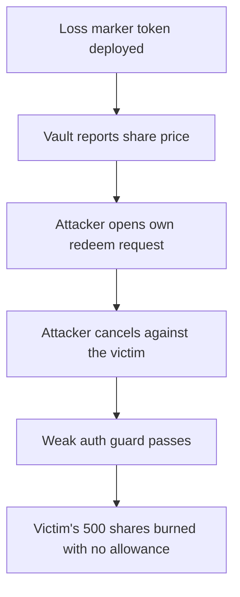

# Astrolab: `cancelRedeemRequest` burns another user's shares

> **Vulnerability classes:** vuln/access-control · vuln/logic
>
> **Reproduction:** a faithful minimal reproduction of the vulnerable finding — the vulnerable `cancelRedeemRequest` is reproduced **verbatim** (marked `@>`) with faithful minimal doubles (ERC20 share ledger, `sharePrice()` NAV read, `requestRedeem` escrow, `AsMaths.mulDiv`); local deploy, no fork.

<!-- source-auditvault: https://github.com/pashov/audits/blob/master/team/md/Astrolab-security-review.md -->

## Root cause

The `cancelRedeemRequest` guard only checks that `msg.sender` is the `operator` or the `owner` — never that the operator holds an allowance over the owner's shares — and it reads the redeem request from `req.byOperator[operator]` (the *caller's own* request) instead of `req.byOperator[owner]`. So any caller can supply their own request's `shares` and stale `sharePrice`, then have the opportunity-cost burn destroy an arbitrary `owner`'s shares. The vulnerable lines, reproduced verbatim:

```solidity
    function cancelRedeemRequest(
        address operator,
        address owner
    ) external nonReentrant {

        if (owner != msg.sender && operator != msg.sender)
            revert Unauthorized();

@>      Erc7540Request storage request = req.byOperator[operator];
        uint256 shares = request.shares;

        if (shares == 0) revert AmountTooLow(0);

        last.sharePrice = sharePrice();

        if (last.sharePrice > request.sharePrice) {
            // burn the excess shares from the loss incurred while not farming
            // with the idle funds (opportunity cost)
            uint256 opportunityCost = shares.mulDiv(
                last.sharePrice - request.sharePrice,
                weiPerShare
            ); // eg. 1e8+1e8-1e8 = 1e8
            _burn(owner, opportunityCost);
        }
```

## Why it's exploitable here

Following the finding's worked example with `weiPerShare = 1e18`:

1. The attacker holds 1000 shares and opens their own redeem request while `sharePrice()` is `1.5`, storing `req.byOperator[attacker] = {shares: 1000, sharePrice: 1.5}`.
2. Time passes; the strategy's NAV rises and `sharePrice()` becomes `2.0`.
3. The attacker calls `cancelRedeemRequest(operator=attacker, owner=victim)`. `msg.sender == operator` passes the guard, and no allowance over the victim is required or held.
4. `request` is the attacker's own `{1000, 1.5}`. Since `last.sharePrice` (2.0) > `request.sharePrice` (1.5), `opportunityCost = 1000 * (2.0 - 1.5) / 1 = 500` shares, burned from the victim via `_burn(owner, 500)`.
5. The victim loses 500 shares. The attacker needed no allowance and gains nothing but destroys another user's value permissionlessly.

## Attack path



## Marked-line walkthrough (Playground)

The EVM Playground pins each step to the exact executed source line in `0x671d353a…`:

1. **L50** — Loss marker token deployed: Setup: a LOSS marker token is minted 1:1 with every destroyed victim share, so the Playground can measure the silent burn.
2. **L132** — Vault reports share price: Setup: sharePrice() returns the vault's NAV per share, injected at the finding's two worked points — 1.5, then later 2.0.
3. **L149** — Attacker opens own redeem request: The attacker requests to redeem 1000 shares at price 1.5, recorded under req.byOperator[attacker] — their own request, priming the misread.
4. **L164** — Attacker cancels against the victim: The attacker calls cancelRedeemRequest(operator=attacker, owner=victim) once NAV has risen to 2.0, targeting shares they never owned.
5. **L171** — Weak auth guard passes: The guard only reverts if the caller is neither operator nor owner; msg.sender is the operator, so it passes with no allowance check.
6. **L173** — Reads caller's own request: Root cause: the request is read from req.byOperator[operator] — the caller's own request — instead of [owner], and no allowance is checked.
7. **L200** — Opportunity-cost burn hits victim: Using the attacker's shares and stale 1.5 price, the opportunity-cost burn of 500 shares is applied to the victim via _burn(owner).
8. **L213** — Victim shares destroyed permissionlessly: victimBurned records 500 of the victim's shares destroyed with zero allowance — anyone can burn another user's tokens for free.

## PoC

Registry (Foundry, local deploy — verbatim vulnerable source + harm-asserting test):

```bash
cd 58097-c-02-wrong-usage-of-mapping-target-in-cancelredeemrequest-pa_exp && forge test -vvv
```

The browser Playground replays the same synthetic opcode-for-opcode and measures the harm: **attacker opens a 1000-share redeem request at price 1.5, NAV rises to 2.0, then `cancelRedeemRequest` burns 500 of the victim's shares with zero allowance**. Both gates are green (registry `forge test` PASS + Playground `_verify-poc` **VERDICT: PASS**).
