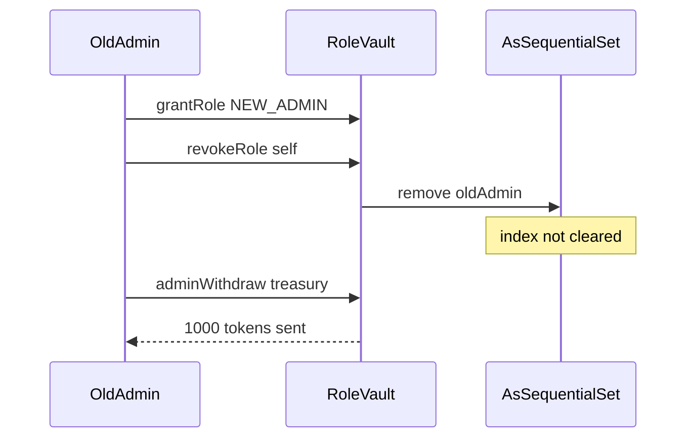

# Astrolab — Accounts not properly removed from roles upon revoking

> **Vulnerability classes:** vuln/access-control/broken-logic · privilege-escalation/role-bypass · known-pattern

> **Reproduction:** a self-contained Foundry PoC that compiles & runs in an
> isolated project with **only `forge-std`** — no fork, no RPC, no `anvil_state`.
> Full trace: [output.txt](output.txt). PoC:
> [test/58098-h-01-accounts-not-properly-removed-from-roles-upon-revoking_exp.sol](test/58098-h-01-accounts-not-properly-removed-from-roles-upon-revoking_exp.sol).

<!-- non-defihacklabs -->
<!-- source-auditvault: https://github.com/Auditware/AuditVault/blob/main/findings/58098-h-01-accounts-not-properly-removed-from-roles-upon-revoking.md -->
<!-- date: 2024-06 -->

**AuditVault taxonomy:** `severity/high` · `sector/bridge` · `access-roles` · `access-control/broken-logic` · `privilege-escalation/role-bypass` · `known-pattern` · `single-tx` · `redesign-logic` · `blast-radius/single-user`

---

## Key info

| | |
|---|---|
| **Impact** | **HIGH** — revoked admins retain `hasRole` and can still drain privileged paths |
| **Protocol** | Astrolab (AsSequentialSet / role members) |
| **Vulnerable code** | `AsSequentialSet.remove` — does not clear `index[o]` |
| **Bug class** | Broken set membership after revoke (stale index) |
| **Finding** | Pashov Audit Group · Astrolab · #58098 |
| **Report** | [pashov/audits Astrolab](https://github.com/pashov/audits/blob/master/team/md/Astrolab-security-review.md) |
| **Source** | [AuditVault](https://github.com/Auditware/AuditVault/blob/main/findings/58098-h-01-accounts-not-properly-removed-from-roles-upon-revoking.md) |
| **Status** | Audit finding. Reproduced as a standalone local PoC. |
| **Compiler** | `^0.8.24` (PoC) |

---

## TL;DR

1. Roles are stored in `AsSequentialSet.Set` (`data[]` + 1-based `index` map).
2. `remove(o)` reads `index[o]` and calls `removeAt`, but **never sets `index[o] = 0`**.
3. `has(o)` returns true when `index[o] > 0 && index[o] <= data.length`.
4. After removing a non-last member (swap-and-pop), the revoked account's index stays in range → `hasRole` still true.
5. A "revoked" admin can still call `adminWithdraw` and drain the treasury. Fix: `q.index[o] = 0` before `removeAt`.

---

## The vulnerable code

```solidity
function remove(Set storage q, bytes32 o) internal {
    uint32 i = q.index[o];
    // FIX: q.index[o] = 0;
    require(i > 0, "Element not found");
    removeAt(q, i - 1); // @> VULN
}

function has(Set storage q, bytes32 o) internal view returns (bool) {
    return q.index[o] > 0 && q.index[o] <= q.data.length;
}
```

---

## Root cause

Membership is decided by the **index map**, not by scanning `data`. Clearing an array slot / popping without zeroing `index[o]` leaves a stale positive index. After a non-last removal, `data.length` still satisfies `index[o] <= length`, so `has` lies.

## Preconditions

- At least two members in the role set.
- Revoke targets a non-last member (typical ownership handoff: first admin renounces after granting the second).

## Attack walkthrough

1. `OldAdmin` is sole `DEFAULT_ADMIN` (index 1); vault holds 1000 tokens.
2. Grant `NEW_ADMIN` (index 2).
3. `OldAdmin.revokeSelf()` — intended full handoff.
4. `hasRole(OldAdmin)` remains **true** (stale index).
5. `OldAdmin.drain` succeeds → 1000 tokens stolen.

## Diagrams



## Impact

Critical roles (including default admin) can be "revoked" while retaining full privileges. Ownership transfers and emergency revocations fail silently from an access-control perspective; the old principal can continue privileged operations including fund extraction.

## Sources

- [AuditVault finding #58098](https://github.com/Auditware/AuditVault/blob/main/findings/58098-h-01-accounts-not-properly-removed-from-roles-upon-revoking.md)
- [Pashov Astrolab security review](https://github.com/pashov/audits/blob/master/team/md/Astrolab-security-review.md)
- PoC gist referenced in finding: [thangtranth/685dd8fa…](https://gist.github.com/thangtranth/685dd8fa7faae141cdd2b1d0061b16f5)
- Reduced source: Astrolab `AsSequentialSet.sol` `remove` / `has` as quoted in the report
