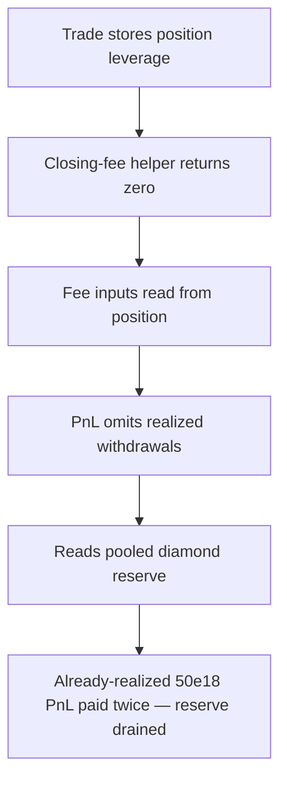

# Gains Network gTrade: decrease position withdraws realized PnL twice

> **Vulnerability classes:** vuln/theft · vuln/logic · vuln/accounting
>
> **Reproduction:** a faithful minimal reproduction of the vulnerable finding — the vulnerable PnL calculation of `DecreasePositionSizeUtils.prepareCallbackValues` is reproduced **verbatim** (marked `@>`) with faithful minimal doubles; local deploy, no fork.

<!-- source-auditvault: https://github.com/pashov/audits/blob/master/team/md/GainsNetwork-security-review_2025-05-26.md -->

## Root cause

When a position is decreased, `prepareCallbackValues` computes `values.existingPnlCollateral` from the trade's `openPrice` and `collateralAmount` alone and never subtracts the PnL the trader has already realized/withdrawn on this position. The value paid out, `collateralSentToTrader = partialTrade.collateralAmount + partialTradePnlCollateral`, therefore hands back a proportional slice of the **full** mark-to-market PnL a second time. The vulnerable lines, reproduced verbatim:

```solidity
        // 5. Calculate existing trade pnl
@>      values.existingPnlCollateral =
            (TradingCommonUtils.getPnlPercent(
                _existingTrade.openPrice,
                uint64(values.priceImpact.priceAfterImpact),
                _existingTrade.long,
                _existingTrade.leverage
            ) * int256(uint256(_existingTrade.collateralAmount))) /
            100 /
            int256(ConstantsUtils.P_10);

        // 6. Calculate value sent to trader
        int256 partialTradePnlCollateral = (values.existingPnlCollateral * int256(values.positionSizeCollateralDelta)) /
            int256(values.existingPositionSizeCollateral);
        // ...
        // @audit - should this consider pnl withdrawal
        values.collateralSentToTrader = int256(uint256(_partialTrade.collateralAmount)) + partialTradePnlCollateral;
```

`existingPnlCollateral` is derived purely from entry price and stored collateral, so any PnL the trader already withdrew on prior partial operations is re-counted. The audit's own recommendation is to subtract `realizedPnlCollateral` when computing `existingPnlCollateral`.

## Why it's exploitable here

Following the finding with concrete numbers (5x leverage, `P_10 = 1e10`):

1. The trader holds a `100e18`-collateral position opened at `openPrice = 1000e10` that has **already realized/withdrawn `50e18`** of PnL on prior operations (`realizedPnlCollateral = 50e18`).
2. Price rises 20% to `1200e10`; at 5x that is `+100%` → `100e18` of mark-to-market PnL.
3. The trader fully decreases. The buggy path sets `existingPnlCollateral = 100e18` (from `openPrice` × `collateralAmount`) with no subtraction of the `50e18` already realized.
4. `collateralSentToTrader = 100e18` (returned collateral) `+ 100e18` (PnL) `= 200e18`. The audit-fixed reference path subtracts the realized PnL → `100e18 + 50e18 = 150e18`.
5. The extra `50e18` is the already-withdrawn PnL paid a **second time**, drawn from other traders' collateral held in the diamond — the shared reserve is over-drained by exactly `50e18`.

## Attack path



## Marked-line walkthrough (Playground)

The EVM Playground pins each step to the exact executed source line in `GNSDiamond…`:

1. **L54** — Trade stores position leverage: Setup: the Trade record keeps leverage at 1e3 precision (5000 = 5x), the multiplier that scales a position's mark-to-market PnL on decrease.
2. **L177** — Closing-fee helper returns zero: During decrease prep the partial-close fee helper is invoked; it returns zero here, so no fee masks the doubled PnL paid out later.
3. **L240** — Fee inputs read from position: prepareCallbackValues feeds the existing trade's pair index and size delta into the closing-fee calc for the slice being decreased.
4. **L260** — PnL omits realized withdrawals: Root cause: existingPnlCollateral uses openPrice and collateralAmount but never subtracts realizedPnlCollateral, so already-withdrawn PnL is paid a second time.
5. **L274** — Reads pooled diamond reserve: The prep reads the collateral the diamond holds — other traders' deposits — the pool from which the inflated payout will be drawn.
6. **L297** — Fixed path subtracts realized PnL: The reference fix applies the audit's advice, subtracting realizedPnlCollateral, so the identical decrease pays 150e18 instead of 200e18.
7. **L412** — Decrease routes to buggy path: executeDecreasePositionSizeMarket selects the verbatim prepareCallbackValues for the attacker's diamond, producing the doubled collateralSentToTrader.
8. **L442** — Exploit opens at 5x leverage: Setup: the driver opens the position at 5x leverage so a +20% price move becomes +100% PnL, maximizing the collateral withdrawn twice.

## PoC

Registry (Foundry, local deploy — verbatim vulnerable source + harm-asserting test):

```bash
cd 58127-c-01-decrease-position-can-be-abused-to-withdraw-pnl-twice-p_exp && forge test -vvv
```

The browser Playground replays the same synthetic opcode-for-opcode and measures the harm: **decrease pays 200e18 on the buggy diamond vs 150e18 on the audit-fixed diamond — the already-realized 50e18 PnL is withdrawn twice and drained from other traders' reserve**. Both gates are green (registry `forge test` PASS + Playground `_verify-poc` **VERDICT: PASS**).
