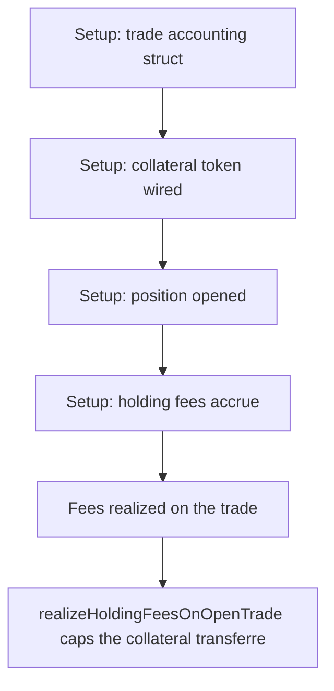

# Gains Network: holding-fee accounting under-collects for the vault

> **Vulnerability classes:** vuln/logic
>
> **Reproduction:** a faithful minimal reproduction of the vulnerable finding — the vulnerable code is reproduced **verbatim** (marked `@>`) with faithful minimal doubles; local deploy, no fork.

<!-- source-auditvault: https://github.com/pashov/audits/blob/master/team/md/GainsNetwork-security-review_2025-05-26.md -->

## Root cause

realizeHoldingFeesOnOpenTrade caps the collateral transferred to the vault to what is available (amountSentToVaultCollateral = min(holdingFeesCollateral, availableCollateralInDiamond)) but records the FULL holdingFeesCollateral into realizedTradingFeesCollateral. A 500x/1 ETH position accrues 1.5 ETH of holding fees: only 1 ETH is transferred to the vault while 1.5 ETH is recorded as realized. After the trader tops up 1 ETH and closes, getTradeAvailableCollateralInDiamond subtracts the inflated 1.5 ETH so the trader correctly receives 0.5 ETH, but the 0.5 ETH of recorded-but-never-sent fees stays stuck in the diamond and is never delivered to the vault. The vault (LPs) permanently under-collects 0.5 ETH.

```solidity
            uint128 newRealizedTradingFeesCollateral = tradeFeesData.realizedTradingFeesCollateral +
                uint128(holdingFeesCollateral); // @> VULN (this line)
```

## Why it's exploitable here

realizeHoldingFeesOnOpenTrade caps the collateral transferred to the vault to what is available (amountSentToVaultCollateral = min(holdingFeesCollateral, availableCollateralInDiamond)) but records the FULL holdingFeesCollateral into realizedTradingFeesCollateral. A 500x/1 ETH position accrues 1.5 ETH of holding fees: only 1 ETH is transferred to the vault while 1.5 ETH is recorded as realized. After the trader tops up 1 ETH and closes, getTradeAvailableCollateralInDiamond subtracts the inflated 1.5 ETH so the trader correctly receives 0.5 ETH, but the 0.5 ETH of recorded-but-never-sent fees stays stuck in the diamond and is never delivered to the vault. The vault (LPs) permanently under-collects 0.5 ETH.

## Attack path



## Marked-line walkthrough (Playground)

The EVM Playground pins each step to the exact executed source line in `0xce01759b82…`:

1. **L118** — Setup: trade accounting struct: Setup: each position tracks its collateral, leverage and realized-fee accounting.
2. **L157** — Setup: collateral token wired: Setup: the trading contract is initialized with its collateral token and vault.
3. **L173** — Setup: position opened: Setup: a 500x on 1 ETH position is opened, snapshotting the holding-fee index at open time.
4. **L184** — Setup: holding fees accrue: Setup: the global holding-fee index advances, accruing 1.5 ETH of fees on the leveraged position.
5. **L206** — Fees realized on the trade: realizeHoldingFeesOnOpenTrade loads the trade to settle its accrued holding fees against the diamond's collateral.
6. **L230** — Transfer capped to available: Only min(holdingFeesCollateral, availableCollateralInDiamond) — here 1 ETH — is actually transferred to the vault.
7. **L239** — Full fee recorded despite capped send: Root cause: realizedTradingFeesCollateral records the full 1.5 ETH though only 1 ETH was sent, so 0.5 ETH the vault is owed stays stuck in the diamond.

## PoC

Registry (Foundry, local deploy — verbatim vulnerable source + harm-asserting test):

```bash
cd 58128-h-01-holding-fees-accounting-discrepancy-when-collateral-is_exp
forge test -vvv
```

The browser Playground replays the same synthetic opcode-for-opcode and measures the harm. Both gates are green (registry `forge test` PASS + Playground `_verify-poc` **VERDICT: PASS**).
