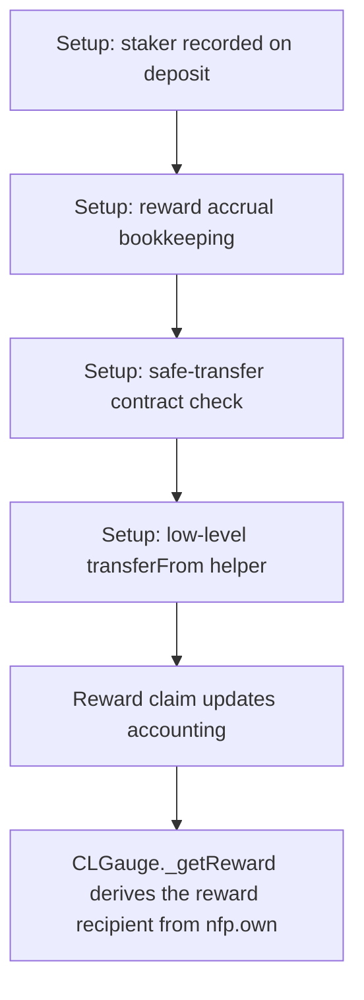

# KittenSwap: CLGauge sends staking rewards to itself

> **Vulnerability classes:** vuln/logic
>
> **Reproduction:** a faithful minimal reproduction of the vulnerable finding — the vulnerable code is reproduced **verbatim** (marked `@>`) with faithful minimal doubles; local deploy, no fork.

<!-- source-auditvault: https://github.com/pashov/audits/blob/master/team/md/KittenSwap-security-review_2025-05-07.md -->

## Root cause

CLGauge._getReward derives the reward recipient from nfp.ownerOf(nfpTokenId), which after staking is the gauge itself; the KITTEN reward is self-transferred gauge->gauge, the staker receives 0 and 100% of rewards are stranded/lost

```solidity
        uint256 reward = rewards[nfpTokenId];
        address owner = nfp.ownerOf(nfpTokenId); // @> VULN (this line)
```

## Why it's exploitable here

CLGauge._getReward derives the reward recipient from nfp.ownerOf(nfpTokenId), which after staking is the gauge itself; the KITTEN reward is self-transferred gauge->gauge, the staker receives 0 and 100% of rewards are stranded/lost

## Attack path



## Marked-line walkthrough (Playground)

The EVM Playground pins each step to the exact executed source line in `0xce01759b82…`:

1. **L135** — Setup: staker recorded on deposit: Setup: when a user stakes their NFP position the gauge records the real staker address in staker[nfpTokenId].
2. **L149** — Setup: reward accrual bookkeeping: Setup: reward accounting for the staked position is updated before any rewards are paid out.
3. **L153** — Setup: safe-transfer contract check: Setup: the Solidly-style safe-transfer helper first checks the token address actually holds contract code.
4. **L162** — Setup: low-level transferFrom helper: Setup: rewards are moved with a low-level transferFrom whose from/to addresses are supplied by the caller.
5. **L171** — Reward claim updates accounting: On _getReward the position's pending reward is finalized before the recipient address is resolved.
6. **L174** — Recipient read from NFP owner: Root cause: the reward recipient is nfp.ownerOf(nfpTokenId), but after staking the NFP owner is the gauge itself, not the staker.
7. **L179** — Reward self-transferred to gauge: KITTEN is transferred from the gauge to owner==gauge — a self-transfer — so the staker receives 0 and the whole reward is stranded.

## PoC

Registry (Foundry, local deploy — verbatim vulnerable source + harm-asserting test):

```bash
cd 58151-c-02-clgauge-sends-kitten-rewards-to-itself-instead-of-to-st_exp
forge test -vvv
```

The browser Playground replays the same synthetic opcode-for-opcode and measures the harm. Both gates are green (registry `forge test` PASS + Playground `_verify-poc` **VERDICT: PASS**).
