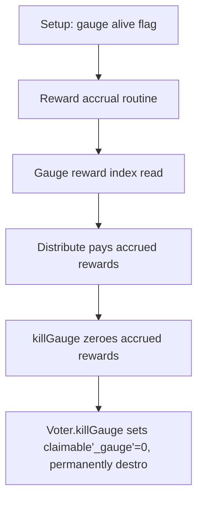

# KittenSwap: gauge deactivation destroys accrued rewards

> **Vulnerability classes:** vuln/logic
>
> **Reproduction:** a faithful minimal reproduction of the vulnerable finding — the vulnerable code is reproduced **verbatim** (marked `@>`) with faithful minimal doubles; local deploy, no fork.

<!-- source-auditvault: https://github.com/pashov/audits/blob/master/team/md/KittenSwap-security-review_2025-05-07.md -->

## Root cause

Voter.killGauge sets claimable[_gauge]=0, permanently destroying a gauge's already-accrued rewards; because _updateFor already advanced supplyIndex[_gauge] to the global index, reviveGauge cannot re-accrue them. Two equally-weighted gauges each accrue 100e18; killing then reviving gauge A makes it receive 0 on distribution while identical gauge B receives its full 100e18, and the equivalent base tokens are stranded in the Voter forever.

```solidity
        require(msg.sender == emergencyCouncil, "not emergency council");
        require(isAlive[_gauge], "gauge already dead");
        isAlive[_gauge] = false;
        claimable[_gauge] = 0; // @> VULN (this line)
```

## Why it's exploitable here

Voter.killGauge sets claimable[_gauge]=0, permanently destroying a gauge's already-accrued rewards; because _updateFor already advanced supplyIndex[_gauge] to the global index, reviveGauge cannot re-accrue them. Two equally-weighted gauges each accrue 100e18; killing then reviving gauge A makes it receive 0 on distribution while identical gauge B receives its full 100e18, and the equivalent base tokens are stranded in the Voter forever.

## Attack path



## Marked-line walkthrough (Playground)

The EVM Playground pins each step to the exact executed source line in `0x671d353a77…`:

1. **L93** — Setup: gauge alive flag: Setup: the Voter tracks whether each gauge is active in isAlive, which gates reward distribution.
2. **L143** — Reward accrual routine: _updateFor advances a gauge's accrued rewards up to the global index whenever emissions are notified.
3. **L147** — Gauge reward index read: The gauge's stored supplyIndex is loaded; its delta to the global index becomes newly claimable rewards.
4. **L165** — Distribute pays accrued rewards: distribute settles a gauge's claimable rewards, but killGauge can intervene before it runs.
5. **L180** — killGauge zeroes accrued rewards: Root cause: killGauge sets claimable[_gauge] = 0, discarding rewards the gauge had already accrued.
6. **L185** — reviveGauge cannot restore them: reviveGauge re-enables the gauge, but supplyIndex is already at the global index, so the zeroed rewards can never re-accrue.
7. **L200** — Revived gauge distributes zero: Distribution moves base tokens with a real transfer, yet the revived gauge now pays 0 while its stranded rewards stay in the Voter.

## PoC

Registry (Foundry, local deploy — verbatim vulnerable source + harm-asserting test):

```bash
cd 58153-h-02-loss-of-claimable-rewards-upon-gauge-deactivation-pasho_exp
forge test -vvv
```

The browser Playground replays the same synthetic opcode-for-opcode and measures the harm. Both gates are green (registry `forge test` PASS + Playground `_verify-poc` **VERDICT: PASS**).
