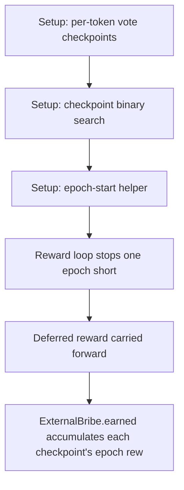

# KittenSwap: ExternalBribe.earned skips one epoch of rewards

> **Vulnerability classes:** vuln/logic
>
> **Reproduction:** a faithful minimal reproduction of the vulnerable finding — the vulnerable code is reproduced **verbatim** (marked `@>`) with faithful minimal doubles; local deploy, no fork.

<!-- source-auditvault: https://github.com/pashov/audits/blob/master/team/md/KittenSwap-security-review_2025-05-07.md -->

## Root cause

ExternalBribe.earned accumulates each checkpoint's epoch reward one loop iteration late (reward += prevRewards.balance fires at the START of the next iteration), but the loop bound is `i <= _endIndex - 1` instead of `i <= _endIndex`, so the reward computed for the checkpoint at index _endIndex-1 is NEVER added and the post-loop block only handles _endIndex. One full epoch of a voter's bribe rewards is silently skipped on every call, and since earned() is the sole accounting source those rewards are permanently unclaimable. A voter (tokenId 1) with equal ve weight across three identically-bribed epochs (100e18 each) has earned() report 100e18 vs a correct loop's 200e18 — exactly one epoch (100e18) lost — while 300e18 of real bribe tokens sit stranded in the ExternalBribe.

```solidity
        if (_endIndex > 0) {
            for (uint i = _startIndex; i <= _endIndex - 1; i++) { // @> VULN (this line)
```

## Why it's exploitable here

ExternalBribe.earned accumulates each checkpoint's epoch reward one loop iteration late (reward += prevRewards.balance fires at the START of the next iteration), but the loop bound is `i <= _endIndex - 1` instead of `i <= _endIndex`, so the reward computed for the checkpoint at index _endIndex-1 is NEVER added and the post-loop block only handles _endIndex. One full epoch of a voter's bribe rewards is silently skipped on every call, and since earned() is the sole accounting source those rewards are permanently unclaimable. A voter (tokenId 1) with equal ve weight across three identically-bribed epochs (100e18 each) has earned() report 100e18 vs a correct loop's 200e18 — exactly one epoch (100e18) lost — while 300e18 of real bribe tokens sit stranded in the ExternalBribe.

## Attack path



## Marked-line walkthrough (Playground)

The EVM Playground pins each step to the exact executed source line in `0x671d353a77…`:

1. **L96** — Setup: per-token vote checkpoints: Setup: the bribe stores each voter's ve-weight checkpoints across epochs.
2. **L131** — Setup: checkpoint binary search: Setup: getPriorBalanceIndex binary-searches the checkpoint that applies at a given epoch.
3. **L166** — Setup: epoch-start helper: Setup: _bribeStart snaps a timestamp to its bribe-epoch boundary.
4. **L192** — Reward loop stops one epoch short: Root cause: the loop bound is _endIndex - 1, and since each reward is added at the start of the NEXT iteration, checkpoint _endIndex-1 is never counted.
5. **L202** — Deferred reward carried forward: Each iteration defers the prior epoch's reward, so the final in-range epoch's reward is dropped when the loop exits early.
6. **L237** — Corrected loop quantifies the loss: A byte-identical earnedFixed using i <= _endIndex returns 200e18 where the buggy earned returns 100e18 — exactly one epoch lost.
7. **L269** — One epoch left unclaimable: Because earned() is the sole accounting source, the skipped 100e18 epoch is permanently unclaimable while real tokens sit in the bribe.

## PoC

Registry (Foundry, local deploy — verbatim vulnerable source + harm-asserting test):

```bash
cd 58154-h-03-externalbribeearned-skips-rewards-before-the-last-token_exp
forge test -vvv
```

The browser Playground replays the same synthetic opcode-for-opcode and measures the harm. Both gates are green (registry `forge test` PASS + Playground `_verify-poc` **VERDICT: PASS**).
