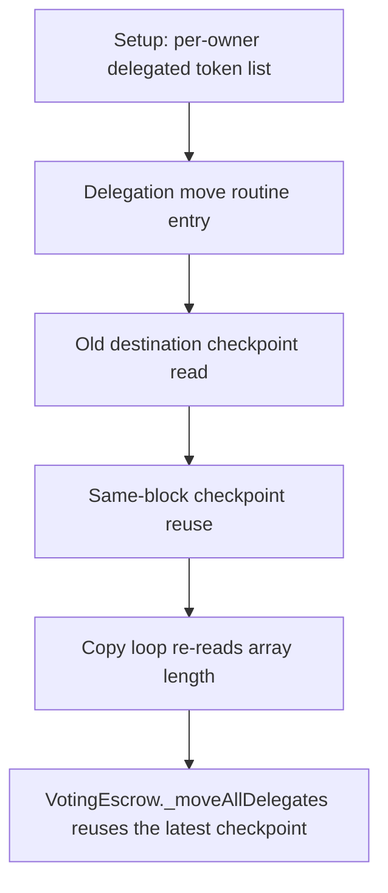

# KittenSwap: same-block delegation bricks the vote-move loop

> **Vulnerability classes:** vuln/logic
>
> **Reproduction:** a faithful minimal reproduction of the vulnerable finding — the vulnerable code is reproduced **verbatim** (marked `@>`) with faithful minimal doubles; local deploy, no fork.

<!-- source-auditvault: https://github.com/pashov/audits/blob/master/team/md/KittenSwap-security-review_2025-05-07.md -->

## Root cause

VotingEscrow._moveAllDelegates reuses the latest checkpoint on a same-block move (_findWhatCheckpointToWrite returns _nCheckPoints-1), so dstRepNew aliases dstRepOld and the verbatim copy loop pushes onto the array whose .length it re-reads each iteration; a second same-block delegation to the same delegatee grows the tokenId list without bound and runs out of gas, permanently bricking that delegation in-block (DoS of governance delegation / vote-move path)

```solidity
                require(
                    dstRepOld.length + ownerTokenCount <= MAX_DELEGATES,
                    "dstRep would have too many tokenIds"
                );
                // All the same
                for (uint i = 0; i < dstRepOld.length; i++) {
                    uint tId = dstRepOld[i];
                    dstRepNew.push(tId); // @> VULN (this line)
```

## Why it's exploitable here

VotingEscrow._moveAllDelegates reuses the latest checkpoint on a same-block move (_findWhatCheckpointToWrite returns _nCheckPoints-1), so dstRepNew aliases dstRepOld and the verbatim copy loop pushes onto the array whose .length it re-reads each iteration; a second same-block delegation to the same delegatee grows the tokenId list without bound and runs out of gas, permanently bricking that delegation in-block (DoS of governance delegation / vote-move path)

## Attack path



## Marked-line walkthrough (Playground)

The EVM Playground pins each step to the exact executed source line in `0x8ea53755a6…`:

1. **L71** — Setup: per-owner delegated token list: Setup: each delegatee's set of delegated ve-NFT tokenIds is held in an owner-indexed mapping.
2. **L96** — Delegation move routine entry: _moveAllDelegates rebuilds the destination delegatee's checkpoint of delegated tokenIds on every delegation change.
3. **L110** — Old destination checkpoint read: The routine reads the delegatee's previous tokenId list (dstRepOld) as the basis for the new checkpoint.
4. **L133** — Same-block checkpoint reuse: On a same-block move the write index resolves to the latest checkpoint, so the new list aliases the old one instead of a fresh slot.
5. **L138** — Copy loop re-reads array length: The copy loop is bounded by dstRepOld.length and re-reads that length on every iteration.
6. **L140** — Aliased push grows unbounded: Root cause: because dstRepNew aliases dstRepOld, each push also grows the loop's own bound, so the array expands endlessly until gas is exhausted.
7. **L162** — Setup: register ve-NFT owner: Setup: a helper seeds ve-NFT ownership so a delegation can be performed in the reproduction.

## PoC

Registry (Foundry, local deploy — verbatim vulnerable source + harm-asserting test):

```bash
cd 58155-h-04-duplicate-tokenid-in-delegate-list-may-inflate-votes-pa_exp
forge test -vvv
```

The browser Playground replays the same synthetic opcode-for-opcode and measures the harm. Both gates are green (registry `forge test` PASS + Playground `_verify-poc` **VERDICT: PASS**).
