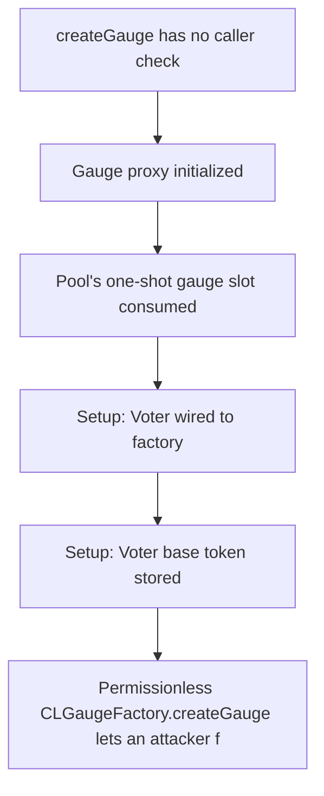

# KittenSwap: CLGauge creation lacks access control

> **Vulnerability classes:** vuln/logic
>
> **Reproduction:** a faithful minimal reproduction of the vulnerable finding — the vulnerable code is reproduced **verbatim** (marked `@>`) with faithful minimal doubles; local deploy, no fork.

<!-- source-auditvault: https://github.com/pashov/audits/blob/master/team/md/KittenSwap-security-review_2025-05-07.md -->

## Root cause

Permissionless CLGaugeFactory.createGauge lets an attacker front-run Voter.createCLGauge and consume the pool's one-shot setGaugeAndPositionManager slot, permanently reverting legitimate gauge creation (DoS of pool emissions/rewards) and binding the pool to an unauthorized gauge

```solidity
        address _pool,
        address _internal_bribe,
        address _kitten,
        bool _isPool
    ) external returns (address) { // @> VULN (this line)
```

## Why it's exploitable here

Permissionless CLGaugeFactory.createGauge lets an attacker front-run Voter.createCLGauge and consume the pool's one-shot setGaugeAndPositionManager slot, permanently reverting legitimate gauge creation (DoS of pool emissions/rewards) and binding the pool to an unauthorized gauge

## Attack path



## Marked-line walkthrough (Playground)

The EVM Playground pins each step to the exact executed source line in `0xbd4fd5a3ce…`:

1. **L190** — createGauge has no caller check: Root cause: CLGaugeFactory.createGauge is external with no require(msg.sender == voter), so anyone can deploy a gauge for any pool.
2. **L194** — Gauge proxy initialized: The new gauge is deployed as an EIP-1967 proxy and its initializer is encoded here, wiring it to the attacker-chosen pool.
3. **L210** — Pool's one-shot gauge slot consumed: createGauge calls the pool's setGaugeAndPositionManager, which reverts if a gauge is already set — a single irreversible binding per pool.
4. **L223** — Setup: Voter wired to factory: Setup: the legitimate Voter stores the gauge factory it will call during official gauge creation.
5. **L224** — Setup: Voter base token stored: Setup: the Voter records the base reward token used for emissions to gauges.
6. **L227** — Legit createCLGauge now reverts: When the Voter finally calls createCLGauge the pool slot is already taken by the attacker's gauge, so official creation reverts — an emissions DoS.

## PoC

Registry (Foundry, local deploy — verbatim vulnerable source + harm-asserting test):

```bash
cd 58157-h-06-lack-of-access-control-in-clgauge-creation-allows-unaut_exp
forge test -vvv
```

The browser Playground replays the same synthetic opcode-for-opcode and measures the harm. Both gates are green (registry `forge test` PASS + Playground `_verify-poc` **VERDICT: PASS**).
