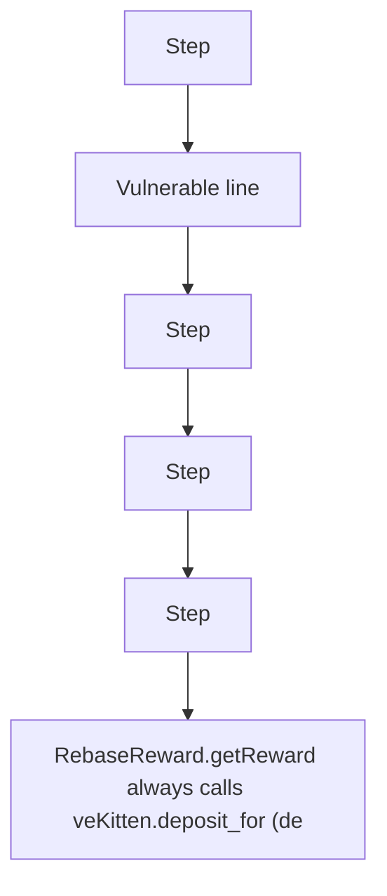

# RebaseReward deposits the wrong token on claim

> **Vulnerability classes:** vuln/logic
>
> **Reproduction:** a faithful minimal reproduction of the vulnerable finding — the vulnerable code is reproduced **verbatim** (marked `@>`) with faithful minimal doubles; local deploy, no fork.

<!-- source-auditvault: AuditVault finding 58205 -->

## Root cause

RebaseReward.getReward always calls veKitten.deposit_for (depositing KITTEN) regardless of the reward token, so a non-Kitten (token0) reward is paid out as Kitten while 100e18 of token0 stays locked in the contract forever.

```solidity
        uint256 reward = rewardOf[token];
        rewardOf[token] = 0;
        if (reward > 0) {
            veKitten.deposit_for(_tokenId, reward); // @> VULN (this line)
```

## Why it's exploitable here

RebaseReward.getReward always calls veKitten.deposit_for (depositing KITTEN) regardless of the reward token, so a non-Kitten (token0) reward is paid out as Kitten while 100e18 of token0 stays locked in the contract forever.

## Attack path



## Marked-line walkthrough (Playground)

The EVM Playground pins each step to the exact executed source line in `0xbd4fd5a3ce…`:

1. **L71** — Step: Executes `function incentivize(address token, uint256 amount) external {`
2. **L81** — Vulnerable line: Executes `veKitten.deposit_for(_tokenId, reward);`
3. **L82** — Step: Executes `emit ClaimReward(_period, _tokenId, token, _owner);`
4. **L91** — Step: Executes `contract Exploit {`
5. **L92** — Step: Executes `address internal constant SINK = 0x000000000000000000000000000000000000D00d;`
6. **L96** — Step: Executes `MiniToken public token0;`

## PoC

Registry (Foundry, local deploy — verbatim vulnerable source + harm-asserting test):

```bash
cd 58205-c-01-rebasereward-fails-because-of-incorrect-token-handling_exp
forge test -vvv
```

The browser Playground replays the same synthetic opcode-for-opcode and measures the harm. Both gates are green (registry `forge test` PASS + Playground `_verify-poc` **VERDICT: PASS**).
