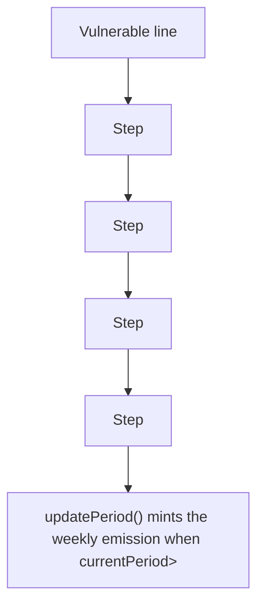

# KittenSwap: missing lastMintedPeriod update allows unlimited minting

> **Vulnerability classes:** vuln/logic
>
> **Reproduction:** a faithful minimal reproduction of the vulnerable finding — the vulnerable code is reproduced **verbatim** (marked `@>`) with faithful minimal doubles; local deploy, no fork.

<!-- source-auditvault: AuditVault finding 58206 -->

## Root cause

updatePeriod() mints the weekly emission when currentPeriod>lastMintedPeriod but never updates lastMintedPeriod, so the condition stays true forever and anyone can mint the emission repeatedly - unlimited Kitten supply (9 extra periods = 1800e18 over-minted).

```solidity
        uint256 currentPeriod = getPeriod();
        if (currentPeriod > lastMintedPeriod) { // @> VULN (this line)
```

## Why it's exploitable here

updatePeriod() mints the weekly emission when currentPeriod>lastMintedPeriod but never updates lastMintedPeriod, so the condition stays true forever and anyone can mint the emission repeatedly - unlimited Kitten supply (9 extra periods = 1800e18 over-minted).

## Attack path



## Marked-line walkthrough (Playground)

The EVM Playground pins each step to the exact executed source line in `0x671d353a77…`:

1. **L58** — Vulnerable line: Executes `if (currentPeriod > lastMintedPeriod) {`
2. **L59** — Step: Executes `kitten.mint(rebaseReward, WEEKLY_EMISSION);`
3. **L66** — Step: Executes ``
4. **L67** — Step: Executes ``
5. **L69** — Step: Executes ``
6. **L72** — Step: Executes `address internal constant REBASE = address(0xBEEF);`

## PoC

Registry (Foundry, local deploy — verbatim vulnerable source + harm-asserting test):

```bash
cd 58206-c-02-lack-of-lastmintedperiod-update-allows-unlimited-mintin_exp
forge test -vvv
```

The browser Playground replays the same synthetic opcode-for-opcode and measures the harm. Both gates are green (registry `forge test` PASS + Playground `_verify-poc` **VERDICT: PASS**).
