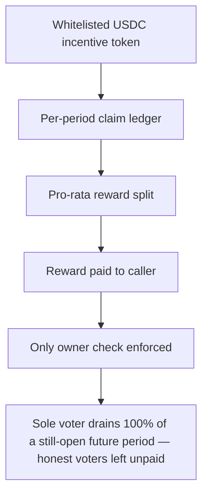

# KittenSwap: `getRewardForPeriod` lets a voter claim a still-open future period

> **Vulnerability classes:** vuln/theft · vuln/reward-accounting
>
> **Reproduction:** a faithful minimal reproduction of the vulnerable finding — the three reward functions `incentivize` / `_deposit` / `getRewardForPeriod` are reproduced **verbatim** (the vulnerable claim marked `@>`) with faithful minimal doubles for the reward accounting, `Voter`/`veKitten` gates and ERC20; local deploy, no fork.

<!-- source-auditvault: https://github.com/pashov/audits/blob/master/team/md/KittenSwap-security-review_2025-06-12.md -->

## Root cause

In KittenSwap's `VotingReward`, `getRewardForPeriod` forwards any caller-supplied `_period` into `_getReward` without ever checking it is not a still-open future period. Both `incentivize` and `_deposit` write into `getCurrentPeriod() + 1`, so a voter can claim that next, still-accumulating period while they are momentarily its only voter and take 100% of its incentives. The vulnerable functions, reproduced verbatim from the finding:

```solidity
    function incentivize(
        address _token,
        uint256 _amount
    ) external virtual nonReentrant {
        // Here we have one white list for token. So we cannot manipulate the token.
        if (voter.isWhitelisted(_token) == false)
            revert NotWhitelistedRewardToken();
        uint256 currentPeriod = getCurrentPeriod() + 1;
        uint256 amount = _addReward(currentPeriod, _token, _amount);
    }
    function _deposit(uint256 _amount, uint256 _tokenId) external onlyVoter {
        uint256 nextPeriod = getCurrentPeriod() + 1;

        tokenIdVotesInPeriod[nextPeriod][_tokenId] += _amount;
        totalVotesInPeriod[nextPeriod] += _amount;
    }
    function getRewardForPeriod(
        uint256 _period,
        uint256 _tokenId,
        address _token
    ) external nonReentrant {
        // Only owner or approved can get rewards.
        if (!veKitten.isApprovedOrOwner(msg.sender, _tokenId))
            revert NotApprovedOrOwner();
@>      _getReward(_period, _tokenId, _token, msg.sender);
    }
```

`getRewardForPeriod` gates only on veNFT ownership; the claimed `_period` is never compared against `getCurrentPeriod()`, so rewards booked for the next, still-open period are immediately claimable.

## Why it's exploitable here

Following the finding's scenario with a 500 USDC incentive and equal voting power:

1. A protocol seeds **500 USDC** to reward voters of the next period `X = getCurrentPeriod() + 1` via `incentivize` — the token lands in `tokenRewardsPerPeriod[usdc][X]`.
2. The attacker votes **100** voting power into period `X` (still open) through the `Voter`, funding **zero** incentives.
3. The attacker calls `getRewardForPeriod(X, ...)`. There is no future-period guard, so the claim succeeds while `X` is still open. As the sole voter so far, `earned = 500e6 * 100 / 100 = 500e6` — the entire incentive.
4. The attacker walks away with **500 USDC it never funded**. An honest co-voter who then votes 100 into `X` is owed `500e6 * 100 / 200 = 250 USDC`, but the reward pool now holds **0** and cannot pay her.

## Attack path



## Marked-line walkthrough (Playground)

The EVM Playground pins each step to the exact executed source line in `0xbd4fd5a3…`:

1. **L55** — Whitelisted USDC incentive token: Setup: the whitelisted reward token is a 6-decimal USDC double that a protocol seeds as voter incentives for an upcoming period.
2. **L134** — Per-period claim ledger: Setup: rewards are booked per (period, tokenId, token) and this claim flag only blocks a second claim of the same period.
3. **L159** — Pro-rata reward split: earned pays each voter rewards * myVotes / totalVotes, so whoever is the only voter in a period is owed 100% of its incentives.
4. **L170** — Reward paid to caller: The computed reward is transferred straight out to the claimant, so real USDC leaves the contract the moment a claim is honored.
5. **L198** — Only owner check enforced: getRewardForPeriod only checks the caller owns the veNFT; it never validates that the requested `_period` has actually closed.
6. **L200** — Missing future-period guard: Root cause: `_getReward` runs with no `_period <= getCurrentPeriod()` guard, so a lone voter drains 100% of a still-open future period.

## PoC

Registry (Foundry, local deploy — verbatim vulnerable source + harm-asserting test):

```bash
cd 58207-c-03-incentive-rewards-may-be-stolen-pashov-audit-group-none_exp
forge test -vvv
```

The browser Playground replays the same synthetic opcode-for-opcode and measures the harm: **seed 500 USDC, vote into the still-open future period, claim 100% while sole voter, leaving an honest co-voter owed 250 USDC the drained pool cannot pay**. Both gates are green (registry `forge test` PASS + Playground `_verify-poc` **VERDICT: PASS**).
